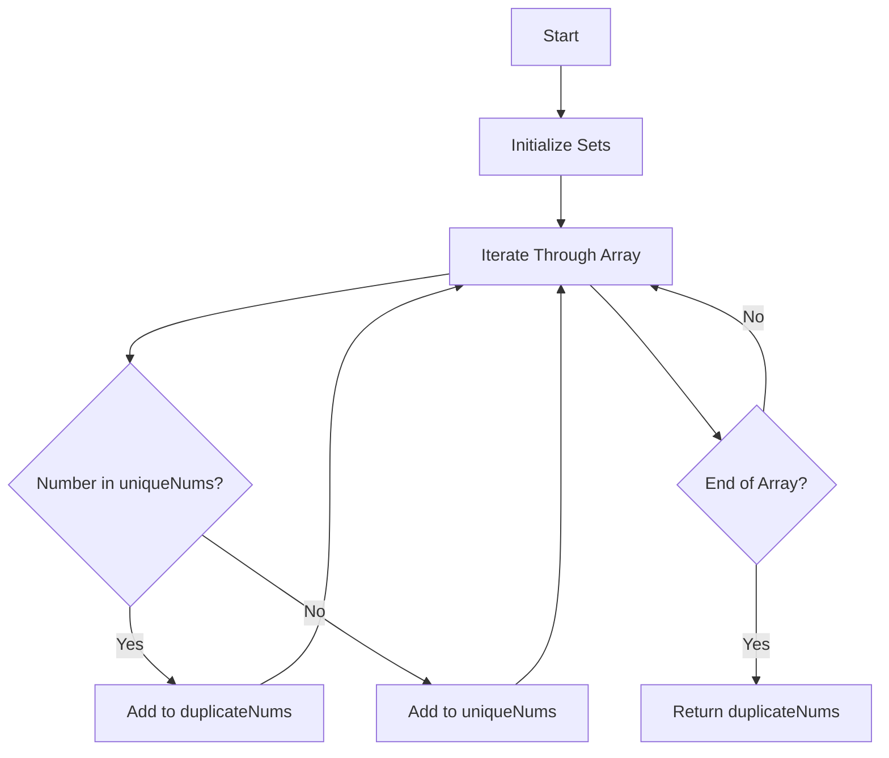

# Find Duplicates in Array

## Problem Understanding
The problem asks to find all duplicate numbers in a given array, which means identifying numbers that appear more than once. The key constraint is that the solution should be efficient in terms of time and space complexity. What makes this problem non-trivial is the requirement to handle large arrays and the need for an efficient data structure to keep track of unique and duplicate numbers. A naive approach, such as comparing each number with every other number, would result in a high time complexity and is therefore not suitable.

## Approach
The algorithm strategy used here is based on the Set data structure, which allows for efficient storage and lookup of unique elements. The intuition behind this approach is to iterate through the input array and check if each number already exists in a Set of unique numbers. If it does, it's a duplicate and is added to a separate Set of duplicate numbers. This approach works because Sets in JavaScript have an average time complexity of O(1) for add and has operations, making the overall time complexity of the algorithm O(n), where n is the length of the input array. The use of two Sets (uniqueNums and duplicateNums) allows for efficient handling of the key constraint of identifying duplicates.

## Complexity Analysis
| Metric | Value | Detailed Reason |
|--------|-------|----------------|
| Time   | O(n)  | The algorithm iterates through the input array once, and each operation within the loop (adding to a Set and checking existence in a Set) has an average time complexity of O(1). Therefore, the overall time complexity is linear, directly proportional to the size of the input array. |
| Space  | O(n)  | In the worst-case scenario, if all numbers in the array are unique, the size of the uniqueNums Set will be equal to the size of the input array. Similarly, in the worst case for duplicates, the size of the duplicateNums Set could also be up to n/2 (if every other number is a duplicate), but since we're considering space complexity in terms of Big O notation, we simplify to O(n) as it represents the maximum space that could be used. |

## Algorithm Walkthrough
```
Input: [4, 3, 2, 7, 8, 2, 3, 1]
Step 1: Initialize uniqueNums = Set() and duplicateNums = Set()
Step 2: Iterate through the array:
  - For 4, uniqueNums = {4}, duplicateNums = Set()
  - For 3, uniqueNums = {4, 3}, duplicateNums = Set()
  - For 2, uniqueNums = {4, 3, 2}, duplicateNums = Set()
  - For 7, uniqueNums = {4, 3, 2, 7}, duplicateNums = Set()
  - For 8, uniqueNums = {4, 3, 2, 7, 8}, duplicateNums = Set()
  - For 2, since 2 is in uniqueNums, add it to duplicateNums = {2}
  - For 3, since 3 is in uniqueNums, add it to duplicateNums = {2, 3}
  - For 1, uniqueNums = {4, 3, 2, 7, 8, 1}, duplicateNums remains {2, 3}
Output: [2, 3]
```

## Visual Flow


## Key Insight
> **Tip:** The single most important insight here is that using a Set for storing unique and duplicate numbers allows for efficient duplicate detection with a time complexity of O(n), making it suitable for large input arrays.

## Edge Cases
- **Empty/null input**: If the input array is empty or null, the function should return an empty array. This is because there are no numbers to process, and thus no duplicates can be found.
- **Single element**: If the input array contains only one element, the function should return an empty array because a single element cannot be a duplicate.
- **All duplicates**: If the input array contains all duplicates (e.g., [1, 1, 1, 1]), the function should return an array containing the duplicate number(s), in this case, [1].

## Common Mistakes
- **Mistake 1**: Not checking for the existence of an element in the uniqueNums Set before adding it to the duplicateNums Set. This can lead to incorrect results if not handled properly.
- **Mistake 2**: Not initializing the Sets properly or not converting the duplicateNums Set back to an array before returning it. This can cause errors or incorrect output.

## Interview Follow-ups
> **Interview:** These are the exact follow-up questions interviewers ask:
- "What if the input is sorted?" → The algorithm's efficiency remains the same, O(n), because it still needs to iterate through the entire array to find duplicates. Sorting does not affect the time complexity in this case.
- "Can you do it in O(1) space?" → No, because to keep track of unique and duplicate numbers, we need at least one data structure (like a Set) that scales with the input size, leading to a space complexity of at least O(n).
- "What if there are duplicates?" → The algorithm is designed to handle duplicates by adding them to the duplicateNums Set. It correctly identifies and returns all duplicate numbers in the input array.

## Javascript Solution

```javascript
// Problem: Find Duplicates in Array
// Language: javascript
// Difficulty: Easy
// Time Complexity: O(n) — single pass through array using Set
// Space Complexity: O(n) — Set stores at most n elements
// Approach: Set duplicate detection — for each number, check if it already exists in the Set

class Solution {
    /**
     * Finds duplicates in an array.
     * @param {number[]} nums - The input array.
     * @return {number[]} - An array of duplicate numbers.
     */
    findDuplicates(nums) {
        // Create a Set to store unique numbers
        const uniqueNums = new Set();
        // Create a Set to store duplicate numbers
        const duplicateNums = new Set();
        
        // Edge case: empty input → return empty array
        if (nums.length === 0) return [];

        // Iterate through the input array
        for (const num of nums) {
            // Check if the number already exists in the uniqueNums Set
            if (uniqueNums.has(num)) {
                // If it does, add it to the duplicateNums Set
                duplicateNums.add(num);
            } else {
                // If it doesn't, add it to the uniqueNums Set
                uniqueNums.add(num);
            }
        }

        // Convert the duplicateNums Set to an array and return it
        return Array.from(duplicateNums);
    }
}

// Example usage:
const solution = new Solution();
console.log(solution.findDuplicates([4, 3, 2, 7, 8, 2, 3, 1]));  // Output: [2, 3]
console.log(solution.findDuplicates([1, 2, 3, 4, 5, 6]));  // Output: []
console.log(solution.findDuplicates([]));  // Output: []
```
