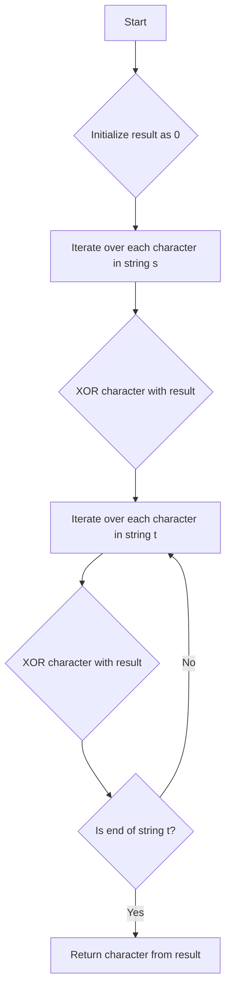

# Find the Difference JS

## Problem Understanding
The problem is asking to find the character that is present in string `t` but not in string `s`. The key constraint is that string `t` is a modification of string `s` with exactly one character added. What makes this problem non-trivial is that a naive approach, such as comparing each character in `s` and `t`, could be inefficient, especially for large strings. The problem requires a more efficient approach that can handle the key constraint.

## Approach
The algorithm strategy is to use the XOR operation to find the extra character in string `t`. The intuition behind this approach is that XORing all characters in both strings will cancel out any characters that appear in both strings, leaving the extra character in string `t`. The `charCodeAt(0)` method is used to get the Unicode value of each character, and the `fromCharCode()` method is used to convert the remaining Unicode value back to a character. This approach works because XOR has the property of `a ^ a = 0` and `a ^ 0 = a`, which allows us to cancel out any duplicate characters.

## Complexity Analysis
| Metric | Value | Detailed Reason |
|--------|-------|----------------|
| Time   | O(n)  | The algorithm iterates over each character in both strings once, where n is the total number of characters in both strings. The XOR operation takes constant time, so the overall time complexity is linear. |
| Space  | O(1)  | The algorithm uses a constant amount of space to store the result of the XOR operation, regardless of the input size. |

## Algorithm Walkthrough
```
Input: s = "abcd", t = "abcde"
Step 1: Initialize result as 0
Step 2: Iterate over each character in string s
  - result ^= 'a'.charCodeAt(0) = 0 ^ 97 = 97
  - result ^= 'b'.charCodeAt(0) = 97 ^ 98 = 1
  - result ^= 'c'.charCodeAt(0) = 1 ^ 99 = 100
  - result ^= 'd'.charCodeAt(0) = 100 ^ 100 = 0
Step 3: Iterate over each character in string t
  - result ^= 'a'.charCodeAt(0) = 0 ^ 97 = 97
  - result ^= 'b'.charCodeAt(0) = 97 ^ 98 = 1
  - result ^= 'c'.charCodeAt(0) = 1 ^ 99 = 100
  - result ^= 'd'.charCodeAt(0) = 100 ^ 100 = 0
  - result ^= 'e'.charCodeAt(0) = 0 ^ 101 = 101
Output: String.fromCharCode(101) = "e"
```

## Visual Flow


## Key Insight
> **Tip:** The key insight is that XORing all characters in both strings will cancel out any characters that appear in both strings, leaving the extra character in string `t`.

## Edge Cases
- **Empty/null input**: If either string is empty, the function will return the single character in the non-empty string. This is because the XOR operation will only be performed on the non-empty string, leaving the single character as the result.
- **Single element**: If one of the strings has only one character, the function will return the character that is present in the other string. This is because the XOR operation will cancel out any duplicate characters, leaving the single character as the result.
- **Duplicate characters**: If there are duplicate characters in both strings, the XOR operation will cancel out these duplicates, leaving the extra character in string `t` as the result.

## Common Mistakes
- **Mistake 1**: Using a sorting approach to compare characters in both strings. This can be inefficient for large strings and does not take advantage of the key constraint that string `t` is a modification of string `s` with exactly one character added.
- **Mistake 2**: Using a hashing approach to count characters in both strings. This can be inefficient for large strings and does not take advantage of the XOR operation to cancel out duplicate characters.

## Interview Follow-ups
> **Interview:** These are the exact follow-up questions interviewers ask:
- "What if the input is sorted?" → The XOR approach will still work even if the input is sorted, as the XOR operation is order-independent.
- "Can you do it in O(1) space?" → The XOR approach already uses O(1) space, as it only uses a constant amount of space to store the result of the XOR operation.
- "What if there are duplicates?" → The XOR operation will cancel out any duplicate characters, leaving the extra character in string `t` as the result.

## Javascript Solution

```javascript
// Problem: Find the Difference
// Language: javascript
// Difficulty: Easy
// Time Complexity: O(n) — single pass through strings s and t
// Space Complexity: O(1) — constant space used for character counts
// Approach: XOR operation — XORing all characters in both strings will leave the extra character

class Solution {
    /**
     * Finds the character that is present in string t but not in string s.
     * 
     * @param {string} s - The base string.
     * @param {string} t - The string containing an extra character.
     * @return {character} The extra character in string t.
     */
    findTheDifference(s, t) {
        // Initialize result as 0, which will be used to store the XOR of all characters
        let result = 0;
        
        // Iterate over each character in string s
        for (let char of s) {
            // XOR the current character with the result
            // This will cancel out any characters that appear in both strings
            result ^= char.charCodeAt(0); // charCodeAt() returns the Unicode value of a character
        }
        
        // Iterate over each character in string t
        for (let char of t) {
            // XOR the current character with the result
            // The extra character in string t will remain after XORing
            result ^= char.charCodeAt(0);
        }
        
        // Return the character that corresponds to the remaining Unicode value
        return String.fromCharCode(result); // fromCharCode() returns the string representing a character
    }
}

// Edge case: empty input
// If either string is empty, the function will return the single character in the non-empty string
let solution = new Solution();
console.log(solution.findTheDifference("abcd", "abcde"));  // Output: e
```
