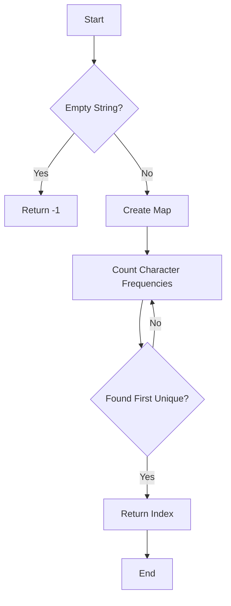

# First Unique Character in a String JS Map

## Problem Understanding
The problem is asking to find the index of the first unique character in a given string. This means we need to identify the character that appears only once in the string and return its index. The key constraint here is that we need to find the first occurrence of such a character, not just any unique character. What makes this problem non-trivial is that a naive approach would involve checking each character's uniqueness by scanning the entire string for each character, leading to an inefficient solution.

## Approach
The algorithm strategy used here is a two-pass approach, utilizing a JavaScript Map to store the frequency of each character in the string. The intuition behind this approach is to first count the occurrences of each character and then find the first character with a count of 1. This approach works because it allows us to efficiently keep track of character frequencies and then scan the string once more to find the first unique character. A Map is chosen as the data structure because it provides constant-time operations for getting and setting values, making it ideal for frequency counting. This approach handles key constraints by ensuring that the first unique character found is indeed the first occurrence in the string.

## Complexity Analysis
| Metric | Value | Detailed Reason |
|--------|-------|----------------|
| Time   | O(n)  | The algorithm makes two passes through the string: one to count character frequencies and another to find the first unique character. Each pass is linear in the length of the string, so the overall time complexity is O(n) + O(n) = O(2n), which simplifies to O(n). |
| Space  | O(n)  | The space complexity is O(n) because in the worst-case scenario (all characters are unique), the Map will store n entries, where n is the length of the string. |

## Algorithm Walkthrough
```
Input: "leetcode"
Step 1: Initialize an empty Map charFrequency.
Step 2: Count the frequency of each character in "leetcode":
    - 'l' is encountered, set charFrequency('l') = 1.
    - 'e' is encountered, set charFrequency('e') = 1.
    - 'e' is encountered again, set charFrequency('e') = 2.
    - 't' is encountered, set charFrequency('t') = 1.
    - 'c' is encountered, set charFrequency('c') = 1.
    - 'o' is encountered, set charFrequency('o') = 1.
    - 'd' is encountered, set charFrequency('d') = 1.
    - 'e' is encountered again, set charFrequency('e') = 3.
Step 3: Find the first unique character in "leetcode":
    - Check 'l', charFrequency('l') = 1, so return index 0.
Output: 0
```

## Visual Flow


## Key Insight
> **Tip:** Utilizing a Map for frequency counting allows for efficient tracking of character occurrences, enabling a two-pass solution that first counts frequencies and then finds the first unique character.

## Edge Cases
- **Empty/null input**: If the input string is empty or null, the function returns -1, as there are no characters to process.
- **Single element**: If the input string has only one character, the function returns 0, because that single character is unique.
- **No unique characters**: If all characters in the string appear more than once, the function returns -1, indicating no unique characters were found.

## Common Mistakes
- **Mistake 1**: Not handling the case where the input string is empty or null, which would lead to an error or incorrect results. → To avoid this, always check for empty or null input at the beginning of the function.
- **Mistake 2**: Failing to reset or initialize the Map correctly before counting character frequencies. → To avoid this, ensure the Map is cleared or reinitialized before the counting process.

## Interview Follow-ups
> **Interview:** These are the exact follow-up questions interviewers ask:
- "What if the input is sorted?" → The algorithm's time complexity remains O(n) because it still needs to make two passes through the string: one to count frequencies and another to find the first unique character. The sorting of the input does not affect the frequency counting or the search for the first unique character.
- "Can you do it in O(1) space?" → No, achieving O(1) space complexity is not feasible for this problem because we need to store the frequency of each character, which requires at least O(n) space in the worst case (when all characters are unique).
- "What if there are duplicates?" → The algorithm handles duplicates correctly by counting their frequencies. If a character appears more than once, its frequency will be greater than 1, and it will not be considered the first unique character.

## Javascript Solution

```javascript
// Problem: First Unique Character in a String JS Map
// Language: javascript
// Difficulty: Easy
// Time Complexity: O(n) — two passes through the string to count and find unique character
// Space Complexity: O(n) — Map stores at most n characters
// Approach: JS Map frequency count — for each character, count its occurrences and find the first unique one

class Solution {
    /**
     * Returns the index of the first unique character in a string.
     * 
     * @param {string} s - The input string.
     * @returns {number} The index of the first unique character, or -1 if no unique character exists.
     */
    firstUniqChar(s) {
        // Edge case: empty string → return -1
        if (s.length === 0) return -1;

        // Create a Map to store the frequency of each character
        let charFrequency = new Map();
        
        // Count the frequency of each character in the string
        for (let i = 0; i < s.length; i++) {
            let charCount = charFrequency.get(s[i]) || 0; // get current count, or 0 if not in Map
            charFrequency.set(s[i], charCount + 1); // increment the count
        }

        // Find the first unique character in the string
        for (let i = 0; i < s.length; i++) {
            // Check if the character has a frequency of 1
            if (charFrequency.get(s[i]) === 1) {
                return i; // return the index of the first unique character
            }
        }

        // If no unique character is found, return -1
        return -1;
    }
}

// Example usage:
let solution = new Solution();
console.log(solution.firstUniqChar("leetcode")); // Output: 0
console.log(solution.firstUniqChar("loveleetcode")); // Output: 2
console.log(solution.firstUniqChar("aabbcc")); // Output: -1
```
