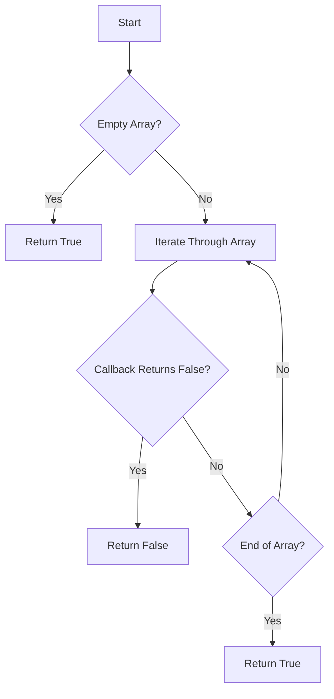

# JS Array: Implement every()

## Problem Understanding
The problem is asking to implement the `every()` function for a JavaScript array, which returns `true` if all elements in the array pass the test implemented by the provided callback function, and `false` otherwise. The key constraint here is that the function should iterate through each element in the array and apply the callback function to it, returning `false` as soon as it encounters an element that fails the test. What makes this problem non-trivial is handling edge cases, such as an empty array or an array with a mix of elements that pass and fail the test, and ensuring the function behaves correctly in these scenarios.

## Approach
The algorithm strategy is to iterate through the array using a for loop and apply the callback function to each element. The intuition behind this approach is to take advantage of the short-circuit behavior of the `every()` function, where if any element fails the test, the function immediately returns `false`. The `every()` function uses a callback function as a parameter, which allows for flexible testing of array elements. The approach handles key constraints by checking each element individually and returning `false` as soon as an element fails the test, thus avoiding unnecessary iterations.

## Complexity Analysis
| Metric | Value | Detailed Reason |
|--------|-------|----------------|
| Time   | O(n)  | The function iterates through the array once, where n is the number of elements in the array. In the worst-case scenario, it checks every element. |
| Space  | O(1)  | The function uses a constant amount of space to store the loop variable and the callback function result, regardless of the size of the input array. |

## Algorithm Walkthrough
```
Input: [1, 2, 3, 4, 5]
Step 1: i = 0, callback(1, 0, [1, 2, 3, 4, 5]) returns true
Step 2: i = 1, callback(2, 1, [1, 2, 3, 4, 5]) returns true
Step 3: i = 2, callback(3, 2, [1, 2, 3, 4, 5]) returns true
Step 4: i = 3, callback(4, 3, [1, 2, 3, 4, 5]) returns true
Step 5: i = 4, callback(5, 4, [1, 2, 3, 4, 5]) returns true
Output: true
```
This example demonstrates the `every()` function with a callback that checks if each element is greater than 0.

## Visual Flow

This flowchart illustrates the decision flow of the `every()` function, including handling the empty array edge case and short-circuiting when an element fails the test.

## Key Insight
> **Tip:** The key to implementing `every()` efficiently is to return `false` as soon as any element fails the test, which minimizes unnecessary iterations through the array.

## Edge Cases
- **Empty array**: The function returns `true` because there are no elements to test.
- **Single element**: The function applies the callback to the single element and returns the result of the callback.
- **Array with a mix of elements that pass and fail the test**: The function returns `false` as soon as it encounters an element that fails the test.

## Common Mistakes
- **Mistake 1**: Not handling the empty array edge case correctly → To avoid this, explicitly check for an empty array at the beginning of the function and return `true`.
- **Mistake 2**: Not short-circuiting when an element fails the test → To avoid this, use a `return false` statement as soon as the callback returns `false` for any element.

## Interview Follow-ups
> **Interview:** These are the exact follow-up questions interviewers ask:
- "What if the input is sorted?" → The implementation of `every()` does not rely on the input being sorted, so the function works correctly regardless of the order of elements.
- "Can you do it in O(1) space?" → Yes, the provided implementation already uses O(1) space because it only uses a constant amount of space to store the loop variable and the callback result.
- "What if there are duplicates?" → The presence of duplicates does not affect the correctness of the `every()` function, as it checks each element individually and returns `false` as soon as any element fails the test.

## Javascript Solution

```javascript
// Problem: JS Array: Implement every()
// Language: javascript
// Difficulty: Easy
// Time Complexity: O(n) — iterate through the array and check each element
// Space Complexity: O(1) — no additional space used
// Approach: Iterate through array and check each element with callback function

/**
 * Implement every() function for JavaScript array.
 * @param {Array} arr - The input array.
 * @param {Function} callback - The callback function.
 * @returns {Boolean} True if all elements pass the test, false otherwise.
 */
function every(arr, callback) {
    // Edge case: empty array → return true
    if (arr.length === 0) return true;
    
    // Iterate through the array and check each element with callback function
    for (let i = 0; i < arr.length; i++) {
        // If any element fails the test, return false
        if (!callback(arr[i], i, arr)) return false;
    }
    
    // If all elements pass the test, return true
    return true;
}

// Example usage:
let arr = [1, 2, 3, 4, 5];
let result = every(arr, (element) => element > 0);
console.log(result); // Output: true

// Example usage with empty array:
let emptyArr = [];
let resultEmpty = every(emptyArr, (element) => element > 0);
console.log(resultEmpty); // Output: true

// Example usage with edge case:
let edgeCaseArr = [1, 2, 3, -4, 5];
let resultEdgeCase = every(edgeCaseArr, (element) => element > 0);
console.log(resultEdgeCase); // Output: false
```
