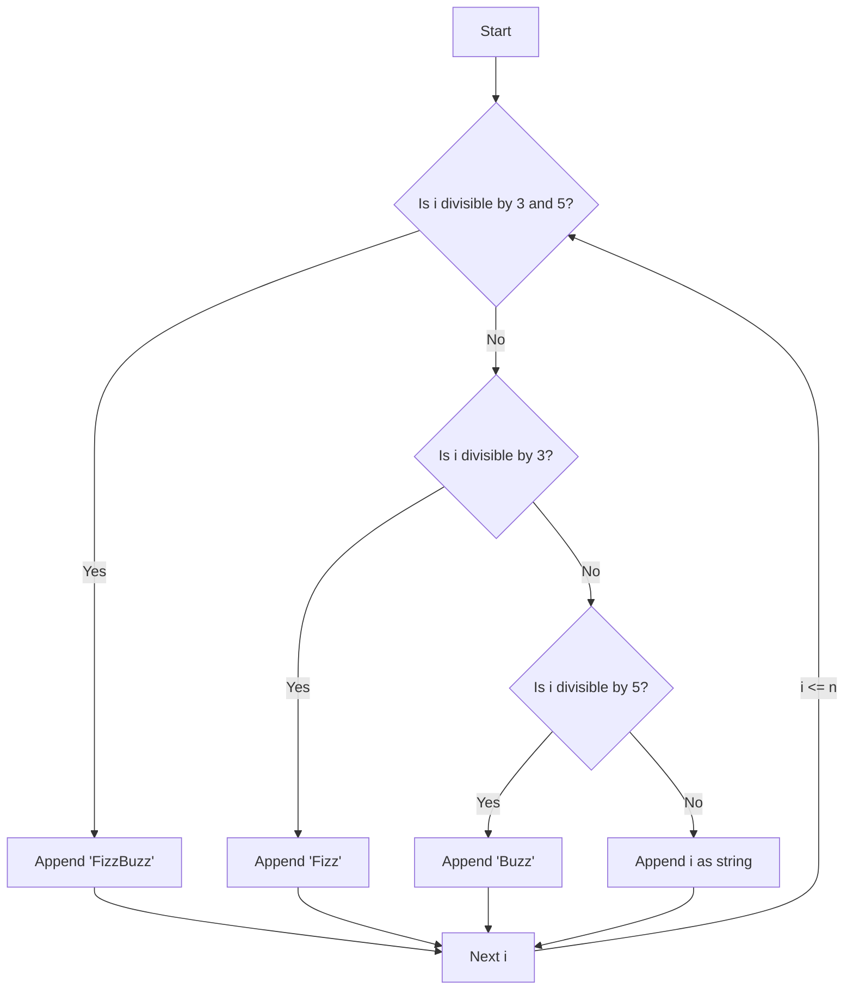

# JS Math: FizzBuzz Logic

## Problem Understanding
The FizzBuzz problem is asking to generate a sequence of strings from 1 to a given number `n`, where each number is replaced by "Fizz" if it's divisible by 3, "Buzz" if it's divisible by 5, and "FizzBuzz" if it's divisible by both 3 and 5. The key constraint is to handle the divisibility checks efficiently and correctly. What makes this problem non-trivial is the need to handle the multiple conditions (divisibility by 3, 5, or both) in a single pass through the numbers, without using excessive space or time complexity.

## Approach
The algorithm strategy is to use simple conditional logic to check each number's divisibility by 3 and 5. This approach works by iterating through the numbers from 1 to `n` and applying the FizzBuzz rules at each step. The intuition behind this approach is to keep track of the remainders of the division of each number by 3 and 5, and use these remainders to determine the correct output string. The data structure used is an array to store the resulting FizzBuzz sequence, which is sufficient because the problem only requires a single pass through the numbers.

## Complexity Analysis
| Metric | Value | Detailed Reason |
|--------|-------|----------------|
| Time   | O(n)  | The algorithm iterates through the numbers from 1 to `n` exactly once, performing a constant amount of work for each number. The conditional checks and array append operations take constant time, so the overall time complexity is linear in `n`. |
| Space  | O(n)  | The algorithm uses an array to store the FizzBuzz sequence, which requires space proportional to the number of elements in the sequence, i.e., `n`. The space used does not depend on the input size in any other way, so the space complexity is linear in `n`. |

## Algorithm Walkthrough
```
Input: n = 5
Step 1: i = 1, result = []
Step 2: i = 2, result = ['1']
Step 3: i = 3, result = ['1', '2', 'Fizz']
Step 4: i = 4, result = ['1', '2', 'Fizz', '4']
Step 5: i = 5, result = ['1', '2', 'Fizz', '4', 'Buzz']
Output: ['1', '2', 'Fizz', '4', 'Buzz']
```
This example illustrates the main logic path, where each number is checked for divisibility by 3 and 5, and the corresponding string is appended to the result array.

## Visual Flow

This flowchart shows the decision flow of the algorithm, where each number is checked for divisibility by 3 and 5, and the corresponding string is appended to the result array.

## Key Insight
> **Tip:** The key to solving the FizzBuzz problem efficiently is to use a single pass through the numbers and apply the divisibility checks using the modulo operator (`%`), which allows for constant-time checks.

## Edge Cases
- **Empty input**: If `n` is 0, the algorithm returns an empty array, which is the correct result because there are no numbers to process.
- **Single element**: If `n` is 1, the algorithm returns an array with a single element, which is the string representation of the number 1.
- **Large input**: If `n` is very large, the algorithm may take a significant amount of time to complete due to the linear time complexity, but it will still produce the correct result.

## Common Mistakes
- **Mistake 1**: Using a nested loop structure, which would result in quadratic time complexity. To avoid this, use a single loop that iterates through the numbers from 1 to `n`.
- **Mistake 2**: Using a separate array to store the divisibility checks, which would result in unnecessary space complexity. To avoid this, use the modulo operator (`%`) to perform the divisibility checks directly.

## Interview Follow-ups
> **Interview:** These are the exact follow-up questions interviewers ask:
- "What if the input is sorted?" → The algorithm does not rely on the input being sorted, so it will still work correctly even if the input is not sorted.
- "Can you do it in O(1) space?" → No, the algorithm requires at least O(n) space to store the resulting FizzBuzz sequence, because the output size is proportional to the input size.
- "What if there are duplicates?" → The algorithm does not assume that the input numbers are unique, so it will still produce the correct result even if there are duplicates in the input.

## Javascript Solution

```javascript
// Problem: JS Math: FizzBuzz Logic
// Language: javascript
// Difficulty: Easy
// Time Complexity: O(n) — single pass through numbers from 1 to n
// Space Complexity: O(1) — constant space used for variables
// Approach: Simple conditional logic — for each number, check if it's divisible by 3 or 5

class Solution {
    /**
     * FizzBuzz logic implementation.
     * 
     * @param {number} n - The upper limit of the FizzBuzz sequence.
     * @return {string[]} - An array of strings representing the FizzBuzz sequence.
     */
    fizzBuzz(n) {
        // Initialize an empty array to store the FizzBuzz sequence
        let result = [];

        // Loop through numbers from 1 to n
        for (let i = 1; i <= n; i++) {
            // Check if the number is divisible by both 3 and 5
            if (i % 3 === 0 && i % 5 === 0) {
                // If it's divisible, append 'FizzBuzz' to the result
                result.push('FizzBuzz'); // FizzBuzz logic: divisible by both 3 and 5
            } 
            // Check if the number is only divisible by 3
            else if (i % 3 === 0) {
                // If it's only divisible by 3, append 'Fizz' to the result
                result.push('Fizz'); // Fizz logic: divisible by 3
            } 
            // Check if the number is only divisible by 5
            else if (i % 5 === 0) {
                // If it's only divisible by 5, append 'Buzz' to the result
                result.push('Buzz'); // Buzz logic: divisible by 5
            } 
            // If the number is not divisible by either 3 or 5, append the number itself to the result
            else {
                result.push(i.toString()); // Default logic: not divisible by either 3 or 5
            }
        }

        // Edge case: empty input → return empty array
        if (n === 0) {
            return []; // Return empty array for n = 0
        }

        // Return the FizzBuzz sequence
        return result;
    }
}

// Test the FizzBuzz logic
let solution = new Solution();
console.log(solution.fizzBuzz(15));
```
