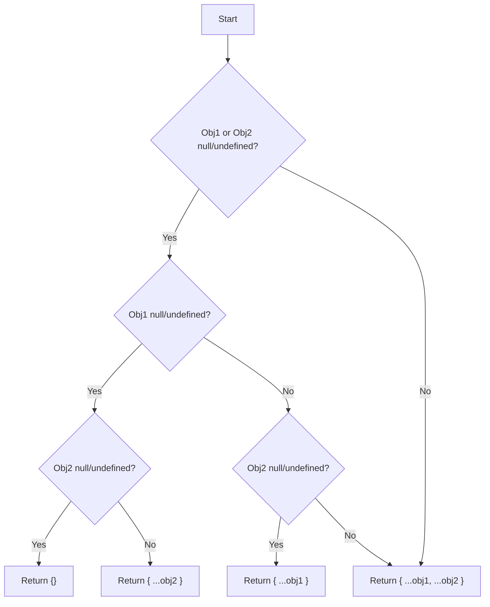

# JS Object: Merge Two Objects

## Problem Understanding
The problem is asking to merge two JavaScript objects into a new object, preserving all properties from both objects and handling any potential duplicate keys by overriding them with the values from the second object. The key constraint here is to ensure that the merge operation does not modify the original objects and handles null or undefined inputs gracefully. What makes this problem non-trivial is the need to handle edge cases such as null or undefined inputs and duplicate keys in an efficient manner. The problem requires a solution that can handle these constraints while providing a straightforward and efficient way to merge objects.

## Approach
The algorithm strategy employed here is to use the spread operator (`...`) to merge the two objects into a new object. This approach works because the spread operator allows for the easy concatenation of properties from one object to another, and it naturally handles the overriding of duplicate keys with the values from the second object. The mathematical/logical reasoning behind this approach is based on the properties of the spread operator and how it interacts with JavaScript objects. The data structure used is a new JavaScript object that stores the properties from both input objects. This approach handles key constraints such as null or undefined inputs by explicitly checking for these conditions and returning the appropriate result.

## Complexity Analysis
| Metric | Value | Detailed Reason |
|--------|-------|----------------|
| Time   | O(n + m) | The time complexity is O(n + m) where n and m are the number of properties in obj1 and obj2, respectively. This is because the spread operator iterates over all properties in both objects once. |
| Space  | O(n + m) | The space complexity is O(n + m) because a new object is created that stores all properties from both obj1 and obj2. This requires additional space proportional to the total number of properties in both objects. |

## Algorithm Walkthrough
```
Input: obj1 = { a: 1, b: 2 }, obj2 = { b: 3, c: 4 }
Step 1: Check if obj1 or obj2 is null or undefined. Since neither is null or undefined, proceed to the merge step.
Step 2: Use the spread operator to merge obj1 and obj2 into a new object: { ...obj1, ...obj2 }
Step 3: The spread operator iterates over obj1, adding its properties to the new object: { a: 1, b: 2 }
Step 4: Then, it iterates over obj2, adding its properties to the new object and overriding any duplicate keys: { a: 1, b: 3, c: 4 }
Output: { a: 1, b: 3, c: 4 }
```

## Visual Flow


## Key Insight
> **Tip:** The key insight here is that the spread operator (`...`) can be used to efficiently merge objects in JavaScript, handling duplicate keys by overriding them with the values from the second object, making it a simple yet powerful tool for object merging.

## Edge Cases
- **Empty/null input**: If both objects are null or undefined, the function returns an empty object (`{}`). This is because there are no properties to merge, and returning an empty object is the most sensible default behavior.
- **Single element**: If one of the objects has only a single element, the function still merges the objects correctly, preserving the single element and any elements from the second object.
- **Duplicate keys**: The function handles duplicate keys by overriding the values from the first object with the values from the second object, ensuring that the resulting object contains the most up-to-date values for all keys.

## Common Mistakes
- **Mistake 1**: Not checking for null or undefined inputs. → To avoid this, always explicitly check for null or undefined inputs at the beginning of the function.
- **Mistake 2**: Modifying the original objects. → To avoid this, ensure that the merge operation creates a new object instead of modifying the existing ones.

## Interview Follow-ups
> **Interview:** 
- "What if the input is sorted?" → The solution does not assume or require the input objects to be sorted in any particular order. The spread operator merges the objects based on the property names, not their order.
- "Can you do it in O(1) space?" → No, achieving O(1) space complexity is not possible because the merge operation requires creating a new object that stores all properties from both input objects, necessitating additional space.
- "What if there are duplicates?" → The solution handles duplicates by overriding the values from the first object with the values from the second object, ensuring that the resulting object contains the most up-to-date values for all keys.

## Javascript Solution

```javascript
// Problem: JS Object: Merge Two Objects
// Language: javascript
// Difficulty: easy
// Time Complexity: O(n + m) — where n and m are the number of properties in obj1 and obj2
// Space Complexity: O(n + m) — new object stores properties from both obj1 and obj2
// Approach: using the spread operator to merge objects

class Solution {
    /**
     * Merge two objects into a new object.
     * 
     * @param {Object} obj1 - The first object to merge.
     * @param {Object} obj2 - The second object to merge.
     * @return {Object} A new object containing properties from both obj1 and obj2.
     */
    mergeObjects(obj1, obj2) {
        // Check for null or undefined inputs
        if (!obj1 && !obj2) return {}; // Edge case: both objects are null or undefined → return empty object
        if (!obj1) return { ...obj2 }; // Edge case: obj1 is null or undefined → return obj2
        if (!obj2) return { ...obj1 }; // Edge case: obj2 is null or undefined → return obj1

        // Use the spread operator to merge obj1 and obj2 into a new object
        return { ...obj1, ...obj2 }; // Merge properties from obj1 and obj2, overriding any duplicate keys with the values from obj2
    }
}

// Example usage:
let solution = new Solution();
let obj1 = { a: 1, b: 2 };
let obj2 = { b: 3, c: 4 };
let result = solution.mergeObjects(obj1, obj2);
console.log(result); // Output: { a: 1, b: 3, c: 4 }
```
