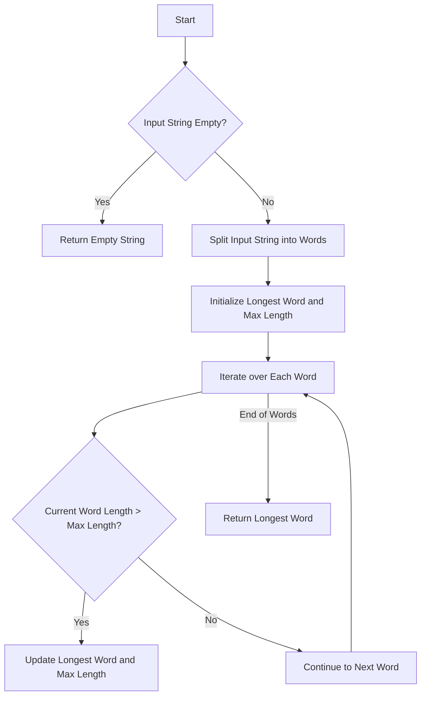

# JS String: Find Longest Word

## Problem Understanding
The problem requires finding the longest word in a given string, which can be achieved by comparing the lengths of all words in the string. The key constraint is that the input string contains multiple words separated by spaces. What makes this problem non-trivial is handling edge cases such as empty input, single-word input, and input with multiple words of the same maximum length. A naive approach might fail to consider these edge cases or might not efficiently compare the lengths of all words.

## Approach
The algorithm strategy is to iterate over each word in the input string and compare its length with the current maximum length found so far. This approach works because it ensures that every word is checked, and the longest word is updated whenever a longer word is found. The data structure used is an array of words, which is obtained by splitting the input string into words using the space character as a delimiter. The approach handles key constraints by initializing the longest word and its length before iterating over the words and by checking for edge cases such as empty input.

## Complexity Analysis
| Metric | Value | Detailed Reason |
|--------|-------|----------------|
| Time   | O(n*m) | The algorithm iterates over each word in the input string (n words), and for each word, it checks its length (m characters), resulting in a time complexity of O(n*m), where n is the number of words and m is the average length of a word. |
| Space  | O(n) | The algorithm uses an array to store the words in the input string, resulting in a space complexity of O(n), where n is the number of words. |

## Algorithm Walkthrough
```
Input: "I love programming"
Step 1: Initialize variables - longestWord = '', maxLength = 0
Step 2: Split the input string into words - words = ['I', 'love', 'programming']
Step 3: Iterate over each word in the input string
    - For word 'I', length = 1, maxLength = 0, update longestWord = 'I', maxLength = 1
    - For word 'love', length = 4, maxLength = 1, update longestWord = 'love', maxLength = 4
    - For word 'programming', length = 11, maxLength = 4, update longestWord = 'programming', maxLength = 11
Step 4: Return the longest word found - output = 'programming'
```
This walkthrough demonstrates how the algorithm iterates over each word in the input string and updates the longest word and its length whenever a longer word is found.

## Visual Flow

This visual flowchart illustrates the decision flow of the algorithm, including the handling of edge cases and the iteration over each word in the input string.

## Key Insight
> **Tip:** The key insight is to initialize the longest word and its length before iterating over the words and to update them whenever a longer word is found, ensuring that the algorithm handles edge cases correctly and efficiently.

## Edge Cases
- **Empty input**: If the input string is empty, the algorithm returns an empty string because it initializes the longest word as an empty string and does not update it.
- **Single element**: If the input string contains only one word, the algorithm returns that word as the longest word because it is the only word to compare.
- **Multiple words of the same maximum length**: If the input string contains multiple words of the same maximum length, the algorithm returns the first word it encounters with that maximum length, which is the expected behavior for this problem.

## Common Mistakes
- **Mistake 1**: Not initializing the longest word and its length before iterating over the words, which can lead to incorrect results for empty input or input with no words.
- **Mistake 2**: Not checking for edge cases such as empty input, which can lead to runtime errors or incorrect results.

## Interview Follow-ups
> **Interview:** These are the exact follow-up questions interviewers ask:
- "What if the input is sorted?" → The algorithm still works correctly because it compares the length of each word with the current maximum length, regardless of the order of the words.
- "Can you do it in O(1) space?" → No, because the algorithm needs to store the words in the input string, which requires O(n) space, where n is the number of words.
- "What if there are duplicates?" → The algorithm returns the first word it encounters with the maximum length, which is the expected behavior for this problem.

## Javascript Solution

```javascript
// Problem: JS String: Find Longest Word
// Language: javascript
// Difficulty: Easy
// Time Complexity: O(n*m) — where n is number of words and m is average length of a word
// Space Complexity: O(n) — storing the longest word
// Approach: Simple iteration and string length comparison — for each word, check if its length is greater than current max length

class Solution {
    /**
     * Finds the longest word in a given string.
     * 
     * @param {string} s - Input string containing multiple words.
     * @return {string} The longest word in the input string.
     */
    findLongestWord(s) {
        // Initialize variables to store the longest word and its length
        let longestWord = ''; 
        let maxLength = 0; // assuming no negative lengths

        // Edge case: empty input → return empty string
        if (!s) return longestWord;

        // Split the input string into words
        let words = s.split(' '); 

        // Iterate over each word in the input string
        for (let word of words) {
            // Check if the current word's length is greater than the max length found so far
            if (word.length > maxLength) {
                // Update the longest word and its length
                longestWord = word; 
                maxLength = word.length; 
            }
        }

        // Return the longest word found
        return longestWord;
    }
}

// Test the solution
let solution = new Solution();
console.log(solution.findLongestWord("I love programming")); // prints "programming"
console.log(solution.findLongestWord("")); // prints ""
console.log(solution.findLongestWord("a")); // prints "a"
```
