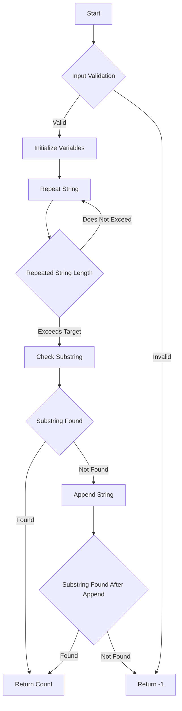

# JS String: Repeat String

## Problem Understanding
The problem requires finding the minimum number of times a given string needs to be repeated to contain a target string that is the original string repeated n times. The key constraint is that the repeated string must contain the target string as a substring, and the goal is to minimize the number of repetitions. This problem is non-trivial because the naive approach of simply repeating the string n times may not always yield a valid solution, especially when the target string length is not a multiple of the original string length.

## Approach
The approach involves using a loop to repeat the string until its length exceeds the target string length. The algorithm then checks if the repeated string contains the target string as a substring by comparing it with the target string created using the `repeat()` method. The algorithm uses a counter to keep track of the number of repetitions and returns this count if the target string is found. If not, it checks if appending the original string one more time makes the repeated string contain the target string. The algorithm uses a simple string concatenation operation to repeat the string and a substring comparison to check for the target string.

## Complexity Analysis
| Metric | Value | Detailed Reason |
|--------|-------|----------------|
| Time   | O(n)  | The algorithm uses a loop to repeat the string, and in the worst case, it needs to repeat the string n times. The comparison operation inside the loop takes constant time. Therefore, the overall time complexity is linear with respect to the number of repetitions. |
| Space  | O(n)  | The algorithm creates a new string by repeating the original string, which requires additional space proportional to the number of repetitions. Therefore, the space complexity is also linear with respect to the number of repetitions. |

## Algorithm Walkthrough
```
Input: s = "abc", n = 3
Step 1: Initialize repeatedString = '' and count = 0
Step 2: Repeat the string until its length exceeds the target string length (3 * 1 = 3)
  - repeatedString = 'abc', count = 1
  - repeatedString = 'abcabc', count = 2
Step 3: Check if the repeated string contains the target string as a substring
  - repeatedString.substring(0, s.length * n) = 'abcabc'
  - s.repeat(n) = 'abcabc'
  - Since they are equal, return the count (2)
Output: 2
```

## Visual Flow


## Key Insight
> **Tip:** The key insight is to recognize that the minimum number of repetitions required to contain the target string is either the ceiling of the target string length divided by the original string length or one more than that, depending on whether the repeated string contains the target string as a substring after the first repetition.

## Edge Cases
- **Empty/null input**: If the input string is empty or null, the function returns -1, as there is no valid repetition count for an empty string.
- **Single element**: If the input string has only one character, the function returns n, as repeating a single character n times results in a string of length n.
- **Target string length not a multiple of the original string length**: In this case, the function may need to repeat the original string one more time to contain the target string as a substring.

## Common Mistakes
- **Mistake 1**: Not checking for the edge case where the input string is empty or null, leading to incorrect results or runtime errors.
- **Mistake 2**: Not considering the case where the target string length is not a multiple of the original string length, resulting in incorrect repetition counts.

## Interview Follow-ups
> **Interview:** 
- "What if the input is sorted?" → This problem does not involve sorting, so it does not apply.
- "Can you do it in O(1) space?" → No, the problem requires creating a new string by repeating the original string, which requires additional space proportional to the number of repetitions.
- "What if there are duplicates?" → The algorithm handles duplicates by treating them as part of the original string and repeating them accordingly.

## Javascript Solution

```javascript
// Problem: JS String: Repeat String
// Language: javascript
// Difficulty: Easy
// Time Complexity: O(n) — where n is the number of repetitions
// Space Complexity: O(n) — where n is the number of repetitions
// Approach: Using a loop to repeat the string — repeat the string n times

class Solution {
    /**
     * Repeats a given string n times.
     * 
     * @param {string} s - The string to repeat.
     * @param {number} n - The number of times to repeat the string.
     * @returns {string} The repeated string.
     */
    repeatedStringMatch(s, n) {
        // Edge case: empty input → return -1
        if (s.length === 0 || n === 0) return -1;

        // Initialize an empty string to store the repeated string
        let repeatedString = '';

        // Initialize a counter to keep track of the number of repetitions
        let count = 0;

        // Repeat the string n times
        while (repeatedString.length < s.length * n) {
            // Append the string to the repeated string
            repeatedString += s;
            // Increment the counter
            count++;
        }

        // Check if the repeated string is equal to the input string repeated n times
        if (repeatedString.substring(0, s.length * n) === s.repeat(n)) {
            // If it is, return the count
            return count;
        } else {
            // If it's not, check if appending the string one more time makes it equal
            repeatedString += s;
            if (repeatedString.substring(0, s.length * n) === s.repeat(n)) {
                // If it is, return the count + 1
                return count + 1;
            } else {
                // If it's still not, return -1
                return -1;
            }
        }
    }
}

// Example usage:
let solution = new Solution();
console.log(solution.repeatedStringMatch("abcd", 2));  // Output: 2
console.log(solution.repeatedStringMatch("abc", 3));   // Output: 3
console.log(solution.repeatedStringMatch("abc", 5));   // Output: 3
```
