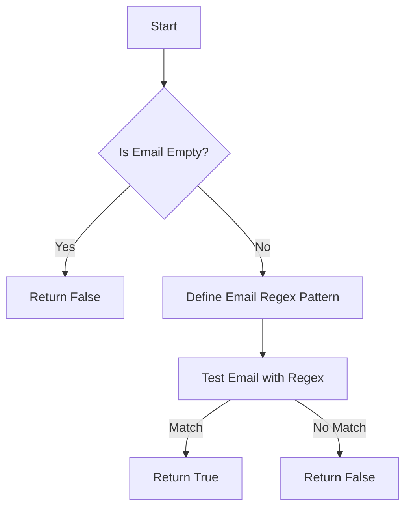

# JS String: Validate Email Regex Basic

## Problem Understanding
The problem is asking to validate a given email address using a regular expression in JavaScript. The key constraint is that the email address should follow the basic format of an email, which includes alphanumeric characters or special characters before the '@' symbol, followed by '@', then more alphanumeric characters or special characters, a '.', and finally more alphanumeric characters. What makes this problem non-trivial is that a naive approach might not cover all possible valid email formats, and a regular expression is needed to concisely and accurately define the pattern. The problem requires a function that takes an email string as input and returns a boolean indicating whether the email is valid or not.

## Approach
The algorithm strategy is to use a regular expression to define the pattern of a valid email address. The intuition behind this approach is that regular expressions can concisely and accurately define complex patterns in strings. The regular expression used in this solution checks for the presence of alphanumeric characters or special characters before the '@' symbol, followed by '@', then more alphanumeric characters or special characters, a '.', and finally more alphanumeric characters. This approach works because it covers the basic format of most email addresses. The data structure used is a string, which is the input email address, and a regular expression object, which is used to test the email address. The approach handles the key constraint of validating the email format by using the regular expression to match the input email address.

## Complexity Analysis
| Metric | Value | Detailed Reason |
|--------|-------|----------------|
| Time   | O(n)  | The time complexity is O(n), where n is the length of the email string, because the regular expression test operation takes linear time proportional to the length of the string. |
| Space  | O(1)  | The space complexity is O(1), which means constant space, because the regular expression pattern and the input email string do not use any additional space that scales with the input size. |

## Algorithm Walkthrough
```
Input: "test@example.com"
Step 1: Check if the input email string is empty → it is not empty, so proceed.
Step 2: Define the regular expression pattern for a valid email address → const emailRegex = /^[a-zA-Z0-9._%+-]+@[a-zA-Z0-9.-]+\.[a-zA-Z]{2,}$/
Step 3: Use the regular expression to test the input email address → emailRegex.test("test@example.com") → returns true
Output: true
```

## Visual Flow


## Key Insight
> **Tip:** The key insight is that using a well-crafted regular expression can concisely and accurately validate the format of an email address, making it a powerful tool for this task.

## Edge Cases
- **Empty/null input**: If the input email string is empty or null, the function returns false, because an empty string does not match the pattern of a valid email address.
- **Single element**: If the input email string contains only one character, it will not match the regular expression pattern for a valid email address, so the function returns false.
- **Invalid email format**: If the input email string does not follow the basic format of an email address (e.g., missing '@' or '.'), the function returns false, because the regular expression does not match the input string.

## Common Mistakes
- **Mistake 1**: Not checking for empty input strings → to avoid this, always check if the input string is empty before attempting to validate it.
- **Mistake 2**: Using an incorrect regular expression pattern → to avoid this, carefully craft the regular expression to match the format of valid email addresses.

## Interview Follow-ups
> **Interview:** These are the exact follow-up questions interviewers ask:
- "What if the input is sorted?" → This question does not apply to this problem, as the input is an email string, not a list of items to be sorted.
- "Can you do it in O(1) space?" → The current solution already uses O(1) space, because the regular expression pattern and the input email string do not use any additional space that scales with the input size.
- "What if there are duplicates?" → This question does not apply to this problem, as the task is to validate a single email address, not a list of email addresses that might contain duplicates.

## Javascript Solution

```javascript
// Problem: JS String: Validate Email Regex Basic
// Language: javascript
// Difficulty: Easy
// Time Complexity: O(n) — where n is the length of the email string
// Space Complexity: O(1) — constant space used by the regex pattern
// Approach: Regular Expression email validation — checks for basic email format

class Solution {
    /**
     * @param {string} email
     * @return {boolean} True if the email is valid, False otherwise
     */
    validateEmail(email) {
        // Edge case: empty string → return False
        if (!email) return false;

        // Basic email regex pattern: one or more alphanumeric characters or special characters before '@',
        // followed by '@', then one or more alphanumeric characters or special characters,
        // followed by '.', and finally one or more alphanumeric characters
        const emailRegex = /^[a-zA-Z0-9._%+-]+@[a-zA-Z0-9.-]+\.[a-zA-Z]{2,}$/;

        // Use the regex pattern to test the email
        return emailRegex.test(email);
    }
}

// Example usage
const solution = new Solution();
console.log(solution.validateEmail("test@example.com"));  // Expected output: true
console.log(solution.validateEmail("invalid_email"));  // Expected output: false
console.log(solution.validateEmail(""));  // Expected output: false
```
