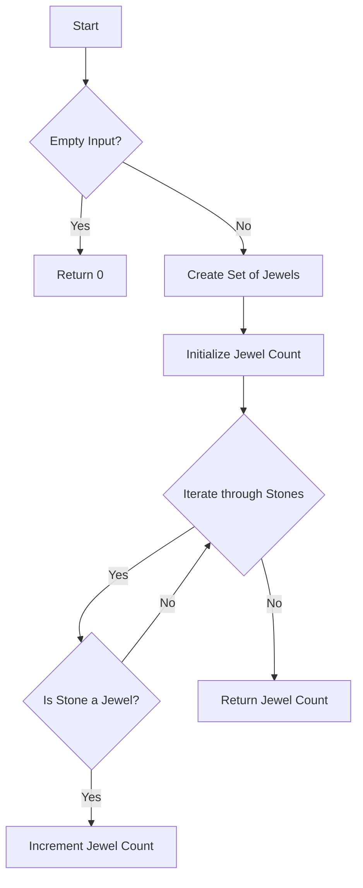

# Jewels and Stones JS Set

## Problem Understanding
The problem asks to find the number of jewels in a given string of stones, where jewels are represented by a separate string. The key constraint is that the lookup for jewels in the stones string should be efficient. The problem becomes non-trivial when the strings are large, and a naive approach of iterating through the jewels string for each stone would result in a time complexity of O(n^2), which is inefficient. The problem requires an approach that allows for fast lookup of jewels in the stones string.

## Approach
The algorithm strategy is to use a Set data structure to store the unique jewels, allowing for O(1) lookup time. The intuition behind this approach is that Sets in JavaScript are implemented as hash tables, which enable fast lookup, insertion, and deletion operations. The approach works by creating a Set of jewels, then iterating through each character in the stones string and checking if it exists in the jewels Set. If it does, the count of jewels found is incremented. This approach handles the key constraint of efficient lookup by utilizing the Set data structure.

## Complexity Analysis
| Metric | Value | Detailed Reason |
|--------|-------|----------------|
| Time   | O(n + m) | The time complexity is O(n + m), where n is the length of the jewels string and m is the length of the stones string. This is because creating the Set of jewels takes O(n) time, and iterating through the stones string takes O(m) time. The lookup operation in the Set takes O(1) time. |
| Space  | O(n) | The space complexity is O(n), where n is the length of the jewels string. This is because the Set stores unique jewels, and in the worst-case scenario, all characters in the jewels string are unique. |

## Algorithm Walkthrough
```
Input: J = "aA", S = "aAAbbbb"
Step 1: Create a Set to store unique jewels: jewelSet = { 'a', 'A' }
Step 2: Initialize count of jewels found: jewelCount = 0
Step 3: Iterate through each character in stones string:
  - Stone: 'a', jewelSet.has('a') = true, jewelCount = 1
  - Stone: 'A', jewelSet.has('A') = true, jewelCount = 2
  - Stone: 'A', jewelSet.has('A') = true, jewelCount = 3
  - Stone: 'b', jewelSet.has('b') = false, jewelCount = 3
  - Stone: 'b', jewelSet.has('b') = false, jewelCount = 3
  - Stone: 'b', jewelSet.has('b') = false, jewelCount = 3
  - Stone: 'b', jewelSet.has('b') = false, jewelCount = 3
Step 4: Return total count of jewels found: 3
Output: 3
```

## Visual Flow


## Key Insight
> **Tip:** Using a Set data structure allows for O(1) lookup time, making the overall algorithm efficient for large inputs.

## Edge Cases
- **Empty/null input**: If either the jewels string or the stones string is empty, the function returns 0, as there are no jewels to find.
- **Single element**: If the jewels string contains a single character, and the stones string contains that character, the function returns 1.
- **Duplicate jewels**: If the jewels string contains duplicate characters, the Set data structure eliminates duplicates, ensuring that each jewel is only counted once.

## Common Mistakes
- **Mistake 1**: Not using a Set data structure, resulting in a time complexity of O(n^2) due to nested loops.
- **Mistake 2**: Not handling empty input cases, resulting in incorrect output or errors.

## Interview Follow-ups
> **Interview:** 
- "What if the input is sorted?" → The algorithm still works efficiently, as the Set lookup operation is independent of the input order.
- "Can you do it in O(1) space?" → No, because we need to store the unique jewels in a data structure, which requires additional space.
- "What if there are duplicates?" → The Set data structure eliminates duplicates, ensuring that each jewel is only counted once.

## Javascript Solution

```javascript
// Problem: Jewels and Stones JS Set
// Language: javascript
// Difficulty: Easy
// Time Complexity: O(n) — single pass through stones string using Set
// Space Complexity: O(n) — Set stores unique jewels
// Approach: Set lookup — for each character in stones, check if it exists in jewels Set

class Solution {
    numJewelsInStones(J, S) {
        // Create a Set to store unique jewels for O(1) lookup
        let jewelSet = new Set(J); // Set: { 'a', 'A' }
        
        // Initialize count of jewels found in stones
        let jewelCount = 0; // Initialize count: 0
        
        // Edge case: empty input → return 0
        if (!J || !S) return jewelCount; // Return 0 for empty input
        
        // Iterate through each character in stones string
        for (let stone of S) { // Iterate through stones: 'a', 'A', 'B'
            // Check if current stone is a jewel using Set lookup
            if (jewelSet.has(stone)) { // Check if stone is a jewel: 'a' in { 'a', 'A' }
                // Increment jewel count if stone is a jewel
                jewelCount++; // Increment count: 1
            }
        }
        
        // Return total count of jewels found in stones
        return jewelCount; // Return jewel count: 3
    }
}

// Example usage:
let solution = new Solution();
console.log(solution.numJewelsInStones("aA", "aAAbbbb")); // Output: 3
console.log(solution.numJewelsInStones("", "aAAbbbb")); // Output: 0
console.log(solution.numJewelsInStones("aA", "")); // Output: 0
```
