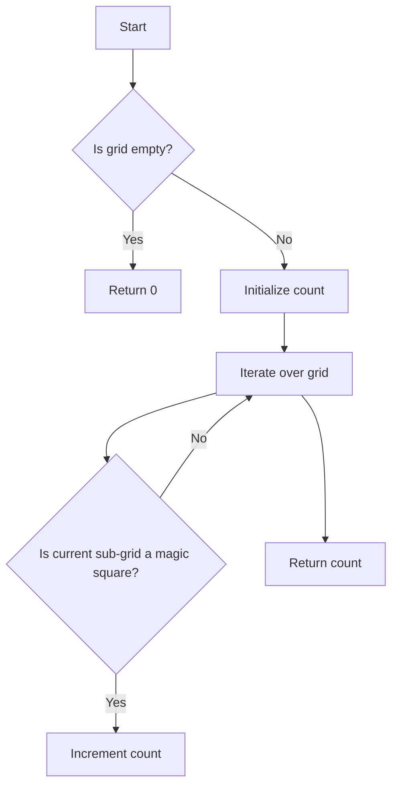

# Magic Squares In Grid JS

## Problem Understanding
The problem asks us to find the number of 3x3 magic squares inside a given grid. A magic square is a 3x3 sub-grid where the sum of each row, column, and diagonal is the same, and all numbers are distinct and between 1 and 9. The key constraint is that the grid can be of any size, and we need to find all possible 3x3 magic squares inside it. This problem is non-trivial because it requires us to iterate over the grid and check every possible 3x3 sub-grid to see if it's a magic square, which can be time-consuming for large grids.

## Approach
The algorithm strategy is to use a brute-force approach, iterating over the grid and checking every possible 3x3 sub-grid to see if it's a magic square. The intuition behind this approach is that we need to check every possible sub-grid to ensure that we don't miss any magic squares. We use a helper function `isMagicSquare` to check if a given sub-grid is a magic square. This function checks the sum of each row, column, and diagonal, as well as the distinctness of the numbers. We use a `Set` data structure to store the numbers in the sub-grid and check for distinctness.

## Complexity Analysis
| Metric | Value | Detailed Reason |
|--------|-------|----------------|
| Time   | O(m * n * k) | The time complexity is O(m * n * k) where m and n are the dimensions of the grid and k is the side length of the magic square (which is 3 in this case). This is because we iterate over the grid and check every possible 3x3 sub-grid. The check for each sub-grid takes O(k^2) time, hence the overall time complexity is O(m * n * k^2). However, since k is a constant (3), we can simplify the time complexity to O(m * n * k). |
| Space  | O(1) | The space complexity is O(1) because we only use a constant amount of space to store the magic square sum and the count of magic squares. The `Set` data structure used in the `isMagicSquare` function also uses a constant amount of space because it only stores at most 9 numbers (the numbers in the 3x3 sub-grid). |

## Algorithm Walkthrough
```
Input: 
[
  [4,3,8,4],
  [9,5,1,9],
  [2,7,6,2]
]

Step 1: Initialize the count of magic squares to 0
count = 0

Step 2: Iterate over the grid
i = 0, j = 0

Step 3: Check if the current sub-grid is a magic square
subGrid = 
[
  [4,3,8],
  [9,5,1],
  [2,7,6]
]

Step 4: Check rows, columns, and diagonals
Row 1: 4 + 3 + 8 = 15 (matches magic square sum)
Row 2: 9 + 5 + 1 = 15 (matches magic square sum)
Row 3: 2 + 7 + 6 = 15 (matches magic square sum)
Column 1: 4 + 9 + 2 = 15 (matches magic square sum)
Column 2: 3 + 5 + 7 = 15 (matches magic square sum)
Column 3: 8 + 1 + 6 = 15 (matches magic square sum)
Diagonal 1: 4 + 5 + 6 = 15 (matches magic square sum)
Diagonal 2: 8 + 5 + 2 = 15 (matches magic square sum)

Step 5: Check for distinct numbers
nums = {4, 3, 8, 9, 5, 1, 2, 7, 6} (all numbers are distinct)

Step 6: Increment the count of magic squares
count = 1

Output: 
1
```

## Visual Flow


## Key Insight
> **Tip:** The key insight to solving this problem is to use a brute-force approach and check every possible 3x3 sub-grid to see if it's a magic square, and to use a helper function to check the properties of a magic square.

## Edge Cases
- **Empty grid**: If the grid is empty, the function should return 0, as there are no magic squares to find.
- **Single element grid**: If the grid has only one element, the function should return 0, as a single element cannot form a 3x3 magic square.
- **Grid with no 3x3 sub-grids**: If the grid is too small to contain any 3x3 sub-grids, the function should return 0.

## Common Mistakes
- **Mistake 1**: Not checking for distinct numbers in the sub-grid. This can be avoided by using a `Set` data structure to store the numbers in the sub-grid and checking for distinctness.
- **Mistake 2**: Not checking for the correct magic square sum. This can be avoided by using a constant variable to store the magic square sum and checking against it.

## Interview Follow-ups
> **Interview:** These are the exact follow-up questions interviewers ask:
- "What if the input is sorted?" → The algorithm will still work correctly, as it checks every possible 3x3 sub-grid regardless of the order of the elements.
- "Can you do it in O(1) space?" → No, the algorithm uses a constant amount of space to store the magic square sum and the count of magic squares, but it also uses a `Set` data structure to store the numbers in the sub-grid, which can use up to O(k^2) space in the worst case.
- "What if there are duplicates?" → The algorithm will still work correctly, as it checks for distinct numbers in the sub-grid and only increments the count if all numbers are distinct.

## Javascript Solution

```javascript
// Problem: Magic Squares In Grid
// Language: javascript
// Difficulty: Easy
// Time Complexity: O(m * n * k) — where m and n are the dimensions of the grid and k is the side length of the magic square
// Space Complexity: O(1) — constant space to store the magic square sum and the count of magic squares
// Approach: Brute force iteration over the grid to find all possible magic squares

class Solution {
    /**
     * @param {number[][]} grid
     * @return {number}
     */
    numMagicSquaresInside(grid) {
        // Edge case: empty grid → return 0
        if (!grid.length || !grid[0].length) return 0;

        // Define the magic square sum
        const magicSquareSum = 15; // 1+2+3+4+5+6+7+8+9 = 45, but for 3x3, it's 15

        // Initialize the count of magic squares
        let count = 0;

        // Iterate over the grid
        for (let i = 0; i < grid.length - 2; i++) { // -2 because we're considering 3x3 sub-grids
            for (let j = 0; j < grid[0].length - 2; j++) {
                // Check if the current sub-grid is a magic square
                if (this.isMagicSquare(grid, i, j, magicSquareSum)) {
                    count++;
                }
            }
        }

        return count;
    }

    /**
     * Checks if a given sub-grid is a magic square.
     * @param {number[][]} grid
     * @param {number} row
     * @param {number} col
     * @param {number} magicSquareSum
     * @return {boolean}
     */
    isMagicSquare(grid, row, col, magicSquareSum) {
        // Extract the sub-grid
        const subGrid = [
            [grid[row][col], grid[row][col + 1], grid[row][col + 2]],
            [grid[row + 1][col], grid[row + 1][col + 1], grid[row + 1][col + 2]],
            [grid[row + 2][col], grid[row + 2][col + 1], grid[row + 2][col + 2]],
        ];

        // Check rows
        for (let i = 0; i < 3; i++) {
            let sum = 0;
            for (let j = 0; j < 3; j++) {
                sum += subGrid[i][j];
            }
            if (sum !== magicSquareSum) return false;
        }

        // Check columns
        for (let i = 0; i < 3; i++) {
            let sum = 0;
            for (let j = 0; j < 3; j++) {
                sum += subGrid[j][i];
            }
            if (sum !== magicSquareSum) return false;
        }

        // Check diagonals
        let sum1 = subGrid[0][0] + subGrid[1][1] + subGrid[2][2];
        let sum2 = subGrid[0][2] + subGrid[1][1] + subGrid[2][0];
        if (sum1 !== magicSquareSum || sum2 !== magicSquareSum) return false;

        // Check for distinct numbers
        const nums = new Set();
        for (let i = 0; i < 3; i++) {
            for (let j = 0; j < 3; j++) {
                if (subGrid[i][j] < 1 || subGrid[i][j] > 9) return false; // numbers must be between 1 and 9
                nums.add(subGrid[i][j]);
            }
        }
        if (nums.size !== 9) return false; // all numbers must be distinct

        return true;
    }
}
```
