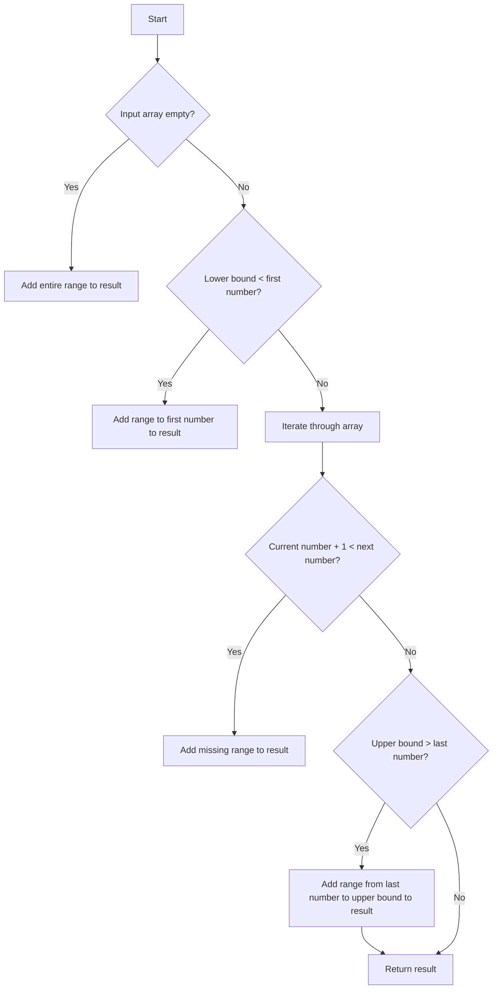

# Missing Ranges JS

## Problem Understanding
The problem of finding missing ranges involves identifying the ranges of numbers that are not present in a given array of numbers, within a specified lower and upper bound. The key constraints are that the input array may be empty, and the lower and upper bounds are inclusive. The problem is non-trivial because a naive approach of checking every number within the bounds would be inefficient, especially for large ranges. A more efficient approach is needed to find the missing ranges.

## Approach
The approach used to solve this problem is a two-pointer technique, iterating through the given array of numbers and adding missing ranges to the output. The algorithm starts by checking if the input array is empty, in which case it adds the entire range to the result. It then checks for missing ranges before the first number, between each pair of numbers, and after the last number in the array. The `getRange` helper function is used to format the missing ranges as strings. This approach works because it efficiently identifies all missing ranges by only checking the boundaries of the given ranges.

## Complexity Analysis
| Metric | Value | Detailed Reason |
|--------|-------|----------------|
| Time   | O(n)  | The algorithm makes a single pass through the input array, performing a constant amount of work for each element. The `getRange` function also performs a constant amount of work. |
| Space  | O(n)  | The output array stores at most n elements, where n is the number of missing ranges. In the worst case, this could be equal to the size of the input array. |

## Algorithm Walkthrough
```
Input: nums = [0, 1, 3, 50, 75], lower = 0, upper = 99
Step 1: Initialize an empty result array
Result: []
Step 2: Check if the input array is empty (it's not)
Step 3: Check if the lower bound is less than the first number in the array (it's not)
Step 4: Iterate through the array to find missing ranges
  - Check if 0 + 1 < 1 (it's not)
  - Check if 1 + 1 < 3 (it is), add range [2] to the result
  Result: ["2"]
  - Check if 3 + 1 < 50 (it is), add range [4->49] to the result
  Result: ["2", "4->49"]
  - Check if 50 + 1 < 75 (it is), add range [51->74] to the result
  Result: ["2", "4->49", "51->74"]
Step 5: Check if the upper bound is greater than the last number in the array (it is)
  - Add range [76->99] to the result
  Result: ["2", "4->49", "51->74", "76->99"]
Output: ["2", "4->49", "51->74", "76->99"]
```
## Visual Flow

## Key Insight
> **Tip:** The key insight is to iterate through the given array and check for missing ranges at each boundary, using a two-pointer technique to efficiently identify all missing ranges.

## Edge Cases
- **Empty/null input**: If the input array is empty, the algorithm adds the entire range to the result.
- **Single element**: If the input array contains only one element, the algorithm checks for missing ranges before and after the element.
- **Unsorted input**: The algorithm assumes the input array is sorted, but it can be modified to handle unsorted input by first sorting the array.

## Common Mistakes
- **Mistake 1**: Not checking for the edge case where the input array is empty, which would result in an incorrect output.
- **Mistake 2**: Not using a helper function to format the missing ranges as strings, which would make the code more complex and harder to read.

## Interview Follow-ups
> **Interview:** These are the exact follow-up questions interviewers ask:
- "What if the input is sorted?" → The algorithm already assumes the input is sorted, so no changes are needed.
- "Can you do it in O(1) space?" → No, the algorithm needs to store the output array, which requires O(n) space.
- "What if there are duplicates?" → The algorithm would need to be modified to handle duplicates, for example by removing duplicates from the input array before processing it.

## Javascript Solution

```javascript
// Problem: Missing Ranges
// Language: javascript
// Difficulty: Easy
// Time Complexity: O(n) — single pass through the given ranges
// Space Complexity: O(n) — output array stores at most n elements
// Approach: Two pointer approach — iterating through the given ranges and adding missing ranges to the output

/**
 * Finds missing ranges in a given array of ranges.
 * 
 * @param {number[]} nums - The given array of numbers.
 * @param {number} lower - The lower bound of the range (inclusive).
 * @param {number} upper - The upper bound of the range (inclusive).
 * @returns {string[]} - An array of strings representing the missing ranges.
 */
var findMissingRanges = function(nums, lower, upper) {
    // Initialize an empty array to store the missing ranges
    let result = [];

    // Edge case: if the input array is empty, add the entire range to the result
    if (nums.length === 0) {
        // Add the range from lower to upper to the result
        result.push(getRange(lower, upper));
        return result;
    }

    // Check if the lower bound is less than the first number in the array
    if (lower < nums[0]) {
        // Add the range from lower to the first number in the array minus one to the result
        result.push(getRange(lower, nums[0] - 1));
    }

    // Iterate through the array to find missing ranges
    for (let i = 0; i < nums.length - 1; i++) {
        // If the current number plus one is less than the next number, there's a missing range
        if (nums[i] + 1 < nums[i + 1]) {
            // Add the range from the current number plus one to the next number minus one to the result
            result.push(getRange(nums[i] + 1, nums[i + 1] - 1));
        }
    }

    // Check if the upper bound is greater than the last number in the array
    if (upper > nums[nums.length - 1]) {
        // Add the range from the last number in the array plus one to the upper bound to the result
        result.push(getRange(nums[nums.length - 1] + 1, upper));
    }

    // Return the result
    return result;
};

// Helper function to get the range in string format
function getRange(start, end) {
    // If the start and end are the same, return the start as a string
    if (start === end) {
        return start.toString();
    }
    // Otherwise, return the range in the format "start->end"
    else {
        return start + "->" + end;
    }
}
```
