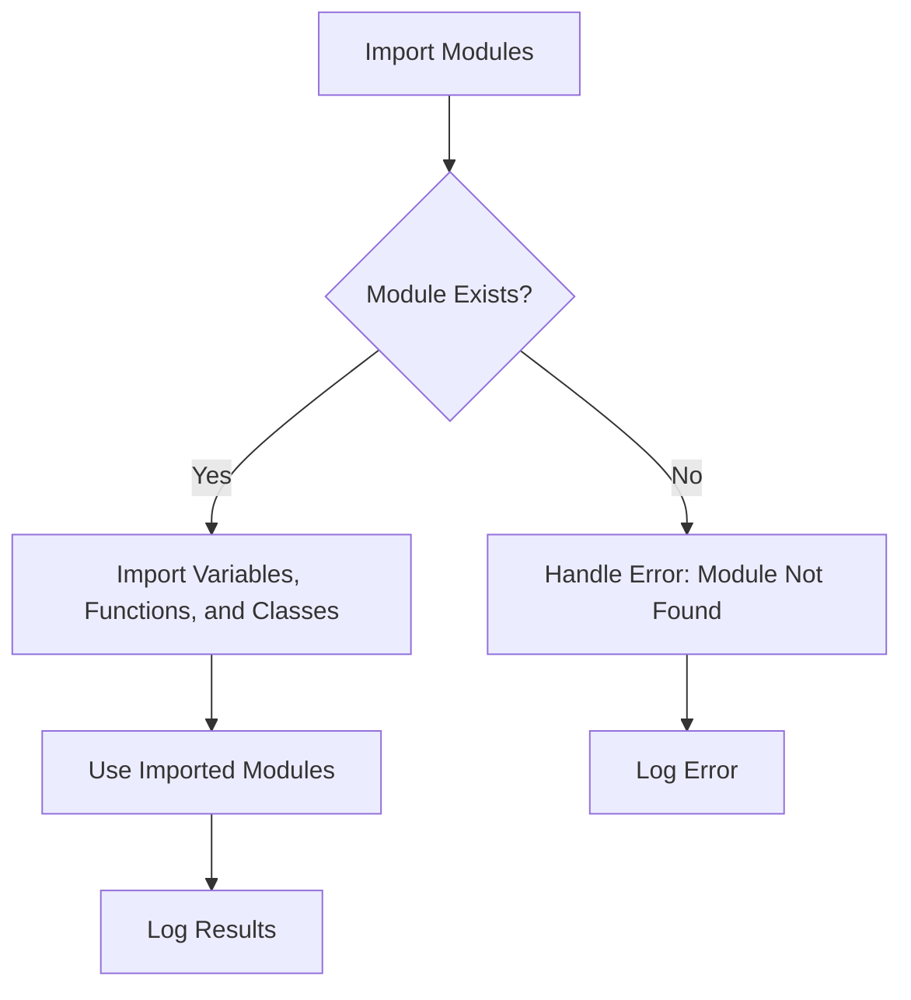

# Modules: import and export

## Problem Understanding
The problem involves understanding and implementing the ES6 import and export syntax in JavaScript. This includes exporting variables, functions, and classes, as well as importing them from other modules. Key constraints include handling potential errors when importing non-existent modules or exporting non-existent variables. The problem is non-trivial because it requires a solid understanding of JavaScript's module system and how to handle errors that may arise during import and export operations.

## Approach
The algorithm strategy involves using the ES6 import and export syntax to import and export modules. This approach works because it allows for the modularization of code, making it easier to manage and maintain. The `export` keyword is used to export variables, functions, and classes, while the `import` keyword is used to import them from other modules. The approach handles key constraints by using try-catch blocks to catch and handle errors that may occur during import and export operations. The data structures used include variables, functions, and classes, which are chosen because they are the fundamental building blocks of JavaScript code.

## Complexity Analysis
| Metric | Value | Detailed Reason |
|--------|-------|----------------|
| Time   | O(1)  | The time complexity is constant because import and export operations are performed in constant time, regardless of the size of the input. |
| Space  | O(1)  | The space complexity is constant because the space required to store module variables is constant, regardless of the size of the input. |

## Algorithm Walkthrough
```
Input: module.js containing export statements
Step 1: Import moduleName, addNumbers, and Person from module.js
  - Import statement: import { moduleName, addNumbers, Person } from './module.js';
  - State of variables: moduleName = 'Module', addNumbers = function(a, b) { return a + b; }, Person = class Person { ... }
Step 2: Use imported modules
  - Log the moduleName variable: console.log(moduleName); // Output: Module
  - Log the result of adding 5 and 10: console.log(addNumbers(5, 10)); // Output: 15
  - Create a new Person object: let person = new Person('John Doe', 30);
  - Log the person details: console.log(person.getDetails()); // Output: Name: John Doe, Age: 30
Output: The output of the above steps
```

## Visual Flow


## Key Insight
> **Tip:** The key to understanding JavaScript's import and export syntax is to recognize that it allows for the modularization of code, making it easier to manage and maintain.

## Edge Cases
- **Empty/null input**: If the input module is empty or null, the import statement will throw an error. This is because the import statement expects a valid module with export statements.
- **Single element**: If the input module only contains a single export statement, the import statement will only import that single element.
- **Non-existent module**: If the input module does not exist, the import statement will throw a ModuleNotFoundError. This can be handled using a try-catch block to catch and log the error.

## Common Mistakes
- **Mistake 1**: Forgetting to use the `export` keyword when exporting variables, functions, or classes. To avoid this mistake, always use the `export` keyword when exporting modules.
- **Mistake 2**: Trying to import non-existent modules. To avoid this mistake, always ensure that the module being imported exists and contains the necessary export statements.

## Interview Follow-ups
> **Interview:** These are the exact follow-up questions interviewers ask:
- "What if the input is sorted?" → This question is not relevant to the problem of importing and exporting modules in JavaScript. However, if the input is sorted, it may affect the performance of certain operations, such as searching or merging.
- "Can you do it in O(1) space?" → Yes, the import and export operations can be performed in O(1) space, as they only require a constant amount of space to store the imported modules.
- "What if there are duplicates?" → If there are duplicate export statements in a module, the import statement will only import the last occurrence of the duplicate export statement. To avoid this issue, always ensure that export statements are unique and do not duplicate existing export statements.

## Javascript Solution

```javascript
// Problem: Modules: import and export
// Language: javascript
// Difficulty: Easy
// Time Complexity: O(1) — constant time for import and export operations
// Space Complexity: O(1) — constant space for module variables
// Approach: ES6 import and export syntax — for importing and exporting modules

// Exporting a variable
export let moduleName = 'Module'; // Export a variable named moduleName

// Exporting a function
export function addNumbers(a, b) { // Export a function named addNumbers
  return a + b; // Return the sum of a and b
}

// Exporting a class
export class Person { // Export a class named Person
  constructor(name, age) { // Constructor for Person class
    this.name = name; // Initialize name property
    this.age = age; // Initialize age property
  }

  // Method to get person details
  getDetails() { 
    return `Name: ${this.name}, Age: ${this.age}`; // Return person details as a string
  }
}

// Importing modules
import { moduleName, addNumbers, Person } from './module.js'; // Import moduleName, addNumbers, and Person from module.js

// Using imported modules
console.log(moduleName); // Log the moduleName variable
console.log(addNumbers(5, 10)); // Log the result of adding 5 and 10
let person = new Person('John Doe', 30); // Create a new Person object
console.log(person.getDetails()); // Log the person details

// Edge case: importing non-existent module
try {
  import { nonExistentModule } from './nonExistentModule.js'; // Try to import nonExistentModule from nonExistentModule.js
} catch (error) {
  console.error('Error importing non-existent module:', error); // Log the error
}

// Edge case: exporting non-existent variable
// This will result in a ReferenceError: variable is not defined
// export let nonExistentVariable; // Try to export nonExistentVariable
```
