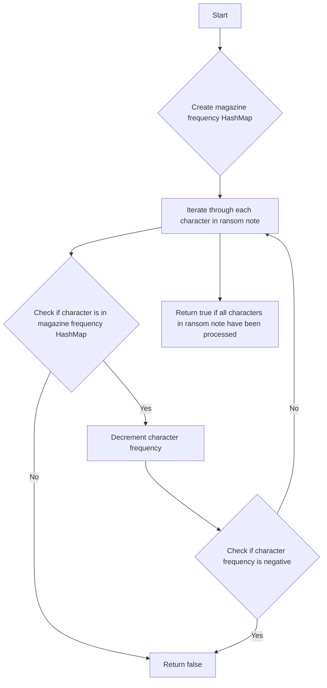

# Ransom Note JS

## Problem Understanding
The problem is asking whether it is possible to construct a ransom note from a given magazine, where each character in the ransom note must be present in the magazine. The key constraint is that each character in the magazine can only be used as many times as it appears in the magazine. This problem is non-trivial because a naive approach of simply checking if all characters in the ransom note are present in the magazine would not work, as it does not take into account the frequency of each character. The problem requires a more sophisticated approach that considers the frequency of each character in both the ransom note and the magazine.

## Approach
The algorithm strategy is to use a HashMap to count the frequency of each character in the magazine, and then iterate through each character in the ransom note, checking if it is present in the magazine and decrementing its frequency if it is. This approach works because it ensures that each character in the ransom note is present in the magazine the correct number of times. The HashMap data structure is used because it allows for efficient lookups and updates of character frequencies. The approach handles the key constraint of character frequency by decrementing the frequency of each character in the magazine as it is used in the ransom note.

## Complexity Analysis
| Metric | Value | Detailed Reason |
|--------|-------|----------------|
| Time   | O(n + m) | The time complexity is O(n + m) because the algorithm iterates through each character in the ransom note (n) and each character in the magazine (m) once. The HashMap lookups and updates are O(1) on average, so they do not affect the overall time complexity. |
| Space  | O(m) | The space complexity is O(m) because the algorithm uses a HashMap to store the frequency of each character in the magazine, and in the worst case, every character in the magazine is unique, resulting in a HashMap of size m. |

## Algorithm Walkthrough
```
Input: ransomNote = "aa", magazine = "ab"
Step 1: Create a HashMap to store the frequency of each character in the magazine
  magazineFrequency = { 'a': 1, 'b': 1 }
Step 2: Iterate through each character in the ransom note
  i = 0, ransomNote[i] = 'a'
  magazineFrequency['a'] = 0
Step 3: Iterate through each character in the ransom note (continued)
  i = 1, ransomNote[i] = 'a'
  magazineFrequency['a'] = -1 (return false because frequency is negative)
Output: false
```
This example exercises the main logic path of the algorithm, including the creation of the HashMap and the iteration through each character in the ransom note.

## Visual Flow

This flowchart shows the decision flow of the algorithm, including the creation of the HashMap, the iteration through each character in the ransom note, and the checks for character presence and frequency.

## Key Insight
> **Tip:** The key insight is to use a HashMap to count the frequency of each character in the magazine, allowing for efficient lookups and updates of character frequencies as the algorithm iterates through each character in the ransom note.

## Edge Cases
- **Empty ransom note**: If the ransom note is empty, the algorithm returns true because an empty ransom note can always be constructed from any magazine.
- **Single element**: If the ransom note contains only one character, the algorithm returns true if that character is present in the magazine, and false otherwise.
- **Ransom note longer than magazine**: If the ransom note is longer than the magazine, the algorithm may return false if the magazine does not contain enough characters to construct the ransom note.

## Common Mistakes
- **Mistake 1**: Not using a HashMap to count character frequencies, resulting in inefficient lookups and updates. To avoid this, use a HashMap to store character frequencies.
- **Mistake 2**: Not checking for negative character frequencies, resulting in incorrect results. To avoid this, check if the character frequency is negative after decrementing it.

## Interview Follow-ups
> **Interview:** These are the exact follow-up questions interviewers ask:
- "What if the input is sorted?" → The algorithm would still work correctly, but the HashMap lookups and updates would be slightly faster on average.
- "Can you do it in O(1) space?" → No, the algorithm requires at least O(m) space to store the character frequencies in the magazine.
- "What if there are duplicates?" → The algorithm handles duplicates correctly by decrementing the character frequency each time it is used in the ransom note.

## Javascript Solution

```javascript
// Problem: Ransom Note
// Language: javascript
// Difficulty: Easy
// Time Complexity: O(n + m) — where n is the length of the ransom note and m is the length of the magazine
// Space Complexity: O(n) — where n is the number of unique characters in the ransom note
// Approach: HashMap frequency count — count the frequency of each character in the ransom note and magazine

/**
 * Checks if a ransom note can be constructed from a given magazine.
 * 
 * @param {string} ransomNote The ransom note to be constructed.
 * @param {string} magazine The magazine to construct the ransom note from.
 * @return {boolean} True if the ransom note can be constructed, false otherwise.
 */
var canConstruct = function(ransomNote, magazine) {
    // Edge case: empty ransom note → return true
    if (ransomNote.length === 0) return true;

    // Create a HashMap to store the frequency of each character in the magazine
    let magazineFrequency = {};
    for (let i = 0; i < magazine.length; i++) { // Iterate through each character in the magazine
        // If the character is already in the HashMap, increment its frequency
        if (magazineFrequency[magazine[i]]) {
            magazineFrequency[magazine[i]]++;
        } 
        // If the character is not in the HashMap, add it with a frequency of 1
        else {
            magazineFrequency[magazine[i]] = 1;
        }
    }

    // Iterate through each character in the ransom note
    for (let i = 0; i < ransomNote.length; i++) {
        // Edge case: character not found in magazine → return false
        if (!magazineFrequency[ransomNote[i]]) return false;
        
        // If the character is in the magazine, decrement its frequency
        magazineFrequency[ransomNote[i]]--;
        
        // Edge case: character frequency reaches 0 → return false
        if (magazineFrequency[ransomNote[i]] < 0) return false;
    }

    // If all characters in the ransom note are found in the magazine, return true
    return true;
};
```
