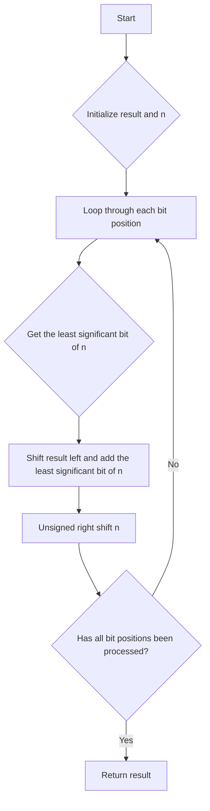

# Reverse Bits JS

## Problem Understanding
The problem is asking to reverse the bits of a given 32-bit unsigned integer. The key constraint is that the input is a 32-bit unsigned integer, which means it has a fixed number of bits. This constraint implies that the time complexity of the solution will be constant, as the number of operations does not depend on the input size. What makes this problem non-trivial is that it requires using bitwise operations to manipulate the bits of the integer, which can be tricky to understand and implement correctly. The naive approach of converting the integer to a binary string, reversing the string, and converting it back to an integer would be inefficient and not scalable.

## Approach
The algorithm strategy is to use bitwise operations to reverse the bits of the input integer. The intuition behind this approach is to iterate through each bit position of the input integer, starting from the least significant bit, and append it to the result. The bitwise shift and mask operations are used to achieve this. The result is shifted left by one bit in each iteration, and the least significant bit of the input integer is added to the result using a bitwise OR operation. The input integer is then unsigned right shifted by one bit to move to the next bit position. This approach works because it effectively reverses the order of the bits in the input integer, and it handles the key constraint of the input being a 32-bit unsigned integer.

## Complexity Analysis
| Metric | Value | Detailed Reason |
|--------|-------|----------------|
| Time   | O(1)  | The time complexity is constant because the number of operations (32 iterations) does not depend on the input size. The bitwise operations used in each iteration take constant time. |
| Space  | O(1)  | The space complexity is constant because only a few variables are used to store the result and the input integer, regardless of the input size. No additional data structures are used that scale with the input size. |

## Algorithm Walkthrough
```
Input: n = 43261596 (binary: 10101010 11110000 00000000 00000000)
Step 1: result = 0, n = 10101010 11110000 00000000 00000000, i = 0
         result = (0 << 1) | (10101010 11110000 00000000 00000000 & 1) = 0
         n = 10101010 11110000 00000000 00000000 >>> 1 = 01010101 01111000 00000000 00000000
Step 2: result = 0, n = 01010101 01111000 00000000 00000000, i = 1
         result = (0 << 1) | (01010101 01111000 00000000 00000000 & 1) = 0
         n = 01010101 01111000 00000000 00000000 >>> 1 = 00101010 10111100 00000000 00000000
...
Step 32: result = 964176192 (binary: 00000000 00000000 00000000 10101010), n = 0, i = 31
         result = (964176192 << 1) | (0 & 1) = 964176192
         n = 0 >>> 1 = 0
Output: result = 964176192 >>> 0 = 964176192 (binary: 00000000 00000000 00000000 10101010)
```
## Visual Flow

## Key Insight
> **Tip:** The key insight is to use bitwise shift and mask operations to reverse the bits of the input integer, effectively treating the integer as a sequence of bits that can be manipulated using bitwise operations.

## Edge Cases
- **Empty/null input**: This is not applicable, as the input is a 32-bit unsigned integer, which cannot be null or empty.
- **Single element**: If the input integer has only one bit set (e.g., 1), the output will be the same integer (e.g., 1), as there is only one bit to reverse.
- **All bits set**: If the input integer has all bits set (e.g., 4294967295), the output will be the same integer (e.g., 4294967295), as all bits are already in the correct order.

## Common Mistakes
- **Mistake 1**: Using a signed right shift instead of an unsigned right shift, which can cause issues with the most significant bit. → To avoid this, use the unsigned right shift operator (`>>>`) instead of the signed right shift operator (`>>`).
- **Mistake 2**: Not handling the case where the input integer is 0, which can cause issues with the result. → To avoid this, initialize the result to 0 and ensure that the loop iterates through all bit positions, even if the input integer is 0.

## Interview Follow-ups
> **Interview:** These are the exact follow-up questions interviewers ask:
- "What if the input is sorted?" → This is not applicable, as the input is a single 32-bit unsigned integer, which cannot be sorted.
- "Can you do it in O(1) space?" → Yes, the solution already uses O(1) space, as only a few variables are used to store the result and the input integer.
- "What if there are duplicates?" → This is not applicable, as the input is a single 32-bit unsigned integer, which cannot have duplicates.

## Javascript Solution

```javascript
// Problem: Reverse Bits
// Language: javascript
// Difficulty: Easy
// Time Complexity: O(1) — since number of bits in an integer is fixed (32)
// Space Complexity: O(1) — no additional space used other than a few variables
// Approach: Bitwise operations — reverse bits using bitwise shift and mask operations

/**
 * @param {number} n - a 32-bit unsigned integer
 * @return {number} - the integer with its bits reversed
 */
var reverseBits = function(n) {
    let result = 0; // initialize result variable to store the reversed integer
    for (let i = 0; i < 32; i++) { // loop through each bit position
        result = (result << 1) | (n & 1); // shift result left and add the least significant bit of n
        n >>>= 1; // unsigned right shift to move to the next bit position in n
    }
    return result >>> 0; // unsigned right shift to ensure result is a 32-bit unsigned integer
};
```
