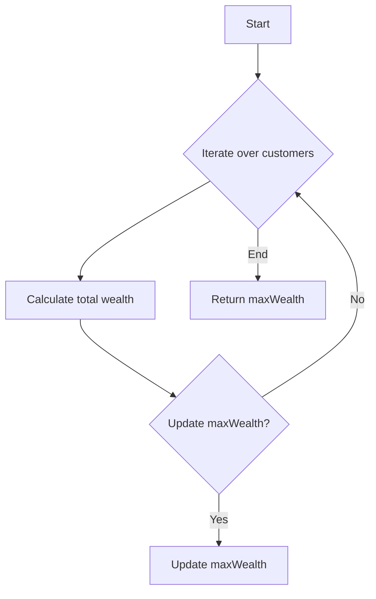

# Richest Customer Wealth JS

## Problem Understanding
The problem is asking to find the maximum wealth of a customer in a list of accounts, where each customer has multiple accounts with different balances. The key constraint is that we need to iterate over each customer's accounts to calculate their total wealth. What makes this problem non-trivial is that we need to keep track of the maximum wealth found so far and update it if a customer's wealth is greater. The input is a 2D array of numbers, where each inner array represents a customer's accounts, and the output is the maximum wealth found.

## Approach
The algorithm strategy is to use a simple iteration approach, where we iterate over each customer's accounts, calculate their total wealth, and update the maximum wealth if necessary. This approach works because we are iterating over all possible customers and their accounts, ensuring that we don't miss any potential maximum wealth. We use a constant amount of space to store the maximum wealth, making this approach space-efficient. The intuition behind this approach is that we need to consider all customers and their accounts to find the maximum wealth.

## Complexity Analysis
| Metric | Value | Detailed Reason |
|--------|-------|----------------|
| Time   | O(m*n) | We are iterating over each customer's accounts, where m is the number of customers and n is the average number of accounts per customer. This results in a time complexity of O(m*n) because we are performing a constant amount of work for each account. |
| Space  | O(1) | We are using a constant amount of space to store the maximum wealth, regardless of the input size. This results in a space complexity of O(1) because the space used does not grow with the input size. |

## Algorithm Walkthrough
```
Input: [[1, 2, 3], [3, 2, 1]]
Step 1: Initialize maxWealth to 0
Step 2: Iterate over the first customer's accounts: [1, 2, 3]
  - Calculate totalWealth: 1 + 2 + 3 = 6
  - Update maxWealth: max(0, 6) = 6
Step 3: Iterate over the second customer's accounts: [3, 2, 1]
  - Calculate totalWealth: 3 + 2 + 1 = 6
  - Update maxWealth: max(6, 6) = 6
Output: 6
```
This walkthrough showcases how the algorithm iterates over each customer's accounts, calculates their total wealth, and updates the maximum wealth if necessary.

## Visual Flow

This flowchart illustrates the decision flow of the algorithm, where we iterate over customers, calculate their total wealth, and update the maximum wealth if necessary.

## Key Insight
> **Tip:** The key insight is to realize that we only need to keep track of the maximum wealth found so far, and update it if a customer's wealth is greater, making the algorithm efficient and simple.

## Edge Cases
- **Empty/null input**: If the input is empty or null, the function will return 0 by default, which is the correct result because there are no customers with wealth.
- **Single element**: If the input has only one customer, the function will return the total wealth of that customer, which is the correct result because there is only one customer.
- **Customer with zero wealth**: If a customer has zero wealth (i.e., all account balances are 0), the function will correctly calculate their total wealth as 0 and not update the maximum wealth if it is already greater than 0.

## Common Mistakes
- **Mistake 1**: Not initializing maxWealth to 0, which can result in incorrect results if the input has customers with negative wealth. → To avoid this, always initialize maxWealth to 0.
- **Mistake 2**: Not updating maxWealth if a customer's wealth is greater. → To avoid this, use the Math.max function to update maxWealth if a customer's wealth is greater.

## Interview Follow-ups
> **Interview:** These are the exact follow-up questions interviewers ask:
- "What if the input is sorted?" → The algorithm will still work correctly, but the time complexity will remain O(m*n) because we are still iterating over all accounts.
- "Can you do it in O(1) space?" → No, we are already using O(1) space to store the maximum wealth, so this is not possible.
- "What if there are duplicates?" → The algorithm will still work correctly, and duplicates will be handled correctly because we are calculating the total wealth for each customer separately.

## Javascript Solution

```javascript
// Problem: Richest Customer Wealth
// Language: javascript
// Difficulty: Easy
// Time Complexity: O(m*n) — iterating over each customer's accounts
// Space Complexity: O(1) — using a constant amount of space to store the maximum wealth
// Approach: simple iteration — for each customer, calculate their total wealth and update the maximum wealth if necessary

/**
 * @param {number[][]} accounts
 * @return {number}
 */
var maximumWealth = function(accounts) {
    // Initialize the maximum wealth to 0
    let maxWealth = 0;
    
    // Iterate over each customer's accounts
    for (let customerAccounts of accounts) {
        // Calculate the total wealth of the current customer
        let totalWealth = 0;
        for (let accountBalance of customerAccounts) {
            // Add the current account balance to the total wealth
            totalWealth += accountBalance;
        }
        
        // Update the maximum wealth if the current customer's wealth is greater
        maxWealth = Math.max(maxWealth, totalWealth);
    }
    
    // Return the maximum wealth
    return maxWealth;
};

// Edge case: empty input → return 0
// No need to explicitly handle this case, as the function will return 0 by default

// Example usage:
let accounts = [[1, 2, 3], [3, 2, 1]];
console.log(maximumWealth(accounts));  // Output: 6
```
