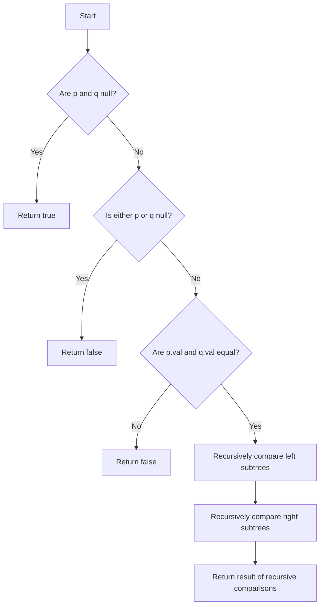

# Same Tree JS

## Problem Understanding
The problem is asking whether two given binary trees are identical, meaning they have the same structure and node values. The key constraint is that the comparison should consider both the values of the nodes and the structure of the trees. This problem is non-trivial because a naive approach that only checks the values of the nodes without considering the tree structure would not work, as two trees with different structures but the same node values could be incorrectly identified as identical.

## Approach
The algorithm strategy is to use a recursive approach to compare the two trees. This approach works because it allows for a systematic and thorough comparison of all nodes in both trees, taking into account both the node values and the tree structure. The key intuition behind this approach is that two trees are identical if and only if their corresponding nodes have the same values and their left and right subtrees are also identical. The data structure used is the binary tree itself, which is defined by the TreeNode class. This approach handles the key constraints by recursively checking the values of the current nodes and the left and right subtrees.

## Complexity Analysis
| Metric | Value | Detailed Reason |
|--------|-------|----------------|
| Time   | O(n)  | The algorithm visits each node in both trees once, where n is the total number of nodes in both trees. The recursive calls ensure that all nodes are visited. |
| Space  | O(h)  | The maximum recursion depth is equal to the height of the tree, where h is the height of the tree. This is because each recursive call adds a layer to the call stack. |

## Algorithm Walkthrough
```javascript
Input: 
p = {1, {2}, {3}}
q = {1, {2}, {3}}

Step 1: p and q are not null, so we compare their values: p.val (1) == q.val (1)
Step 2: We recursively compare the left subtrees: isSameTree(p.left, q.left)
  - p.left = {2}, q.left = {2}
  - p.left and q.left are not null, so we compare their values: p.left.val (2) == q.left.val (2)
  - We recursively compare the left and right subtrees of p.left and q.left: isSameTree(p.left.left, q.left.left) and isSameTree(p.left.right, q.left.right)
  - Since p.left.left and q.left.left are null, and p.left.right and q.left.right are null, we return true
Step 3: We recursively compare the right subtrees: isSameTree(p.right, q.right)
  - p.right = {3}, q.right = {3}
  - p.right and q.right are not null, so we compare their values: p.right.val (3) == q.right.val (3)
  - We recursively compare the left and right subtrees of p.right and q.right: isSameTree(p.right.left, q.right.left) and isSameTree(p.right.right, q.right.right)
  - Since p.right.left and q.right.left are null, and p.right.right and q.right.right are null, we return true
Output: true
```

## Visual Flow


## Key Insight
> **Tip:** The key insight is that two trees are identical if and only if their corresponding nodes have the same values and their left and right subtrees are also identical.

## Edge Cases
- **Empty/null input**: If both trees are null, the function returns true, indicating that they are the same.
- **Single element**: If one tree has a single node and the other tree also has a single node with the same value, the function returns true.
- **Unbalanced trees**: If one tree is unbalanced (e.g., has only left or right children) and the other tree has the same structure and node values, the function returns true.

## Common Mistakes
- **Mistake 1**: Not checking for null inputs before comparing node values. To avoid this, always check if the inputs are null before attempting to compare them.
- **Mistake 2**: Not recursively comparing the left and right subtrees. To avoid this, make sure to call the function recursively on the left and right subtrees.

## Interview Follow-ups
> **Interview:** 
- "What if the input is sorted?" → The function will still work correctly, as it compares the values of the nodes and the structure of the trees, regardless of whether the input is sorted or not.
- "Can you do it in O(1) space?" → No, the function uses recursive calls, which require O(h) space, where h is the height of the tree.
- "What if there are duplicates?" → The function will still work correctly, as it compares the values of the nodes and the structure of the trees, regardless of whether there are duplicates or not.

## Javascript Solution

```javascript
// Problem: Same Tree
// Language: javascript
// Difficulty: Easy
// Time Complexity: O(n) — recursively checking all nodes in both trees
// Space Complexity: O(h) — maximum recursion depth, where h is the height of the tree
// Approach: Recursive tree comparison — checking if two trees are identical by recursively comparing nodes

/**
 * Definition for a binary tree node.
 * function TreeNode(val, left, right) {
 *     this.val = (val===undefined ? 0 : val)
 *     this.left = (left===undefined ? null : left)
 *     this.right = (right===undefined ? null : right)
 * }
 */
/**
 * @param {TreeNode} p
 * @param {TreeNode} q
 * @return {boolean}
 */
var isSameTree = function(p, q) {
    // Base case: if both trees are null, they are the same
    if (p === null && q === null) return true;
    
    // Edge case: if one tree is null and the other is not, they are not the same
    if (p === null || q === null) return false;
    
    // Recursively check if the values of the current nodes are the same
    // and if the left and right subtrees are the same
    return (p.val === q.val) && 
           isSameTree(p.left, q.left) && // recursively check left subtrees
           isSameTree(p.right, q.right); // recursively check right subtrees
};
```
