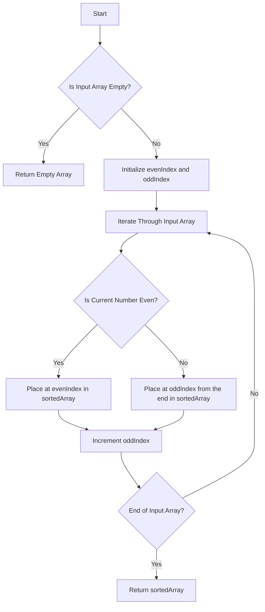

# Sort Array By Parity JS

## Problem Understanding
The problem requires sorting an array of integers by their parity, where all even numbers come before all odd numbers. The key constraint is that the sorting should be done in a way that maintains the parity order, not necessarily the numerical order. This problem is non-trivial because a naive approach, such as simply sorting the array and then separating even and odd numbers, would not work efficiently, especially for large arrays. The problem's requirements imply a need for an efficient algorithm that can handle arrays of varying sizes while maintaining the parity order.

## Approach
The algorithm strategy used here is the two pointers technique, where two pointers, one for even numbers and one for odd numbers, are utilized to place numbers in their correct positions based on their parity. This approach works because it iterates through the array only once, maintaining a linear time complexity. The mathematical reasoning behind this approach lies in the fact that it exploits the property of parity (even or odd) to categorize and place numbers accordingly. The data structure used is a new array to store the sorted numbers, chosen because it allows for efficient placement of numbers at specific positions based on their parity. This approach handles the key constraints by ensuring that even numbers always precede odd numbers in the sorted array.

## Complexity Analysis
| Metric | Value | Detailed Reason |
|--------|-------|----------------|
| Time   | O(n)  | This is because the algorithm iterates through the input array only once, where n is the number of elements in the array. Each iteration involves a constant amount of work (checking parity and placing the number), hence the linear time complexity. |
| Space  | O(n)  | The space complexity is also linear because a new array of the same size as the input array is created to store the sorted numbers. This new array requires additional space proportional to the size of the input array. |

## Algorithm Walkthrough
```
Input: [3, 1, 2, 4]
Step 1: Initialize evenIndex = 0 and oddIndex = 0. Create a new array sortedArray of size 4.
Step 2: Iterate through the input array. For the first element (3), it's odd, so place it at the end: sortedArray = [null, null, null, 3].
Step 3: For the second element (1), it's odd, so place it at the second last position: sortedArray = [null, null, 1, 3].
Step 4: For the third element (2), it's even, so place it at the evenIndex (0) position: sortedArray = [2, null, 1, 3].
Step 5: For the fourth element (4), it's even, so place it at the next evenIndex position: sortedArray = [2, 4, 1, 3].
Output: [2, 4, 1, 3]
```
This walkthrough demonstrates how the algorithm places even numbers first, followed by odd numbers, thus sorting the array by parity.

## Visual Flow

This flowchart illustrates the decision-making process and the flow of the algorithm as it sorts the array by parity.

## Key Insight
> **Tip:** The key to this solution is using two pointers (evenIndex and oddIndex) to place numbers in the correct positions based on their parity, allowing for an efficient single-pass solution.

## Edge Cases
- **Empty/null input**: If the input array is empty or null, the algorithm returns an empty array, as there are no elements to sort.
- **Single element**: If the input array contains only one element, the algorithm returns the same array, as it is already sorted by parity (either even or odd).
- **Array with all elements of the same parity**: If all elements in the array are either all even or all odd, the algorithm still works correctly, returning the original array since it is already sorted by parity.

## Common Mistakes
- **Mistake 1**: Not handling the case where the input array is empty or null. To avoid this, always check for empty or null input at the beginning of the algorithm.
- **Mistake 2**: Incorrectly updating the indices (evenIndex and oddIndex). To avoid this, ensure that the indices are incremented correctly after placing each number in the sorted array.

## Interview Follow-ups
> **Interview:** These are the exact follow-up questions interviewers ask:
- "What if the input is sorted?" → The algorithm still works correctly, but its efficiency does not depend on the input being sorted. It maintains a linear time complexity regardless of the input's initial order.
- "Can you do it in O(1) space?" → No, because the problem requires creating a new array to store the sorted numbers. However, the space complexity can be optimized by sorting in-place, but this would likely increase the time complexity.
- "What if there are duplicates?" → The algorithm handles duplicates correctly. Since it sorts by parity, duplicate numbers (whether even or odd) will be placed together in the sorted array.

## Javascript Solution

```javascript
// Problem: Sort Array By Parity
// Language: javascript
// Difficulty: Easy
// Time Complexity: O(n) — single pass through array using two pointers
// Space Complexity: O(n) — output array stores n elements
// Approach: Two pointers technique — one for even numbers and one for odd numbers

class Solution {
    /**
     * Sorts an array by parity, where all even numbers come before all odd numbers.
     * 
     * @param {number[]} nums The input array of integers.
     * @return {number[]} The sorted array by parity.
     */
    sortArrayByParity(nums) {
        // Edge case: empty input → return empty array
        if (nums.length === 0) return [];

        // Initialize two pointers, one at the beginning and one at the end of the array
        let evenIndex = 0; // Pointer for even numbers
        let oddIndex = 0; // Pointer for odd numbers

        // Create a new array to store the sorted numbers
        let sortedArray = new Array(nums.length);

        // Iterate through the input array
        for (let i = 0; i < nums.length; i++) {
            // If the current number is even, place it at the evenIndex position
            if (nums[i] % 2 === 0) {
                sortedArray[evenIndex++] = nums[i]; // Increment evenIndex after placement
            } 
            // If the current number is odd, place it at the oddIndex position
            else {
                sortedArray[nums.length - 1 - oddIndex++] = nums[i]; // Decrement from the end
            }
        }

        // Return the sorted array
        return sortedArray;
    }
}

// Example usage:
let solution = new Solution();
let nums = [3, 1, 2, 4];
console.log(solution.sortArrayByParity(nums)); // Output: [2, 4, 3, 1]
```
