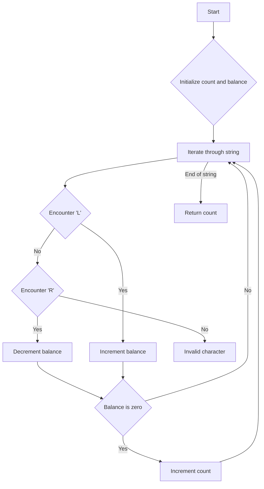

# Split a String in Balanced Strings JS

## Problem Understanding
The problem requires splitting a string consisting of 'L' and 'R' characters into balanced strings, where a balanced string has an equal number of 'L' and 'R' characters. The key constraint is that the input string only contains 'L' and 'R' characters. This problem is non-trivial because a naive approach might involve checking every possible substring, which would result in a time complexity of O(n^2), making it inefficient for large inputs. The problem can be solved efficiently by keeping track of the balance of 'L' and 'R' characters as we iterate through the string.

## Approach
The algorithm strategy is to iterate through the string and keep track of the balance of 'L' and 'R' characters using a counter. When the balance is zero, it means we have a balanced string. The intuition behind this approach is that the balance of 'L' and 'R' characters will be zero when the number of 'L' characters equals the number of 'R' characters. This approach works because it takes advantage of the fact that the input string only contains 'L' and 'R' characters. A simple counter is used to keep track of the balance, and an array is not needed because we are only counting the number of balanced strings.

## Complexity Analysis
| Metric | Value | Detailed Reason |
|--------|-------|----------------|
| Time   | O(n)  | The algorithm makes a single pass through the string, where n is the length of the string. Each character is visited once, resulting in a linear time complexity. |
| Space  | O(1)  | The algorithm uses a constant amount of space to store the balance and count variables, regardless of the input size. |

## Algorithm Walkthrough
```
Input: "RLRRLLRLRL"
Step 1: Initialize count = 0, balance = 0
Step 2: Encounter 'R', balance = -1
Step 3: Encounter 'L', balance = 0, count = 1 (balanced string found)
Step 4: Encounter 'R', balance = -1
Step 5: Encounter 'R', balance = -2
Step 6: Encounter 'L', balance = -1
Step 7: Encounter 'L', balance = 0, count = 2 (balanced string found)
Step 8: Encounter 'R', balance = -1
Step 9: Encounter 'L', balance = 0, count = 3 (balanced string found)
Step 10: Encounter 'R', balance = -1
Step 11: Encounter 'L', balance = 0, count = 4 (balanced string found)
Output: 4
```
This example demonstrates how the algorithm iterates through the string and keeps track of the balance of 'L' and 'R' characters to find balanced strings.

## Visual Flow

This flowchart illustrates the decision flow of the algorithm as it iterates through the string and keeps track of the balance of 'L' and 'R' characters.

## Key Insight
> **Tip:** The key insight is to use a balance counter to keep track of the difference between the number of 'L' and 'R' characters, allowing us to efficiently identify balanced strings.

## Edge Cases
- **Empty/null input**: If the input is empty or null, the algorithm will return 0 because there are no balanced strings to count.
- **Single element**: If the input string contains only one character, the algorithm will return 0 because a single character cannot form a balanced string.
- **Unbalanced string**: If the input string is unbalanced (i.e., the number of 'L' characters does not equal the number of 'R' characters), the algorithm will still work correctly and return the count of balanced substrings.

## Common Mistakes
- **Mistake 1**: Not initializing the balance counter correctly, leading to incorrect counts. → To avoid this, make sure to initialize the balance counter to 0 before iterating through the string.
- **Mistake 2**: Not checking for the end of the string correctly, leading to infinite loops. → To avoid this, make sure to check for the end of the string after each iteration and return the count when the end is reached.

## Interview Follow-ups
> **Interview:** These are the exact follow-up questions interviewers ask:
- "What if the input is sorted?" → The algorithm will still work correctly, but the input being sorted does not affect the time complexity or the correctness of the algorithm.
- "Can you do it in O(1) space?" → The algorithm already uses O(1) space, so this is not a concern.
- "What if there are duplicates?" → The algorithm will still work correctly, as it only cares about the balance of 'L' and 'R' characters, not the presence of duplicates.

## Javascript Solution

```javascript
// Problem: Split a String in Balanced Strings
// Language: javascript
// Difficulty: Easy
// Time Complexity: O(n) — single pass through string
// Space Complexity: O(1) — constant space used
// Approach: Counting 'L' and 'R' occurrences — balance string when counts are equal

class Solution {
    /**
     * @param {string} s - The input string consisting of 'L' and 'R' characters.
     * @return {number[]} - An array of balanced string counts.
     */
    balancedStringSplit(s) {
        let count = 0; // Initialize count of balanced strings
        let balance = 0; // Initialize balance of 'L' and 'R' counts
        
        // Iterate through each character in the string
        for (let i = 0; i < s.length; i++) {
            // If 'L' is encountered, increment balance
            if (s[i] === 'L') {
                balance++;
            } 
            // If 'R' is encountered, decrement balance
            else if (s[i] === 'R') {
                balance--;
            }
            
            // Edge case: empty input → return 0
            if (!s) {
                return 0;
            }
            
            // When balance is zero, it means we have a balanced string
            if (balance === 0) {
                count++; // Increment count of balanced strings
            }
        }
        
        return count; // Return the count of balanced strings
    }
}

// Example usage:
let solution = new Solution();
let result = solution.balancedStringSplit("RLRRLLRLRL");
console.log(result); // Output: 4
```
