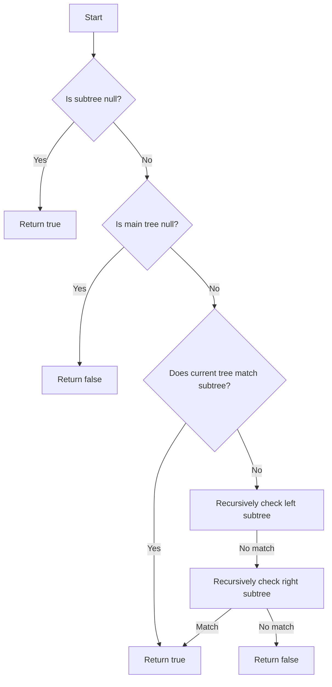

# Subtree of Another Tree JS

## Problem Understanding
The problem is asking to determine if a given binary tree (subtree) is a subset of another binary tree (main tree). The key constraints are that the subtree must match the main tree exactly, and the matching must be done recursively. What makes this problem non-trivial is that a naive approach would involve checking every possible subtree of the main tree, which would result in an exponential time complexity. The problem requires an efficient algorithm to check if the subtree is present in the main tree.

## Approach
The algorithm strategy used here is recursive subtree matching. The intuition behind this approach is to check if the subtree is present in the main tree by recursively matching the nodes of the subtree with the nodes of the main tree. This approach works because it takes advantage of the fact that if a subtree is present in a main tree, then the nodes of the subtree must match the nodes of the main tree exactly. The data structures used are binary trees, which are represented using nodes with a value and references to the left and right child nodes. The approach handles the key constraints by checking for exact matches between the nodes of the subtree and the main tree.

## Complexity Analysis
| Metric | Value | Detailed Reason |
|--------|-------|----------------|
| Time   | O(n*m) | The time complexity is O(n*m) because in the worst case, we need to check every node of the main tree (n) against every node of the subtree (m). This is because the `isSubtree` function recursively checks the left and right subtrees of the main tree against the subtree. |
| Space  | O(n) | The space complexity is O(n) because in the worst case, the recursive call stack can go up to the height of the main tree, which is n. This is because the `isSubtree` function makes recursive calls to itself for the left and right subtrees of the main tree. |

## Algorithm Walkthrough
```javascript
Input: 
// Main tree
//       3
//      / \
//     4   5
//    / \
//   1   2
// Subtree
//     4
//    / \
//   1   2

Step 1: Check if subtree is null (it's not), and if main tree is null (it's not)
Step 2: Check if current tree matches the subtree using `isMatch` function (it doesn't)
Step 3: Recursively check the left subtree of the main tree against the subtree
Step 4: In the left subtree, check if current tree matches the subtree using `isMatch` function (it does)
Step 5: Return true because the subtree is found in the main tree

Output: true
```

## Visual Flow


## Key Insight
> **Tip:** The key insight here is to use a recursive approach to check for subtree matches, and to handle the base cases where the subtree or main tree is null.

## Edge Cases
- **Empty/null input**: If the subtree is null, it is considered a subtree of any tree, so the function returns true. If the main tree is null but the subtree is not, the function returns false.
- **Single element**: If the subtree has only one element, the function checks if the main tree has a node with the same value, and returns true if it does.
- **Identical trees**: If the subtree is identical to the main tree, the function returns true.

## Common Mistakes
- **Mistake 1**: Not handling the base cases correctly, such as not checking for null subtrees or main trees. → To avoid this, make sure to check for null inputs at the beginning of the function.
- **Mistake 2**: Not using a recursive approach to check for subtree matches. → To avoid this, use a recursive function to check for matches between the subtree and the main tree.

## Interview Follow-ups
> **Interview:** These are the exact follow-up questions interviewers ask:
- "What if the input is sorted?" → The function still works correctly even if the input is sorted, because it checks for exact matches between the nodes of the subtree and the main tree.
- "Can you do it in O(1) space?" → No, the function cannot be done in O(1) space because it requires a recursive call stack to check for subtree matches.
- "What if there are duplicates?" → The function still works correctly even if there are duplicates, because it checks for exact matches between the nodes of the subtree and the main tree.

## Javascript Solution

```javascript
// Problem: Subtree of Another Tree
// Language: javascript
// Difficulty: Easy
// Time Complexity: O(n*m) — where n and m are the sizes of the two trees
// Space Complexity: O(n) — for recursive call stack in the worst case
// Approach: Recursive subtree matching — check if subtree is present in main tree

/**
 * Definition for a binary tree node.
 * function TreeNode(val, left, right) {
 *     this.val = (val===undefined ? 0 : val)
 *     this.left = (left===undefined ? null : left)
 *     this.right = (right===undefined ? null : right)
 * }
 */
/**
 * @param {TreeNode} root
 * @param {TreeNode} subRoot
 * @return {boolean}
 */
var isSubtree = function(root, subRoot) {
    // Edge case: if subtree is null, it is a subtree of any tree
    if (!subRoot) return true;
    
    // Edge case: if main tree is null but subtree is not, it's not a subtree
    if (!root) return false;
    
    // If current tree matches the subtree, return true
    if (isMatch(root, subRoot)) return true;
    
    // Recursively check the left and right subtrees
    return isSubtree(root.left, subRoot) || isSubtree(root.right, subRoot);
};

// Helper function to check if two trees match
var isMatch = function(root1, root2) {
    // If both trees are null, they match
    if (!root1 && !root2) return true;
    
    // If one tree is null and the other is not, they don't match
    if (!root1 || !root2) return false;
    
    // If the values at the current nodes don't match, the trees don't match
    if (root1.val !== root2.val) return false;
    
    // Recursively check the left and right subtrees
    return isMatch(root1.left, root2.left) && isMatch(root1.right, root2.right);
}
```
