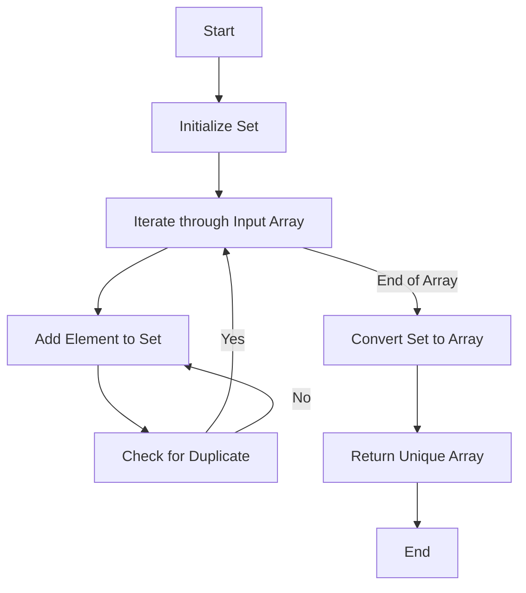

# Unique Values in Array

## Problem Understanding
The problem requires finding unique values in an array, which means removing duplicates and returning an array containing only distinct elements. The key constraint is that the solution should handle arrays of varying sizes and potentially empty or null inputs. What makes this problem non-trivial is the need for an efficient approach that minimizes both time and space complexity, as naive approaches like sorting and then iterating to remove duplicates or using nested loops for comparison can be inefficient.

## Approach
The algorithm strategy involves utilizing a Set data structure, which automatically removes duplicates. The intuition behind this approach is that Sets in JavaScript are implemented as hash tables, allowing for constant time complexity when adding or checking for the existence of an element. This approach works because Sets only store unique values, making it ideal for removing duplicates. The Set is used to store unique elements from the input array, and then this Set is converted back to an array for the final output. This approach efficiently handles key constraints like empty or null inputs and arrays with duplicate values.

## Complexity Analysis
| Metric | Value | Detailed Reason |
|--------|-------|----------------|
| Time   | O(n)  | The algorithm iterates through the input array once, adding each element to the Set. Since adding an element to a Set is an O(1) operation on average, the overall time complexity is linear with respect to the size of the input array. |
| Space  | O(n)  | In the worst-case scenario, if all elements in the input array are unique, the Set will store n elements, where n is the size of the input array. Therefore, the space complexity is also linear with respect to the size of the input array. |

## Algorithm Walkthrough
```
Input: [1, 2, 2, 3, 4, 4, 5]
Step 1: Initialize an empty Set, uniqueSet = {}
Step 2: Iterate through the input array, adding each element to uniqueSet:
    - Add 1 to uniqueSet: uniqueSet = {1}
    - Add 2 to uniqueSet: uniqueSet = {1, 2}
    - Add 2 to uniqueSet (no change because 2 already exists): uniqueSet = {1, 2}
    - Add 3 to uniqueSet: uniqueSet = {1, 2, 3}
    - Add 4 to uniqueSet: uniqueSet = {1, 2, 3, 4}
    - Add 4 to uniqueSet (no change because 4 already exists): uniqueSet = {1, 2, 3, 4}
    - Add 5 to uniqueSet: uniqueSet = {1, 2, 3, 4, 5}
Step 3: Convert uniqueSet back to an array: uniqueArray = [1, 2, 3, 4, 5]
Output: [1, 2, 3, 4, 5]
```

## Visual Flow


## Key Insight
> **Tip:** Using a Set to automatically eliminate duplicate values is the key insight that simplifies the solution and achieves efficient time and space complexity.

## Edge Cases
- **Empty/null input**: If the input array is empty or null, the function will return an empty array, as there are no elements to process.
- **Single element**: If the input array contains only one element, the function will return an array with that single element, as there are no duplicates to remove.
- **All duplicates**: If the input array contains all duplicate elements (e.g., [2, 2, 2, 2]), the function will return an array with a single element, which is the duplicate value.

## Common Mistakes
- **Mistake 1**: Not checking for null or empty input arrays, which can lead to runtime errors.
- **Mistake 2**: Using a nested loop approach to compare each element with every other element, which results in quadratic time complexity and is inefficient for large arrays.

## Interview Follow-ups
> **Interview:** 
- "What if the input is sorted?" → The solution remains the same, as the Set approach does not rely on the input being sorted. The time complexity remains O(n) because adding elements to a Set is an O(1) operation on average, regardless of the input order.
- "Can you do it in O(1) space?" → No, achieving O(1) space complexity is not possible with this problem because we need to store the unique elements somewhere, and in the worst case, this requires space proportional to the input size.
- "What if there are duplicates?" → The solution handles duplicates by using a Set, which automatically removes duplicates. The Set ensures that each element in the output array is unique.

## Javascript Solution

```javascript
// Problem: Unique Values in Array
// Language: javascript
// Difficulty: Easy
// Time Complexity: O(n) — single pass through array
// Space Complexity: O(n) — Set stores at most n elements
// Approach: Set data structure — stores unique elements

class Solution {
    /**
     * Returns an array of unique values from the input array.
     * @param {number[]} nums - The input array of numbers.
     * @return {number[]} An array of unique numbers.
     */
    uniqueValues(nums) {
        // Edge case: empty input → return empty array
        if (!nums || nums.length === 0) return [];

        // Create a Set to store unique elements
        let uniqueSet = new Set(); // Set automatically removes duplicates

        // Iterate through the input array
        for (let num of nums) {
            // Add each number to the Set
            uniqueSet.add(num); // Set automatically handles duplicates
        }

        // Convert the Set back to an array
        let uniqueArray = Array.from(uniqueSet); // Convert Set to array

        // Return the array of unique values
        return uniqueArray;
    }
}

// Example usage
let solution = new Solution();
let nums = [1, 2, 2, 3, 4, 4, 5];
console.log(solution.uniqueValues(nums)); // Output: [1, 2, 3, 4, 5]
```
