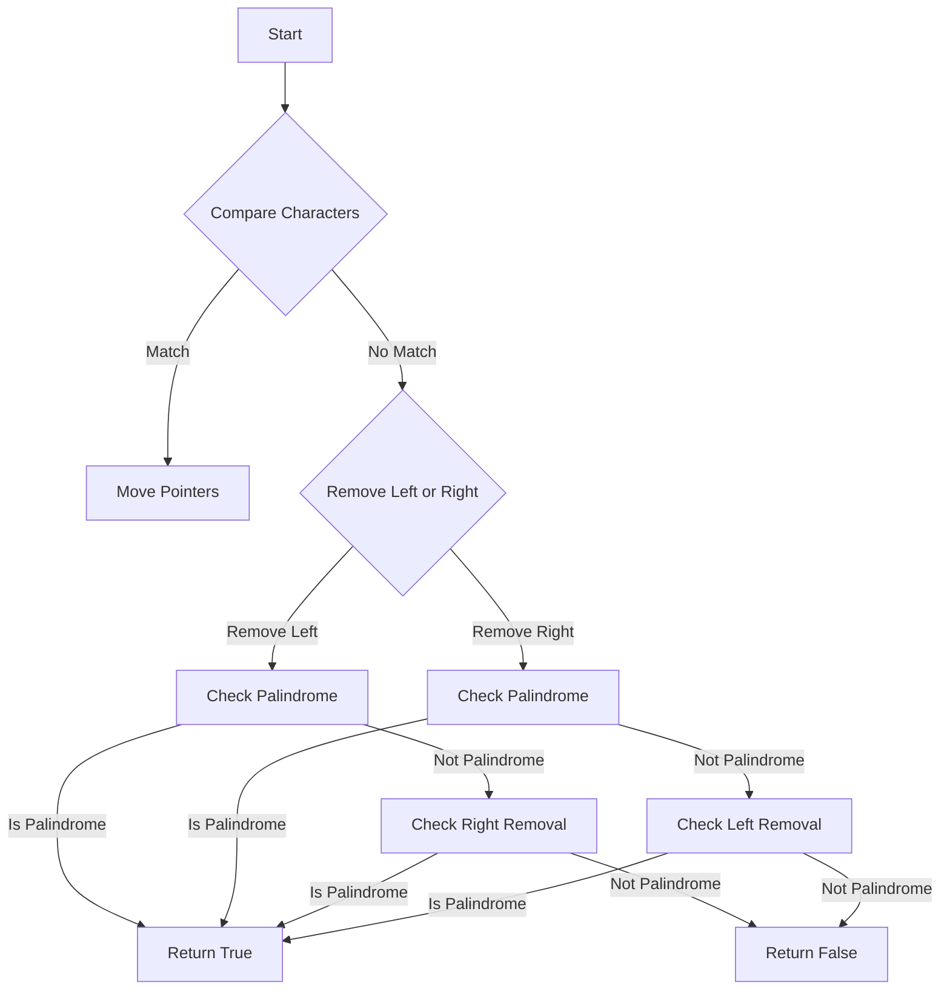

# Valid Palindrome II JS

## Problem Understanding
The problem is asking to determine if a given string can be made into a palindrome by removing at most one character. The key constraint here is that we can only remove one character, which implies that if there are multiple mismatches between the start and end of the string, we cannot simply remove all of them. This problem is non-trivial because a naive approach of checking all possible substrings would result in an inefficient solution with high time complexity. The constraint of removing at most one character and the requirement to handle strings of varying lengths make this problem challenging.

## Approach
The algorithm strategy used here is the two-pointer technique, starting from both ends of the string and moving towards the center. The intuition behind this approach is to compare characters from the start and end of the string and move the pointers closer to the center as long as the characters match. If a mismatch is found, we try removing one character from either the left or the right pointer and check if the resulting substring is a palindrome. This approach works because it systematically checks all possible scenarios of removing at most one character and handles the key constraint efficiently. The data structure used is a simple string, and the algorithm's time complexity is optimized by only making two passes through the string in the worst case.

## Complexity Analysis
| Metric | Value | Detailed Reason |
|--------|-------|----------------|
| Time   | O(n)  | The algorithm makes two passes through the string: one to check for mismatches and potentially another to verify if the substring (after removing a character) is a palindrome. The `isPalindrome` function also makes a pass through the substring. Since these passes are sequential and not nested, the overall time complexity remains linear. |
| Space  | O(n)  | The space complexity is linear because in the worst case, we might create a new substring of length n-1 (by removing one character from the original string of length n). The `slice` method creates a new string, which requires additional space proportional to the length of the substring. |

## Algorithm Walkthrough
```
Input: "aba"
Step 1: Initialize pointers, left = 0, right = 2
Step 2: Compare characters at left and right pointers, 'a' == 'a', move pointers closer to the center, left = 1, right = 1
Step 3: Since left >= right, the loop ends, and the function returns true because no mismatches were found that required character removal.

Input: "abca"
Step 1: Initialize pointers, left = 0, right = 3
Step 2: Compare characters at left and right pointers, 'a' == 'a', move pointers closer to the center, left = 1, right = 2
Step 3: Compare characters at left and right pointers, 'b' != 'c', try removing character at left or right position
Step 4: Remove character at left position, resulting string is "bca", check if it's a palindrome, it's not
Step 5: Remove character at right position, resulting string is "abc", check if it's a palindrome, it's not
Step 6: Since neither removal results in a palindrome, the function returns false
```

## Visual Flow


## Key Insight
> **Tip:** The key insight here is to recognize that when a mismatch is found, trying to remove either the character at the left or the right pointer and then checking if the resulting substring is a palindrome provides an efficient way to handle the constraint of removing at most one character.

## Edge Cases
- **Empty/null input**: If the input string is empty or null, the function should return true because an empty string can be considered a palindrome. The current implementation handles this by returning true when the input length is 0.
- **Single element**: If the input string consists of a single character, it is inherently a palindrome, and the function should return true. The current implementation correctly handles this case as the while loop condition (left < right) is never met, and the function returns true.
- **Palindrome with even length**: For a string that is already a palindrome and has an even length (e.g., "abba"), the function should return true without attempting to remove any characters. The current implementation correctly handles this by moving the pointers closer to the center without finding any mismatches.

## Common Mistakes
- **Mistake 1**: Incorrectly handling the edge case of an empty string. To avoid this, ensure that the function explicitly checks for an empty string and returns true.
- **Mistake 2**: Failing to consider the scenario where removing a character from either end results in a palindrome. To avoid this, always try removing characters from both ends when a mismatch is found and check if the resulting substrings are palindromes.

## Interview Follow-ups
> **Interview:** 
- "What if the input is sorted?" → The problem statement does not specify that the input string must be sorted, and the algorithm's correctness does not depend on the input being sorted. It checks for palindrome properties, not sorted order.
- "Can you do it in O(1) space?" → Achieving O(1) space complexity is not feasible here because we need to create a new substring when removing a character, which requires additional space proportional to the length of the substring.
- "What if there are duplicates?" → The presence of duplicates in the string does not affect the algorithm's ability to determine if the string can be made into a palindrome by removing at most one character. The algorithm checks for character matches from both ends, regardless of whether characters are duplicated elsewhere in the string.

## Javascript Solution

```javascript
// Problem: Valid Palindrome II
// Language: javascript
// Difficulty: Easy
// Time Complexity: O(n) — two passes through the string to check for palindrome
// Space Complexity: O(n) — creating a new string with one character removed
// Approach: Two-pointer technique with a single character removal allowance — checks if a string is a palindrome after removing at most one character

/**
 * Checks if a given string is a palindrome after removing at most one character.
 * @param {string} s - The input string to check.
 * @return {boolean} True if the string is a palindrome after removing at most one character, false otherwise.
 */
var validPalindrome = function(s) {
    // Edge case: empty string → return true
    if (s.length === 0) return true;
    
    // Initialize two pointers, one at the start and one at the end of the string
    let left = 0;
    let right = s.length - 1;
    
    // Loop through the string from both ends
    while (left < right) {
        // If the characters at the current positions do not match
        if (s[left] !== s[right]) {
            // Try removing the character at the left position
            let removeLeft = s.slice(left + 1, right + 1);
            // Try removing the character at the right position
            let removeRight = s.slice(left, right);
            
            // Check if either of the resulting strings is a palindrome
            return isPalindrome(removeLeft) || isPalindrome(removeRight);
        }
        
        // If the characters match, move the pointers closer to the center
        left++;
        right--;
    }
    
    // If the loop completes without finding a mismatch, the string is a palindrome
    return true;
};

// Helper function to check if a string is a palindrome
function isPalindrome(s) {
    // Initialize two pointers, one at the start and one at the end of the string
    let left = 0;
    let right = s.length - 1;
    
    // Loop through the string from both ends
    while (left < right) {
        // If the characters at the current positions do not match
        if (s[left] !== s[right]) {
            // The string is not a palindrome
            return false;
        }
        
        // If the characters match, move the pointers closer to the center
        left++;
        right--;
    }
    
    // If the loop completes without finding a mismatch, the string is a palindrome
    return true;
}
```
