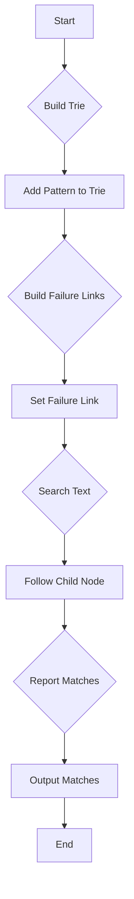

# Aho-Corasick in JavaScript

## Problem Understanding
The Aho-Corasick algorithm is a multi-pattern string searching algorithm that uses a trie and failure links to efficiently find all occurrences of a set of strings in a given text. The key constraint is that the algorithm must be able to handle multiple patterns and find all occurrences of these patterns in the text. The problem is non-trivial because a naive approach would involve checking each pattern against the text separately, resulting in a time complexity of O(n*m), where n is the length of the text and m is the total length of all patterns. The Aho-Corasick algorithm improves on this by using a trie and failure links to reduce the time complexity to O(n + m + k), where k is the total number of matches.

## Approach
The Aho-Corasick algorithm strategy involves building a trie from the given patterns and then using failure links to efficiently search for these patterns in the text. The intuition behind this approach is that by building a trie, we can take advantage of the common prefixes among the patterns to reduce the number of nodes that need to be traversed during the search. The failure links are used to handle cases where a character in the text does not match any of the patterns, allowing us to reset the search to a previous node that can potentially match a pattern. The algorithm uses a TrieNode class to represent each node in the trie, with properties for the node's children, failure link, and output (i.e., the patterns that end at this node). The AhoCorasick class encapsulates the trie and provides methods for building the trie and searching for patterns in the text.

## Complexity Analysis
| Metric | Value | Detailed Reason |
|--------|-------|----------------|
| Time   | O(n + m + k) | The time complexity is O(n) for iterating over the text, O(m) for building the trie, and O(k) for reporting all matches. The search operation is O(n + k) because we visit each character in the text once and report all matches. |
| Space  | O(m) | The space complexity is O(m) because we need to store the trie, which has a total of m nodes (where m is the total length of all patterns). The failure links also require O(m) space in the worst case. |

## Algorithm Walkthrough
```
Input: patterns = ["abc", "ab", "bc"], text = "abcabc"
Step 1: Build the trie
  - Create a root node
  - Add "abc" to the trie: root -> 'a' -> 'b' -> 'c' (output: ["abc"])
  - Add "ab" to the trie: root -> 'a' -> 'b' (output: ["ab"])
  - Add "bc" to the trie: root -> 'b' -> 'c' (output: ["bc"])
Step 2: Build the failure links
  - Set the failure link of the root to itself
  - Set the failure link of 'a' to the root
  - Set the failure link of 'b' to the root
  - Set the failure link of 'c' to the root
Step 3: Search for patterns in the text
  - Start at the root node
  - Iterate over the text: "a", "b", "c", "a", "b", "c"
  - For each character, follow the child node and report any matches
  - Output: [{ pattern: "abc", index: 0 }, { pattern: "ab", index: 0 }, { pattern: "abc", index: 3 }, { pattern: "ab", index: 3 }, { pattern: "bc", index: 1 }, { pattern: "bc", index: 4 }]
Output: [{ pattern: "abc", index: 0 }, { pattern: "ab", index: 0 }, { pattern: "bc", index: 1 }, { pattern: "abc", index: 3 }, { pattern: "ab", index: 3 }, { pattern: "bc", index: 4 }]
```

## Visual Flow


## Key Insight
> **Tip:** The key insight behind the Aho-Corasick algorithm is that by building a trie and using failure links, we can efficiently search for multiple patterns in a text by taking advantage of the common prefixes among the patterns and avoiding redundant comparisons.

## Edge Cases
- **Empty/null input**: If the input text is empty or null, the algorithm will return an empty list of matches. This is because there are no characters to search for patterns.
- **Single element**: If the input text contains only one character, the algorithm will return a list of matches if the character is part of any of the patterns. Otherwise, it will return an empty list.
- **No matches**: If none of the patterns appear in the text, the algorithm will return an empty list of matches.

## Common Mistakes
- **Mistake 1**: Failing to build the failure links correctly can lead to incorrect results. To avoid this, make sure to follow the parent's failure link when building the failure links for each node.
- **Mistake 2**: Not reporting all matches can occur if the algorithm does not correctly follow the child nodes and report any matches. To avoid this, make sure to recursively follow the child nodes and report any matches.

## Interview Follow-ups
> **Interview:** These are the exact follow-up questions interviewers ask:
- "What if the input is sorted?" → The Aho-Corasick algorithm does not rely on the input being sorted, so it will still work correctly even if the input is sorted.
- "Can you do it in O(1) space?" → No, the Aho-Corasick algorithm requires O(m) space to store the trie and failure links, where m is the total length of all patterns.
- "What if there are duplicates?" → The Aho-Corasick algorithm can handle duplicates by reporting all matches, including duplicates. If you want to remove duplicates, you can modify the algorithm to keep track of unique matches.

## Javascript Solution

```javascript
// Problem: Aho-Corasick
// Language: JavaScript
// Difficulty: Hard
// Time Complexity: O(n + m + k) — n is the string length, m is the total length of all patterns, and k is the total number of matches
// Space Complexity: O(m) — storing the trie and failure links
// Approach: Aho-Corasick algorithm — a multi-pattern string searching algorithm that uses a trie and failure links to efficiently find all occurrences of a set of strings

class TrieNode {
    constructor() {
        // Initialize the node with an empty object to store children and a failure link
        this.children = {};
        this.failure = null;
        this.output = [];
    }
}

class AhoCorasick {
    constructor(patterns) {
        // Initialize the Aho-Corasick algorithm with a set of patterns
        this.root = new TrieNode();
        this.patterns = patterns;

        // Build the trie
        for (let pattern of patterns) {
            // Start at the root for each pattern
            let node = this.root;
            for (let char of pattern) {
                // If the character is not in the node's children, add it
                if (!(char in node.children)) {
                    node.children[char] = new TrieNode();
                }
                // Move to the child node
                node = node.children[char];
            }
            // Mark the end of the pattern
            node.output.push(pattern);
        }

        // Build the failure links
        let queue = [this.root];
        while (queue.length > 0) {
            // Dequeue a node
            let node = queue.shift();
            for (let char in node.children) {
                // Get the child node
                let child = node.children[char];
                // If the node is the root, set the failure link to the root
                if (node === this.root) {
                    child.failure = this.root;
                } else {
                    // Find the failure link by following the parent's failure link
                    let failNode = node.failure;
                    while (failNode && !(char in failNode.children)) {
                        failNode = failNode.failure;
                    }
                    if (failNode) {
                        child.failure = failNode.children[char];
                        // Copy the output from the failure node
                        child.output = child.output.concat(child.failure.output);
                    } else {
                        child.failure = this.root;
                    }
                }
                // Enqueue the child node
                queue.push(child);
            }
        }
    }

    search(text) {
        // Search for the patterns in the text
        let node = this.root;
        let matches = [];
        for (let i = 0; i < text.length; i++) {
            // Edge case: character not in any pattern → reset to root
            while (node && !(text[i] in node.children)) {
                node = node.failure;
            }
            if (node) {
                // Move to the child node
                node = node.children[text[i]];
                // Add any matches to the result
                matches = matches.concat(node.output.map(pattern => ({ pattern, index: i - pattern.length + 1 })));
            } else {
                // Reset to the root
                node = this.root;
            }
        }
        return matches;
    }
}

// Example usage
let patterns = ["abc", "ab", "bc"];
let text = "abcabc";
let ac = new AhoCorasick(patterns);
let matches = ac.search(text);
console.log(matches);
```
