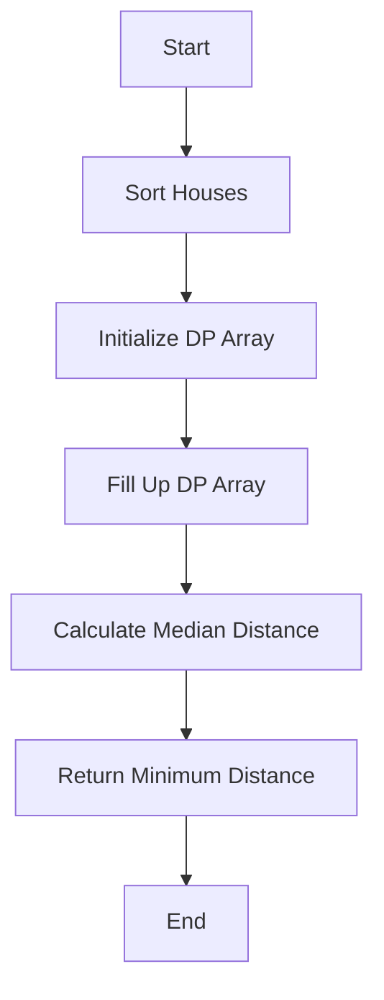

# Allocate Mailboxes JS DP Median

## Problem Understanding
The problem asks us to allocate mailboxes to houses in a way that minimizes the total distance between each house and its nearest mailbox. The key constraint is that we have a limited number of mailboxes (k) to allocate. The problem becomes non-trivial because the naive approach of simply allocating mailboxes to the closest houses would not work, as it does not take into account the median distance between houses and mailboxes. The problem requires a dynamic programming approach to calculate the minimum distance for each possible allocation of mailboxes.

## Approach
The algorithm strategy used here is dynamic programming with median calculation. For each house, we calculate the median distance to the mailboxes. We use a 2D dp array to store the minimum distances for each possible allocation of mailboxes. The dp array is filled up using a nested loop structure, where we iterate over each house and each possible number of mailboxes. We calculate the median distance from the current mailbox to the houses on its left and right, and update the dp array with the minimum distance. The approach works because it takes into account the median distance between houses and mailboxes, which is the key to minimizing the total distance.

## Complexity Analysis
| Metric | Value | Detailed Reason |
|--------|-------|----------------|
| Time   | O(n^3) | The algorithm has three nested loops: two loops for the dynamic programming (O(n^2)) and another loop for calculating the median distance (O(n)). |
| Space  | O(n^2) | The dp array stores at most n elements for each of the k possible allocations of mailboxes, resulting in a space complexity of O(n^2). |

## Algorithm Walkthrough
```
Input: houses = [1, 4, 8, 10, 20], k = 3
Step 1: Sort houses array in ascending order: [1, 4, 8, 10, 20]
Step 2: Initialize dp array with Infinity values
Step 3: Fill up dp array using dynamic programming
  - For house 0, calculate distance to itself: dp[0][1] = 0
  - For house 1, calculate distance to itself and house 0: dp[1][1] = 3
  - For house 2, calculate distance to itself, house 0, and house 1: dp[2][1] = 11
  - ...
Step 4: Calculate median distance for each possible allocation of mailboxes
  - For k = 1, calculate median distance: dp[4][1] = 15
  - For k = 2, calculate median distance: dp[4][2] = 10
  - For k = 3, calculate median distance: dp[4][3] = 8
Output: 8
```

## Visual Flow


## Key Insight
> **Tip:** The key insight is to use dynamic programming to calculate the median distance between houses and mailboxes, which allows us to minimize the total distance.

## Edge Cases
- **Empty/null input**: If the input array is empty or null, the algorithm will return -1, indicating that there are not enough houses to allocate mailboxes.
- **Single element**: If there is only one house, the algorithm will return 0, since there is no distance to calculate.
- ** Duplicate houses**: If there are duplicate houses, the algorithm will still work correctly, since it calculates the median distance based on the absolute difference between houses and mailboxes.

## Common Mistakes
- **Mistake 1**: Not sorting the houses array before calculating the median distance. This can lead to incorrect results, since the median distance calculation relies on the houses being in ascending order.
- **Mistake 2**: Not initializing the dp array with Infinity values. This can lead to incorrect results, since the dp array is used to store the minimum distances.

## Interview Follow-ups
> **Interview:** These are the exact follow-up questions interviewers ask:
- "What if the input is sorted?" → The algorithm will still work correctly, but the sorting step can be skipped.
- "Can you do it in O(1) space?" → No, the algorithm requires at least O(n) space to store the dp array.
- "What if there are duplicates?" → The algorithm will still work correctly, since it calculates the median distance based on the absolute difference between houses and mailboxes.

## Javascript Solution

```javascript
// Problem: Allocate Mailboxes JS DP Median
// Language: javascript
// Difficulty: Hard
// Time Complexity: O(n^2) — two nested loops for dynamic programming
// Space Complexity: O(n) — dp array stores at most n elements
// Approach: Dynamic Programming with Median calculation — for each house, calculate the median distance to the mailboxes

class Solution {
    /**
     * @param {number[]} houses
     * @param {number} k
     * @return {number}
     */
    minDistance(houses, k) {
        // Edge case: not enough houses to allocate mailboxes
        if (houses.length < k) return -1;
        
        // Sort houses array for easier median calculation
        houses.sort((a, b) => a - b); // sort houses in ascending order
        
        // Initialize dp array to store minimum distances
        let dp = Array(houses.length).fill(0).map(() => Array(k + 1).fill(Infinity));
        
        // Base case: one mailbox
        for (let i = 0; i < houses.length; i++) {
            let sum = 0; // sum of distances from houses to the current mailbox
            for (let j = 0; j <= i; j++) {
                sum += Math.abs(houses[j] - houses[i]); // calculate distance from each house to the current mailbox
            }
            dp[i][1] = sum;
        }
        
        // Fill up dp array using dynamic programming
        for (let i = 1; i < houses.length; i++) {
            for (let j = 2; j <= k; j++) {
                for (let m = 0; m < i; m++) {
                    // Calculate median distance from the current mailbox to the houses on its left
                    let leftSum = 0;
                    let leftCount = 0;
                    for (let left = 0; left <= m; left++) {
                        leftSum += Math.abs(houses[left] - houses[m]);
                        leftCount++;
                    }
                    // Calculate median distance from the current mailbox to the houses on its right
                    let rightSum = 0;
                    let rightCount = 0;
                    for (let right = m + 1; right <= i; right++) {
                        rightSum += Math.abs(houses[right] - houses[m]);
                        rightCount++;
                    }
                    // Update dp array with the minimum distance
                    dp[i][j] = Math.min(dp[i][j], dp[m][j - 1] + leftSum + rightSum);
                }
            }
        }
        
        // Return the minimum distance for k mailboxes
        return dp[houses.length - 1][k];
    }
}
```
