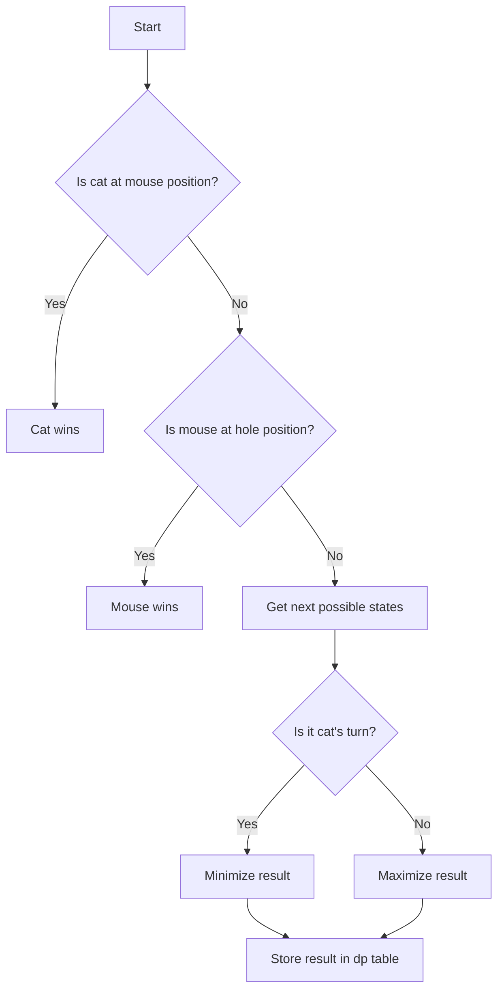

# Cat and Mouse JS Minimax DP

## Problem Understanding
The problem is asking us to determine the outcome of a game between a cat and a mouse, where the cat tries to catch the mouse and the mouse tries to escape through a hole. The game is played on a one-dimensional grid with n positions, and the cat and mouse can move to adjacent positions. The key constraint is that the cat and mouse can only move in certain directions (left or right), and the cat wins if it catches the mouse, while the mouse wins if it reaches the hole. What makes this problem non-trivial is the need to consider all possible moves for both the cat and the mouse, making a naive approach impractical due to the exponential number of possible game states.

## Approach
The algorithm strategy used here is Minimax Dynamic Programming, which involves considering the best move for both the cat and the mouse at each state and storing the results of subproblems in a dp table to avoid redundant computation. The intuition behind this approach is to simulate all possible games and determine the optimal move for each player, taking into account the possible moves of the opponent. The dp table is used to store the results of subproblems, and the minimax function is used to fill up the dp table by considering all possible next states. This approach works because it allows us to prune the game tree and focus on the most promising lines of play.

## Complexity Analysis
| Metric | Value | Detailed Reason |
|--------|-------|----------------|
| Time   | O(n^2) | The time complexity is O(n^2) because we have two nested loops to fill up the dp table, where n is the number of positions on the grid. The minimax function is called recursively, but the dp table ensures that each subproblem is only solved once. |
| Space  | O(n^2) | The space complexity is O(n^2) because we need to store the dp table, which has a size of n x n x 2 (for the two players). |

## Algorithm Walkthrough
```
Input: n = 3
Step 1: Initialize the dp table with -1 (unknown result)
dp = [
  [[-1, -1], [-1, -1], [-1, -1]],
  [[-1, -1], [-1, -1], [-1, -1]],
  [[-1, -1], [-1, -1], [-1, -1]]
]
Step 2: Call the minimax function from the initial state (cat at position n-1, mouse at position n-1, cat's turn)
minimax(2, 2, 0)
  -> getNextStates(2, 2, 0) returns [[1, 2, 1], [3, 2, 1]] (possible next states)
  -> minimax(1, 2, 1) returns 1 (cat wins)
  -> minimax(3, 2, 1) returns 1 (cat wins)
  -> dp[2][2][0] = 1 (store the result in the dp table)
Output: 1 (cat wins)
```
## Visual Flow

## Key Insight
> **Tip:** The key insight is to use Minimax Dynamic Programming to prune the game tree and focus on the most promising lines of play, taking into account the possible moves of the opponent.

## Edge Cases
- **Empty/null input**: If the input n is 0 or null, the function should return an error message, as the game cannot be played on an empty grid.
- **Single element**: If the input n is 1, the function should return 1 (cat wins), as the cat will always catch the mouse on a grid with only one position.
- **Large input**: If the input n is very large, the function may take a long time to compute the result, as the dp table will have a large size.

## Common Mistakes
- **Mistake 1**: Not using the dp table to store the results of subproblems, leading to redundant computation and increased time complexity.
- **Mistake 2**: Not considering all possible next states in the minimax function, leading to incorrect results.

## Interview Follow-ups
> **Interview:** These are the exact follow-up questions interviewers ask:
- "What if the input is sorted?" → The input is not sorted, as the cat and mouse can move in any direction.
- "Can you do it in O(1) space?" → No, the dp table is necessary to store the results of subproblems, and its size is O(n^2).
- "What if there are duplicates?" → The dp table ensures that each subproblem is only solved once, so duplicates do not affect the result.

## Javascript Solution

```javascript
// Problem: Cat and Mouse JS Minimax DP
// Language: javascript
// Difficulty: Hard
// Time Complexity: O(n^2) — two nested loops to fill up the dp table
// Space Complexity: O(n^2) — dp table to store the results of subproblems
// Approach: Minimax Dynamic Programming — for each state, consider the best move for both cat and mouse

class Solution {
    /**
     * @param {number} n
     * @return {number}
     */
    catMouseGame(n) {
        // Edge case: when n is 1, the cat will always catch the mouse
        if (n === 1) return 1;

        // Initialize the dp table with -1 (unknown result)
        const dp = Array.from({ length: n * 2 }, () => Array.from({ length: n * 2 }, () => Array(2).fill(-1)));

        // Function to check if the cat has caught the mouse
        function hasCaught(cat, mouse) {
            // If the cat is at the same position as the mouse, it has caught the mouse
            return cat === mouse;
        }

        // Function to get the next possible states
        function getNextStates(cat, mouse, turn) {
            const nextStates = [];
            // If it's the cat's turn, it can move to the left or right
            if (turn === 0) {
                for (let i = -1; i <= 1; i += 2) {
                    const nextCat = cat + i;
                    if (nextCat >= 0 && nextCat < n) {
                        nextStates.push([nextCat, mouse, 1 - turn]);
                    }
                }
            }
            // If it's the mouse's turn, it can move to the left or right
            else {
                for (let i = -1; i <= 1; i += 2) {
                    const nextMouse = mouse + i;
                    if (nextMouse >= 0 && nextMouse < n) {
                        nextStates.push([cat, nextMouse, 1 - turn]);
                    }
                }
            }
            return nextStates;
        }

        // Function to fill up the dp table using minimax
        function minimax(cat, mouse, turn) {
            // If the cat has caught the mouse, return 1 (cat wins)
            if (hasCaught(cat, mouse)) return 1;
            // If the mouse is at the hole (position 0), return 2 (mouse wins)
            if (mouse === 0) return 2;

            // If the result is already known, return it
            if (dp[cat][mouse][turn] !== -1) return dp[cat][mouse][turn];

            // If it's the cat's turn, try to minimize the result
            if (turn === 0) {
                let minResult = Infinity;
                for (const [nextCat, nextMouse, nextTurn] of getNextStates(cat, mouse, turn)) {
                    const result = minimax(nextCat, nextMouse, nextTurn);
                    minResult = Math.min(minResult, result);
                }
                dp[cat][mouse][turn] = minResult;
                return minResult;
            }
            // If it's the mouse's turn, try to maximize the result
            else {
                let maxResult = -Infinity;
                for (const [nextCat, nextMouse, nextTurn] of getNextStates(cat, mouse, turn)) {
                    const result = minimax(nextCat, nextMouse, nextTurn);
                    maxResult = Math.max(maxResult, result);
                }
                dp[cat][mouse][turn] = maxResult;
                return maxResult;
            }
        }

        // Start the minimax from the initial state
        return minimax(n - 1, n - 1, 0);
    }
}
```
