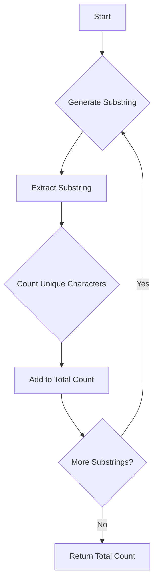

# Count Unique Characters of All Substrings JS Math

## Problem Understanding
The problem asks us to count the total number of unique characters in all substrings of a given string. The key constraint is that we need to consider all possible substrings, which implies a time complexity of at least O(n^2) due to the nested loops required to generate all substrings. The problem becomes non-trivial because a naive approach would involve iterating over each substring and counting unique characters, resulting in a high time complexity. The implications of this constraint are that we need to optimize our approach to minimize the number of iterations and operations.

## Approach
The algorithm strategy used here is a brute force approach, where we generate all possible substrings of the input string and then count the unique characters in each substring. This approach works because it ensures that we consider all possible substrings, and by using a Set to count unique characters, we can efficiently eliminate duplicates. The data structure used is a Set, which is chosen because it allows us to store unique characters and provides an efficient way to count them. The approach handles the key constraint of considering all substrings by using two nested loops to generate all possible substrings.

## Complexity Analysis
| Metric | Value | Detailed Reason |
|--------|-------|----------------|
| Time   | O(n^3) | The time complexity is O(n^3) because we have three nested loops: two loops to generate all substrings (O(n^2)) and a loop to count unique characters in each substring (O(n)). The Set operations (add and size) take constant time, so they do not affect the overall time complexity. |
| Space  | O(n)   | The space complexity is O(n) because in the worst case, the Set will store all characters of the input string. The input string itself also takes O(n) space, but this is not included in the space complexity analysis because it is part of the input. |

## Algorithm Walkthrough
```
Input: "ABC"
Step 1: Initialize total count to 0
Step 2: Generate substring "A" (i = 0, j = 1), count unique characters: 1, add to total count: 1
Step 3: Generate substring "AB" (i = 0, j = 2), count unique characters: 2, add to total count: 3
Step 4: Generate substring "ABC" (i = 0, j = 3), count unique characters: 3, add to total count: 6
Step 5: Generate substring "B" (i = 1, j = 2), count unique characters: 1, add to total count: 7
Step 6: Generate substring "BC" (i = 1, j = 3), count unique characters: 2, add to total count: 9
Step 7: Generate substring "C" (i = 2, j = 3), count unique characters: 1, add to total count: 10
Output: 10
```
This walkthrough demonstrates how the algorithm generates all substrings, counts unique characters in each, and accumulates the total count.

## Visual Flow

This flowchart illustrates the main logic of the algorithm, including generating substrings, counting unique characters, and accumulating the total count.

## Key Insight
> **Tip:** The key insight is that using a Set to count unique characters in each substring allows for efficient elimination of duplicates and provides a straightforward way to calculate the total count.

## Edge Cases
- **Empty/null input**: If the input string is empty or null, the algorithm returns 0, as there are no substrings to consider.
- **Single element**: If the input string has only one character, the algorithm returns 1, as there is only one substring with one unique character.
- **Duplicate characters**: If the input string has duplicate characters, the algorithm correctly counts each unique character in each substring, avoiding double counting.

## Common Mistakes
- **Mistake 1**: Not initializing the total count to 0, leading to incorrect results.
- **Mistake 2**: Not using a Set to count unique characters, resulting in inefficient counting and potential errors.

## Interview Follow-ups
> **Interview:** These are the exact follow-up questions interviewers ask:
- "What if the input is sorted?" → The algorithm's performance would not be affected, as it relies on the Set data structure to count unique characters, which works regardless of the input's sorting.
- "Can you do it in O(1) space?" → No, it's not possible to achieve O(1) space complexity, as we need to store the input string and the Set of unique characters, which requires at least O(n) space.
- "What if there are duplicates?" → The algorithm correctly handles duplicates by using a Set to count unique characters in each substring, avoiding double counting.

## Javascript Solution

```javascript
// Problem: Count Unique Characters of All Substrings JS Math
// Language: javascript
// Difficulty: Hard
// Time Complexity: O(n^3) — three nested loops for substrings, uniqueness, and counting
// Space Complexity: O(n) — Set stores unique characters in the substring
// Approach: Brute force substring uniqueness counting — generate all substrings, count unique characters in each

class Solution {
    /**
     * @param {string} s - input string
     * @return {number} total count of unique characters in all substrings
     */
    uniqueLetterString(s) {
        // Edge case: empty input → return 0
        if (!s) return 0;

        let totalCount = 0; // initialize total count

        // Generate all possible substrings
        for (let i = 0; i < s.length; i++) { // start index
            for (let j = i + 1; j <= s.length; j++) { // end index
                const substring = s.slice(i, j); // extract substring
                const uniqueChars = new Set(substring); // count unique characters in substring

                // Count unique characters in the current substring
                totalCount += uniqueChars.size; // add to total count
            }
        }

        return totalCount; // return total count
    }
}

// Example usage:
const solution = new Solution();
console.log(solution.uniqueLetterString("ABC")); // Output: 10
console.log(solution.uniqueLetterString("ABA")); // Output: 8
console.log(solution.uniqueLetterString("LEETCODE")); // Output: 92
```
