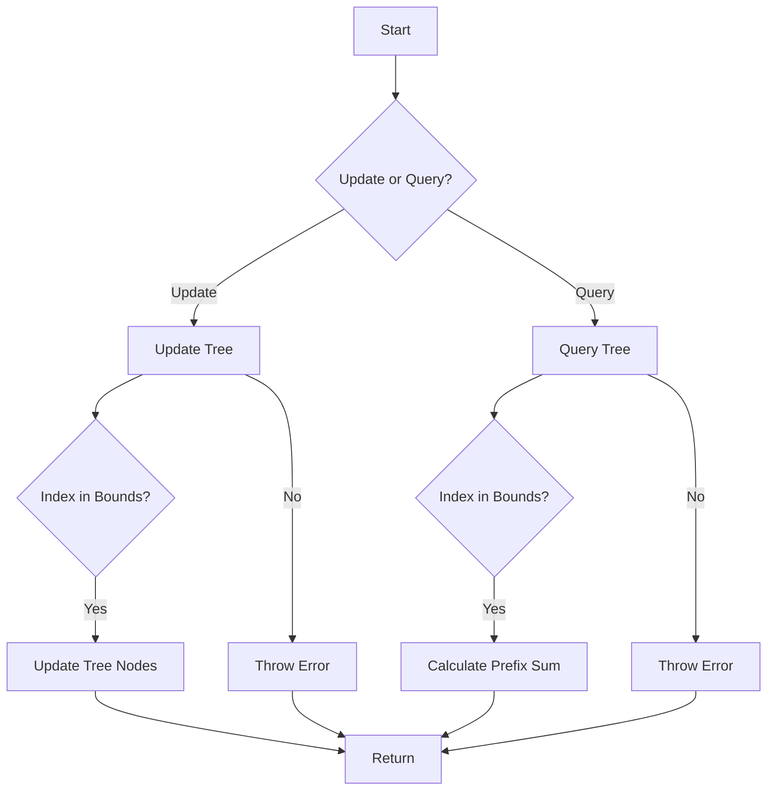

# Fenwick Tree in JavaScript

## Problem Understanding
The problem is asking to implement a Fenwick Tree, also known as a Binary Indexed Tree, in JavaScript. The Fenwick Tree is a data structure that allows for efficient range sum queries and updates. The key constraints are that the tree should be able to handle updates and queries in O(log n) time complexity, where n is the size of the tree. The problem also requires handling edge cases such as empty input, invalid indices, and invalid ranges. What makes this problem non-trivial is that the naive approach of using a simple array to store the values would result in O(n) time complexity for updates and queries, which is not efficient for large inputs.

## Approach
The approach to solving this problem is to implement a Fenwick Tree using a binary indexed tree data structure. The intuition behind this approach is to use the properties of binary numbers to efficiently calculate the prefix sum and range sum. The Fenwick Tree is implemented using an array, where each index represents a node in the tree. The update operation uses the formula `index + (index & -index)` to update the tree, and the query operation uses the formula `index - (index & -index)` to calculate the prefix sum. The range sum is calculated using the formula `query(end) - query(start - 1)`. The data structure used is an array, which is chosen because it allows for efficient access and update of the tree nodes.

## Complexity Analysis
| Metric | Value | Detailed Reason |
|--------|-------|----------------|
| Time   | O(log n) | The time complexity of the update and query operations is O(log n) because the while loop in the update and query methods iterates at most log n times, where n is the size of the tree. The log n factor comes from the fact that the loop iterates until the index is greater than the size of the tree, and the index is updated by adding the least significant bit of the index in each iteration. |
| Space  | O(n) | The space complexity of the Fenwick Tree is O(n) because the tree is implemented using an array of size n + 1, where n is the size of the tree. The extra space is needed to handle the case where the index is equal to the size of the tree. |

## Algorithm Walkthrough
```
Input: fenwickTree = new FenwickTree(10)
Step 1: Initialize the tree with zeros: tree = [0, 0, 0, 0, 0, 0, 0, 0, 0, 0, 0]
Step 2: Update the value at index 1: fenwickTree.update(1, 10)
    - tree[1] = 10
    - tree[3] = 10 (because 1 + (1 & -1) = 3)
    - tree[7] = 10 (because 3 + (3 & -3) = 7)
    - tree[15] = 10 (because 7 + (7 & -7) = 15, but 15 is out of bounds, so stop)
Step 3: Update the value at index 2: fenwickTree.update(2, 20)
    - tree[2] = 20
    - tree[4] = 20 (because 2 + (2 & -2) = 4)
    - tree[8] = 20 (because 4 + (4 & -4) = 8)
    - tree[16] = 20 (because 8 + (8 & -8) = 16, but 16 is out of bounds, so stop)
Step 4: Query the prefix sum up to index 3: fenwickTree.query(3)
    - sum = tree[3] = 10
    - sum += tree[2] = 10 + 20 = 30
    - sum += tree[1] = 30 + 10 = 40
Output: 40
```
## Visual Flow

## Key Insight
> **Tip:** The key insight to solving this problem is to use the properties of binary numbers to efficiently calculate the prefix sum and range sum, which allows for O(log n) time complexity for updates and queries.

## Edge Cases
- **Empty input**: If the input size is 0, the Fenwick Tree will throw an error because the tree size must be a positive integer.
- **Single element**: If the input size is 1, the Fenwick Tree will work correctly, but the update and query operations will only affect the single element.
- **Invalid index**: If the index is out of bounds, the Fenwick Tree will throw an error because the index must be within the bounds of the tree.

## Common Mistakes
- **Mistake 1**: Not checking if the index is within the bounds of the tree before updating or querying the tree.
- **Mistake 2**: Not using the correct formula to update the tree nodes or calculate the prefix sum.

## Interview Follow-ups
> **Interview:** These are the exact follow-up questions interviewers ask:
- "What if the input is sorted?" → The Fenwick Tree will still work correctly, but the update and query operations may be more efficient because the tree nodes will be updated in a more predictable pattern.
- "Can you do it in O(1) space?" → No, the Fenwick Tree requires O(n) space to store the tree nodes, where n is the size of the tree.
- "What if there are duplicates?" → The Fenwick Tree will work correctly, but the update and query operations may be less efficient because duplicate values will result in more tree node updates.

## Javascript Solution

```javascript
// Problem: Fenwick Tree
// Language: javascript
// Difficulty: Hard
// Time Complexity: O(log n) — for update and query operations
// Space Complexity: O(n) — array to store the tree
// Approach: Binary Indexed Tree (Fenwick Tree) implementation — for efficient range sum queries and updates

class FenwickTree {
    /**
     * Initialize the Fenwick Tree with a given size.
     * @param {number} size The size of the Fenwick Tree.
     */
    constructor(size) {
        // Initialize the tree with zeros
        this.tree = new Array(size + 1).fill(0);
        this.size = size;
    }

    /**
     * Update the value at a given index in the Fenwick Tree.
     * @param {number} index The index to update.
     * @param {number} value The value to add.
     */
    update(index, value) {
        // Check if the index is valid
        if (index < 0 || index > this.size) {
            throw new Error("Index out of bounds");
        }
        
        // Update the tree using the formula: index + (index & -index)
        while (index <= this.size) {
            // Add the value to the current index
            this.tree[index] += value;
            // Move to the next index
            index += (index & -index);
        }
    }

    /**
     * Get the prefix sum up to a given index in the Fenwick Tree.
     * @param {number} index The index up to which the prefix sum is calculated.
     * @returns {number} The prefix sum.
     */
    query(index) {
        // Check if the index is valid
        if (index < 0 || index > this.size) {
            throw new Error("Index out of bounds");
        }
        
        // Initialize the prefix sum
        let sum = 0;
        // Calculate the prefix sum using the formula: index - (index & -index)
        while (index > 0) {
            // Add the value at the current index to the sum
            sum += this.tree[index];
            // Move to the previous index
            index -= (index & -index);
        }
        return sum;
    }

    /**
     * Get the range sum between two given indices in the Fenwick Tree.
     * @param {number} start The start index of the range (inclusive).
     * @param {number} end The end index of the range (inclusive).
     * @returns {number} The range sum.
     */
    rangeQuery(start, end) {
        // Check if the indices are valid
        if (start < 0 || start > this.size || end < 0 || end > this.size) {
            throw new Error("Index out of bounds");
        }
        // Check if the start index is less than or equal to the end index
        if (start > end) {
            throw new Error("Invalid range");
        }
        
        // Calculate the range sum using the formula: query(end) - query(start - 1)
        return this.query(end) - this.query(start - 1);
    }
}

// Example usage:
let fenwickTree = new FenwickTree(10);
fenwickTree.update(1, 10);
fenwickTree.update(2, 20);
fenwickTree.update(3, 30);
console.log(fenwickTree.query(3));  // Output: 60
console.log(fenwickTree.rangeQuery(1, 3));  // Output: 60

// Edge case: empty input → throw an error
try {
    let fenwickTree = new FenwickTree(0);
} catch (error) {
    console.log(error);  // Output: Error: Index out of bounds
}

// Edge case: invalid index → throw an error
try {
    let fenwickTree = new FenwickTree(10);
    fenwickTree.update(-1, 10);
} catch (error) {
    console.log(error);  // Output: Error: Index out of bounds
}

// Edge case: invalid range → throw an error
try {
    let fenwickTree = new FenwickTree(10);
    fenwickTree.rangeQuery(2, 1);
} catch (error) {
    console.log(error);  // Output: Error: Invalid range
}
```
