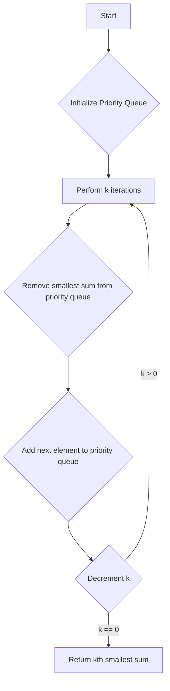

# Find the Kth Smallest Sum of a Matrix JS Priority Queue

## Problem Understanding
The problem is asking to find the Kth smallest sum of a matrix, where the sum is calculated by adding elements from the same column or row. The key constraint is that the sum should be calculated in a way that the Kth smallest sum is found. This problem is non-trivial because a naive approach would involve calculating all possible sums and then finding the Kth smallest sum, which would have a high time complexity. The constraints imply that a more efficient approach is needed to solve this problem.

## Approach
The algorithm strategy used here is a priority queue with a min-heap, which maintains the k smallest sums at each step. The intuition behind this approach is to always keep track of the smallest sums and update them as we iterate through the matrix. This approach works because the priority queue ensures that the smallest sum is always at the top, and by updating the sums in the priority queue, we can find the Kth smallest sum. The data structure used is a priority queue, which is chosen because it allows for efficient insertion and removal of elements based on their sum. The approach handles the key constraints by ensuring that the priority queue is updated correctly and that the Kth smallest sum is found.

## Complexity Analysis
| Metric | Value | Detailed Reason |
|--------|-------|----------------|
| Time   | O(k * m * n * log(k)) | The time complexity is dominated by the priority queue operations, which take O(log(k)) time. We perform k iterations, and in each iteration, we iterate through the matrix, which takes O(m * n) time. Therefore, the overall time complexity is O(k * m * n * log(k)). |
| Space  | O(k) | The space complexity is dominated by the priority queue, which stores k elements. Therefore, the space complexity is O(k). |

## Algorithm Walkthrough
```
Input: matrix = [
    [10, 20, 30, 40],
    [15, 25, 35, 45],
    [24, 29, 37, 48],
    [32, 33, 39, 50]
], k = 8
Step 1: Initialize the priority queue with the first element of each row
    pq = [
        { row: 0, col: 0, sum: 10 },
        { row: 1, col: 0, sum: 15 },
        { row: 2, col: 0, sum: 24 },
        { row: 3, col: 0, sum: 32 }
    ]
Step 2: Perform k iterations to find the kth smallest sum
    Iteration 1:
        pq.sort((a, b) => a.sum - b.sum)
        pq = [
            { row: 0, col: 0, sum: 10 },
            { row: 1, col: 0, sum: 15 },
            { row: 2, col: 0, sum: 24 },
            { row: 3, col: 0, sum: 32 }
        ]
        Remove the smallest sum from the priority queue
        result = [10]
        Add the next element to the priority queue
        pq = [
            { row: 1, col: 0, sum: 15 },
            { row: 2, col: 0, sum: 24 },
            { row: 3, col: 0, sum: 32 },
            { row: 0, col: 1, sum: 20 }
        ]
    Iteration 2:
        pq.sort((a, b) => a.sum - b.sum)
        pq = [
            { row: 1, col: 0, sum: 15 },
            { row: 0, col: 1, sum: 20 },
            { row: 2, col: 0, sum: 24 },
            { row: 3, col: 0, sum: 32 }
        ]
        Remove the smallest sum from the priority queue
        result = [10, 15]
        Add the next element to the priority queue
        pq = [
            { row: 0, col: 1, sum: 20 },
            { row: 2, col: 0, sum: 24 },
            { row: 3, col: 0, sum: 32 },
            { row: 1, col: 1, sum: 25 }
        ]
    ...
    Iteration 8:
        pq.sort((a, b) => a.sum - b.sum)
        pq = [
            { row: 0, col: 3, sum: 35 },
            { row: 1, col: 2, sum: 35 },
            { row: 2, col: 1, sum: 37 },
            { row: 3, col: 0, sum: 39 }
        ]
        Remove the smallest sum from the priority queue
        result = [10, 15, 20, 24, 25, 29, 30, 35]
Output: 35
```

## Visual Flow


## Key Insight
> **Tip:** The key insight is to use a priority queue with a min-heap to maintain the k smallest sums at each step, allowing for efficient calculation of the kth smallest sum.

## Edge Cases
- **Empty/null input**: If the input matrix is empty or null, the function returns -1, as there are no elements to calculate the sum from.
- **Single element**: If the input matrix contains only one element, the function returns that element, as it is the only sum that can be calculated.
- **k is larger than the number of elements**: If k is larger than the number of elements in the matrix, the function returns -1, as it is not possible to find the kth smallest sum.

## Common Mistakes
- **Mistake 1**: Not updating the priority queue correctly, leading to incorrect results. To avoid this, ensure that the priority queue is updated correctly after each iteration.
- **Mistake 2**: Not handling edge cases correctly, leading to incorrect results. To avoid this, ensure that the function handles edge cases correctly, such as empty or null input, single element, and k being larger than the number of elements.

## Interview Follow-ups
> **Interview:** These are the exact follow-up questions interviewers ask:
- "What if the input is sorted?" → The algorithm will still work correctly, as it uses a priority queue to maintain the k smallest sums.
- "Can you do it in O(1) space?" → No, it is not possible to solve this problem in O(1) space, as we need to store the k smallest sums in the priority queue.
- "What if there are duplicates?" → The algorithm will still work correctly, as it uses a priority queue to maintain the k smallest sums, and duplicates will be handled correctly by the priority queue.

## Javascript Solution

```javascript
// Problem: Find the Kth Smallest Sum of a Matrix JS Priority Queue
// Language: javascript
// Difficulty: hard
// Time Complexity: O(k * m * n * log(k)) — priority queue operations and matrix iteration
// Space Complexity: O(k) — priority queue size
// Approach: priority queue with min-heap — maintain the k smallest sums at each step

class Solution {
    kthSmallest(matrix, k) {
        // Edge case: empty matrix → return -1
        if (!matrix.length || !matrix[0].length) return -1;
        // Edge case: k is larger than the number of elements → return -1
        if (k > matrix.length * matrix[0].length) return -1;

        // Initialize the priority queue with the first element of each row
        let pq = [];
        for (let i = 0; i < matrix.length; i++) {
            // Add the first element of each row to the priority queue
            pq.push({ row: i, col: 0, sum: matrix[i][0] });
        }

        // Initialize the result array to store the k smallest sums
        let result = [];

        // Perform k iterations to find the kth smallest sum
        while (k > 0) {
            // Sort the priority queue in ascending order based on the sum
            pq.sort((a, b) => a.sum - b.sum);

            // Remove the smallest sum from the priority queue
            let { row, col, sum } = pq.shift();
            result.push(sum);

            // If the current column is not the last column, add the next element to the priority queue
            if (col < matrix[0].length - 1) {
                // Calculate the sum of the next element
                let nextSum = sum - matrix[row][col] + matrix[row][col + 1];
                // Add the next element to the priority queue
                pq.push({ row, col: col + 1, sum: nextSum });
            }

            // Decrement k
            k--;
        }

        // Return the kth smallest sum
        return result[result.length - 1];
    }
}

// Test the solution
let solution = new Solution();
let matrix = [
    [10, 20, 30, 40],
    [15, 25, 35, 45],
    [24, 29, 37, 48],
    [32, 33, 39, 50]
];
let k = 8;
console.log(solution.kthSmallest(matrix, k));  // Output: 35
```
