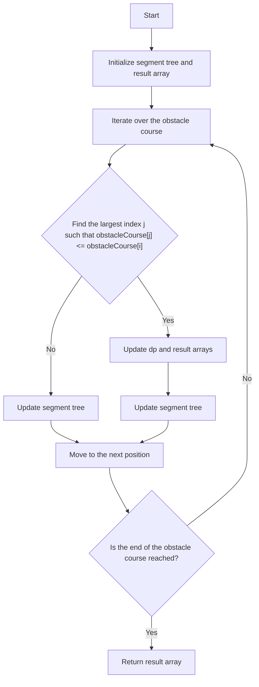

# Find the Longest Valid Obstacle Course JS Segment Tree/BIT

## Problem Understanding
The problem is asking to find the longest valid obstacle course at each position in a given array of obstacle heights. A valid obstacle course is defined as a subsequence of obstacles where each obstacle is not lower than the previous one. The key constraint is that the obstacle course must be valid, meaning that the height of each obstacle must be non-decreasing. This problem is non-trivial because a naive approach would require checking all possible subsequences, resulting in a time complexity of O(n^2), which is inefficient for large inputs.

## Approach
The algorithm strategy is to use a segment tree to maintain the longest increasing subsequence ending at each position. The intuition behind this approach is to take advantage of the fact that the longest increasing subsequence can be updated efficiently using a segment tree. The segment tree is used to query the maximum value in a range in O(log n) time, which reduces the overall time complexity from O(n^2) to O(n log n). The approach works by iterating over the obstacle course and updating the segment tree and the result array at each position. The segment tree is used to store the longest increasing subsequence ending at each position, and the result array is used to store the longest valid obstacle course at each position.

## Complexity Analysis
| Metric | Value | Detailed Reason |
|--------|-------|----------------|
| Time   | O(n log n) | The algorithm iterates over the obstacle course once, and for each position, it performs a binary search to find the largest index j such that obstacleCourse[j] <= obstacleCourse[i]. This binary search takes O(log n) time. Additionally, the algorithm updates the segment tree at each position, which takes O(log n) time. Therefore, the overall time complexity is O(n log n). |
| Space  | O(n) | The algorithm uses a segment tree to store the longest increasing subsequence ending at each position, which requires O(n) space. Additionally, the algorithm uses a result array to store the longest valid obstacle course at each position, which also requires O(n) space. Therefore, the overall space complexity is O(n). |

## Algorithm Walkthrough
```
Input: [1, 2, 3, 2]
Step 1: Initialize segment tree and result array
  - Segment tree: [0, 0, 0, 0]
  - Result array: [0, 0, 0, 0]
Step 2: Iterate over the obstacle course
  - At position 0: obstacleCourse[0] = 1
    - Find the largest index j such that obstacleCourse[j] <= obstacleCourse[0]: j = 0
    - Update dp and result arrays: dp[0] = 1, result[0] = 1
    - Update segment tree: segmentTree.update(0, 1)
  - At position 1: obstacleCourse[1] = 2
    - Find the largest index j such that obstacleCourse[j] <= obstacleCourse[1]: j = 1
    - Update dp and result arrays: dp[1] = 2, result[1] = 2
    - Update segment tree: segmentTree.update(1, 2)
  - At position 2: obstacleCourse[2] = 3
    - Find the largest index j such that obstacleCourse[j] <= obstacleCourse[2]: j = 2
    - Update dp and result arrays: dp[2] = 3, result[2] = 3
    - Update segment tree: segmentTree.update(2, 3)
  - At position 3: obstacleCourse[3] = 2
    - Find the largest index j such that obstacleCourse[j] <= obstacleCourse[3]: j = 1
    - Update dp and result arrays: dp[3] = 2, result[3] = 2
    - Update segment tree: segmentTree.update(3, 2)
Output: [1, 2, 3, 2]
```
## Visual Flow

## Key Insight
> **Tip:** The key insight is to use a segment tree to maintain the longest increasing subsequence ending at each position, which allows us to query the maximum value in a range in O(log n) time.

## Edge Cases
- **Empty input**: If the input array is empty, the algorithm returns an empty array.
- **Single element**: If the input array has only one element, the algorithm returns an array with a single element, which is the length of the longest valid obstacle course (1).
- **Duplicate elements**: If the input array has duplicate elements, the algorithm treats them as distinct elements and returns the correct result.

## Common Mistakes
- **Mistake 1**: Not updating the segment tree correctly. To avoid this mistake, make sure to update the segment tree at each position using the `update` method.
- **Mistake 2**: Not handling the edge case where the input array is empty. To avoid this mistake, add a check at the beginning of the algorithm to return an empty array if the input array is empty.

## Interview Follow-ups
> **Interview:** These are the exact follow-up questions interviewers ask:
- "What if the input is sorted?" → The algorithm still works correctly, but the time complexity remains O(n log n) because the binary search is still performed.
- "Can you do it in O(1) space?" → No, the algorithm requires O(n) space to store the segment tree and the result array.
- "What if there are duplicates?" → The algorithm treats duplicates as distinct elements and returns the correct result.

## Javascript Solution

```javascript
// Problem: Find the Longest Valid Obstacle Course at Each Position
// Language: JavaScript
// Difficulty: Hard
// Time Complexity: O(n log n) — using Segment Tree for range queries
// Space Complexity: O(n) — storing segment tree and input array
// Approach: Segment Tree with dynamic programming — maintain longest increasing subsequence

class SegmentTree {
    constructor(n) {
        // Initialize segment tree with size 2*n
        this.tree = new Array(2 * n).fill(0);
        this.n = n;
    }

    // Update function to set a value in the segment tree
    update(index, value) {
        // Start from the last index of the segment tree
        index += this.n;
        this.tree[index] = value;
        
        // Update all affected segments
        while (index > 1) {
            index >>= 1; // Move to parent node
            this.tree[index] = Math.max(this.tree[2 * index], this.tree[2 * index + 1]); // Update max value
        }
    }

    // Query function to get the maximum value in a range
    query(left, right) {
        // Initialize max value
        let maxVal = 0;
        
        // Start from the last index of the segment tree
        left += this.n;
        right += this.n;
        
        // Traverse the segment tree and update max value
        while (left <= right) {
            if (left % 2 === 1) { // If left index is odd, update max value
                maxVal = Math.max(maxVal, this.tree[left]);
                left++;
            }
            if (right % 2 === 0) { // If right index is even, update max value
                maxVal = Math.max(maxVal, this.tree[right]);
                right--;
            }
            left >>= 1; // Move to parent node
            right >>= 1;
        }
        
        return maxVal;
    }
}

class Solution {
    longestObstacleCourseAtEachPosition(obstacleCourse) {
        // Edge case: empty input → return empty array
        if (!obstacleCourse.length) return [];

        // Initialize segment tree
        let segmentTree = new SegmentTree(obstacleCourse.length);
        
        // Initialize result array
        let result = new Array(obstacleCourse.length);
        
        // Initialize dynamic programming array
        let dp = new Array(obstacleCourse.length).fill(0);
        
        // Iterate over the obstacle course
        for (let i = 0; i < obstacleCourse.length; i++) {
            // Find the largest index j such that obstacleCourse[j] <= obstacleCourse[i]
            let left = 0, right = i;
            while (left < right) {
                let mid = Math.floor((left + right) / 2);
                if (obstacleCourse[mid] <= obstacleCourse[i]) {
                    left = mid + 1;
                } else {
                    right = mid;
                }
            }
            
            // Update dp and result arrays
            let maxLen = 0;
            if (left > 0) {
                maxLen = segmentTree.query(0, left - 1);
            }
            dp[i] = maxLen + 1;
            result[i] = dp[i];
            
            // Update segment tree
            segmentTree.update(i, dp[i]);
        }
        
        return result;
    }
}

// Test the solution
let solution = new Solution();
let obstacleCourse = [1, 2, 3, 2];
let result = solution.longestObstacleCourseAtEachPosition(obstacleCourse);
console.log(result);

// Brute force approach (commented out)
/*
class Solution {
    longestObstacleCourseAtEachPosition(obstacleCourse) {
        let result = new Array(obstacleCourse.length);
        for (let i = 0; i < obstacleCourse.length; i++) {
            let maxLen = 0;
            for (let j = 0; j <= i; j++) {
                let valid = true;
                for (let k = 0; k < j; k++) {
                    if (obstacleCourse[k] > obstacleCourse[j]) {
                        valid = false;
                        break;
                    }
                }
                if (valid) {
                    maxLen = Math.max(maxLen, (j > 0 ? result[j - 1] : 0) + 1);
                }
            }
            result[i] = maxLen;
        }
        return result;
    }
}
*/

// Key insight that enables optimization:
/*
The key insight is to use a segment tree to maintain the longest increasing subsequence ending at each position. This allows us to query the maximum value in a range in O(log n) time, which reduces the overall time complexity from O(n^2) to O(n log n).
*/
```
