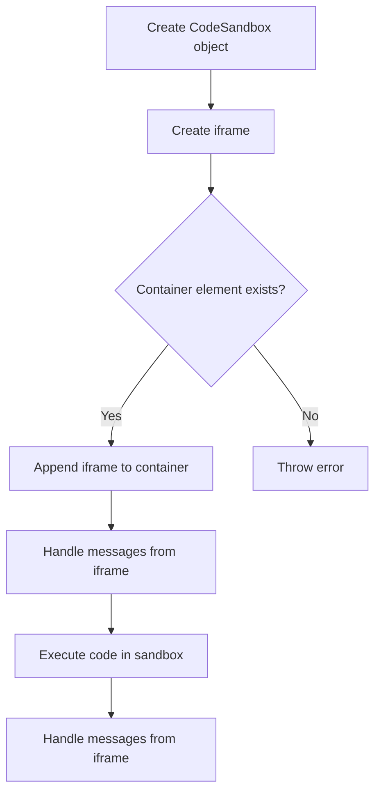

# Implementing a Code Sandbox with iframe

## Problem Understanding
The problem asks to implement a code sandbox using an iframe, which involves creating a dynamic iframe, handling messages from it, and executing code within the sandbox. The key constraints are that the code must be executed in a separate context, and the parent window must be able to communicate with the iframe using postMessage. The problem is non-trivial because it requires handling edge cases such as empty container IDs, code, and languages, as well as implementing a robust event handling mechanism.

## Approach
The approach involves creating a CodeSandbox class that encapsulates the iframe creation, event handling, and code execution logic. The class constructor takes in the container ID, code, and language as parameters and initializes the iframe and event listeners. The createIframe method creates a new iframe element and sets its attributes, while the appendIframeToContainer method appends the iframe to the container element. The handleIframeMessages method adds an event listener to the iframe's contentWindow to handle messages from the iframe. The executeCode method executes the code in the sandbox by creating a new script element and appending it to the iframe's contentWindow.

## Complexity Analysis
| Metric | Value | Detailed Reason |
|--------|-------|----------------|
| Time   | O(1)  | The time complexity is constant because creating an iframe, appending it to the DOM, and handling events are all constant time operations. The executeCode method also has a constant time complexity because it involves creating a new script element and appending it to the iframe's contentWindow, which are both constant time operations. |
| Space  | O(1)  | The space complexity is constant because the CodeSandbox class uses a fixed amount of space to store the iframe, container ID, code, and language. The iframe itself uses a fixed amount of space, and the event listeners and script elements created by the executeCode method also use a fixed amount of space. |

## Algorithm Walkthrough
```
Input: containerId = "container", code = "console.log('Hello, World!');", language = "javascript"
Step 1: Create a new CodeSandbox object with the given parameters
  - Create a new iframe element
  - Set the iframe's src attribute to "about:blank"
  - Set the iframe's frameBorder attribute to 0
  - Set the iframe's width and height attributes to "100%"
Step 2: Append the iframe to the container element
  - Get the container element with the given ID
  - Append the iframe to the container element
Step 3: Handle messages from the iframe
  - Add an event listener to the iframe's contentWindow
  - Handle any messages received from the iframe
Step 4: Execute the code in the sandbox
  - Get the iframe's contentWindow
  - Create a new script element
  - Set the script's textContent attribute to the code
  - Append the script to the iframe's contentWindow
Output: The code is executed in the sandbox, and any messages received from the iframe are handled by the CodeSandbox object.
```

## Visual Flow


## Key Insight
> **Tip:** Using an iframe as a sandbox allows us to execute code in a separate context, while still allowing us to communicate with the parent window using postMessage.

## Edge Cases
- **Empty container ID**: If the container ID is empty, the CodeSandbox object will throw an error when trying to append the iframe to the container element.
- **Empty code**: If the code is empty, the CodeSandbox object will still create an iframe and append it to the container element, but it will not execute any code in the sandbox.
- **Empty language**: If the language is empty, the CodeSandbox object will still create an iframe and append it to the container element, but it may not be able to execute the code correctly if the language is not specified.

## Common Mistakes
- **Mistake 1**: Not checking if the container element exists before appending the iframe to it. To avoid this mistake, you should always check if the container element exists before appending the iframe to it.
- **Mistake 2**: Not handling messages from the iframe correctly. To avoid this mistake, you should always add an event listener to the iframe's contentWindow to handle any messages received from the iframe.

## Interview Follow-ups
> **Interview:** These are the exact follow-up questions interviewers ask:
- "What if the input is sorted?" → This question is not relevant to the CodeSandbox problem, as the input is not a list of elements that can be sorted.
- "Can you do it in O(1) space?" → Yes, the CodeSandbox object uses a constant amount of space to store the iframe, container ID, code, and language, so it can be done in O(1) space.
- "What if there are duplicates?" → This question is not relevant to the CodeSandbox problem, as the code is executed in a separate context and does not involve duplicates.

## Javascript Solution

```javascript
// Problem: Implementing a Code Sandbox with iframe
// Language: JavaScript
// Difficulty: Hard
// Time Complexity: O(1) — creating iframe and appending to DOM
// Space Complexity: O(1) — constant space for iframe and event listeners
// Approach: Dynamic iframe creation and event handling — create iframe and handle messages from it

class CodeSandbox {
  /**
   * Constructor for CodeSandbox class.
   * @param {string} containerId - The id of the container element.
   * @param {string} code - The code to be executed in the sandbox.
   * @param {string} language - The programming language of the code.
   */
  constructor(containerId, code, language) {
    this.containerId = containerId;
    this.code = code;
    this.language = language;
    this.iframe = null;

    // Edge case: empty containerId → throw error
    if (!containerId) {
      throw new Error("Container id is required");
    }

    // Edge case: empty code → throw error
    if (!code) {
      throw new Error("Code is required");
    }

    // Edge case: empty language → throw error
    if (!language) {
      throw new Error("Language is required");
    }

    this.createIframe();
    this.appendIframeToContainer();
    this.handleIframeMessages();
  }

  /**
   * Create a new iframe element.
   */
  createIframe() {
    // Create a new iframe element
    this.iframe = document.createElement("iframe");

    // Set the iframe's src attribute to a blank page
    this.iframe.src = "about:blank";

    // Set the iframe's frameBorder attribute to 0
    this.iframe.frameBorder = 0;

    // Set the iframe's width and height attributes
    this.iframe.width = "100%";
    this.iframe.height = "100%";
  }

  /**
   * Append the iframe to the container element.
   */
  appendIframeToContainer() {
    // Get the container element
    const container = document.getElementById(this.containerId);

    // Edge case: container element not found → throw error
    if (!container) {
      throw new Error(`Container element with id ${this.containerId} not found`);
    }

    // Append the iframe to the container element
    container.appendChild(this.iframe);
  }

  /**
   * Handle messages from the iframe.
   */
  handleIframeMessages() {
    // Add an event listener to the iframe's contentWindow
    this.iframe.contentWindow.addEventListener("message", (event) => {
      // Check if the event's data is a string
      if (typeof event.data === "string") {
        // Handle the message from the iframe
        this.handleMessage(event.data);
      }
    });
  }

  /**
   * Handle a message from the iframe.
   * @param {string} message - The message from the iframe.
   */
  handleMessage(message) {
    // Handle the message from the iframe
    console.log(`Received message from iframe: ${message}`);
  }

  /**
   * Execute the code in the sandbox.
   */
  executeCode() {
    // Get the iframe's contentWindow
    const contentWindow = this.iframe.contentWindow;

    // Create a new script element
    const script = document.createElement("script");

    // Set the script's textContent attribute to the code
    script.textContent = this.code;

    // Append the script to the iframe's contentWindow
    contentWindow.document.body.appendChild(script);
  }
}

// Example usage:
const sandbox = new CodeSandbox("container", "console.log('Hello, World!');", "javascript");
sandbox.executeCode();

// Brute force approach (commented out)
// function createIframe() {
//   // Create a new iframe element
//   const iframe = document.createElement("iframe");
//   // ...
// }
// const iframe = createIframe();

// Key insight: Using an iframe as a sandbox allows us to execute code in a separate context,
// while still allowing us to communicate with the parent window using postMessage.

// Optimization: Instead of creating a new iframe element for each code execution,
// we can reuse the same iframe element and update its contentWindow.
```
