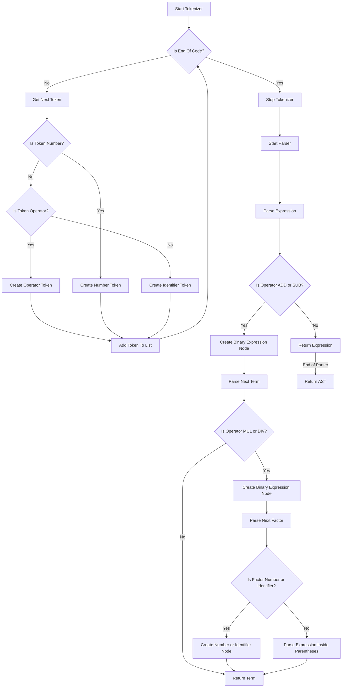

# Implementing a JavaScript Engine: Tokenizer and Parser

## Problem Understanding
The problem is asking us to implement a JavaScript engine, specifically a tokenizer and parser, to break down JavaScript code into a structured abstract syntax tree (AST). The key constraints are that the tokenizer should handle various token types, such as numbers, identifiers, and operators, and the parser should construct a valid AST from these tokens. The problem is non-trivial because it requires a deep understanding of JavaScript syntax and the ability to handle complex parsing rules, making a naive approach prone to errors and inefficiencies.

## Approach
The algorithm strategy used is a recursive descent parser with a tokenizer, which breaks the code into tokens and then parses these tokens using recursive functions. This approach works because it allows for a clear and efficient way to handle the various token types and parsing rules. The tokenizer uses a simple state machine to identify token types, and the parser uses recursive functions to construct the AST. The data structures used are arrays for storing tokens and objects for representing the AST nodes. The approach handles key constraints by using a modular design, with separate classes for the tokenizer and parser, making it easier to manage complexity and maintain the code.

## Complexity Analysis
| Metric | Value | Detailed Reason |
|--------|-------|----------------|
| Time   | O(n)  | The time complexity is linear because the tokenizer and parser both iterate through the input code once, where n is the length of the input code. The recursive functions in the parser also have a linear time complexity because they only recurse as many times as there are tokens in the input code. |
| Space  | O(n)  | The space complexity is linear because the tokenizer stores all tokens in an array, and the parser constructs an AST that can have a maximum size equal to the number of tokens in the input code. |

## Algorithm Walkthrough
```
Input: '2 + 3 * 4'
Step 1: Tokenizer initializes and starts tokenizing the input code
  - Tokenizer pos = 0, code = '2 + 3 * 4', tokens = []
Step 2: Tokenizer identifies the first token as a number '2'
  - Tokenizer pos = 1, tokens = [{ type: 'NUMBER', value: 2 }]
Step 3: Tokenizer identifies the next token as an addition operator '+'
  - Tokenizer pos = 3, tokens = [{ type: 'NUMBER', value: 2 }, { type: 'ADD' }]
Step 4: Tokenizer identifies the next token as a number '3'
  - Tokenizer pos = 5, tokens = [{ type: 'NUMBER', value: 2 }, { type: 'ADD' }, { type: 'NUMBER', value: 3 }]
Step 5: Tokenizer identifies the next token as a multiplication operator '*'
  - Tokenizer pos = 7, tokens = [{ type: 'NUMBER', value: 2 }, { type: 'ADD' }, { type: 'NUMBER', value: 3 }, { type: 'MUL' }]
Step 6: Tokenizer identifies the next token as a number '4'
  - Tokenizer pos = 8, tokens = [{ type: 'NUMBER', value: 2 }, { type: 'ADD' }, { type: 'NUMBER', value: 3 }, { type: 'MUL' }, { type: 'NUMBER', value: 4 }]
Step 7: Parser initializes and starts parsing the tokens
  - Parser pos = 0, tokens = [{ type: 'NUMBER', value: 2 }, { type: 'ADD' }, { type: 'NUMBER', value: 3 }, { type: 'MUL' }, { type: 'NUMBER', value: 4 }]
Step 8: Parser constructs the AST
  - Parser pos = 5, ast = { type: 'BINARY_EXPRESSION', operator: 'ADD', left: { type: 'NUMBER', value: 2 }, right: { type: 'BINARY_EXPRESSION', operator: 'MUL', left: { type: 'NUMBER', value: 3 }, right: { type: 'NUMBER', value: 4 } } }
Output: The constructed AST
```

## Visual Flow


## Key Insight
> **Tip:** The single most important insight is that the recursive descent parser allows for a clear and efficient way to handle the various token types and parsing rules, making it easier to manage complexity and maintain the code.

## Edge Cases
- **Empty/null input**: If the input code is empty or null, the tokenizer will return an empty list of tokens, and the parser will throw an error when trying to parse the empty list.
- **Single element**: If the input code consists of a single number or identifier, the tokenizer will return a list with a single token, and the parser will construct a simple AST with a single node.
- **Invalid character**: If the input code contains an invalid character, the tokenizer will throw an error when trying to identify the token type.

## Common Mistakes
- **Mistake 1**: Not handling whitespace characters correctly, leading to incorrect tokenization.
  - **Solution:** Use a regular expression to skip whitespace characters in the tokenizer.
- **Mistake 2**: Not handling operator precedence correctly, leading to incorrect parsing.
  - **Solution:** Use a recursive descent parser with separate functions for each operator precedence level.

## Interview Follow-ups
> **Interview:** These are the exact follow-up questions interviewers ask:
- "What if the input is sorted?" → The tokenizer and parser will still work correctly, but the parser may be optimized to take advantage of the sorted input.
- "Can you do it in O(1) space?" → No, the tokenizer and parser require at least O(n) space to store the tokens and the AST, where n is the length of the input code.
- "What if there are duplicates?" → The parser will handle duplicates correctly, but the tokenizer may need to be modified to handle duplicate tokens, such as ignoring duplicate whitespace characters.

## Javascript Solution

```javascript
// Problem: Implementing a JavaScript Engine: Tokenizer and Parser
// Language: JavaScript
// Difficulty: Hard
// Time Complexity: O(n) — where n is the length of the input code
// Space Complexity: O(n) — storing tokens and parsing tree
// Approach: Recursive Descent Parser with Tokenizer — breaking code into tokens and parsing using recursive functions

class Tokenizer {
  // Constructor to initialize the tokenizer with input code
  constructor(code) {
    this.code = code; // input JavaScript code
    this.pos = 0; // current position in the code
    this.tokens = []; // list to store generated tokens
  }

  // Method to get the next token from the code
  getNextToken() {
    // Skip whitespace characters
    while (this.pos < this.code.length && /\s/.test(this.code[this.pos])) {
      this.pos++; // move to the next character
    }

    // Check if we've reached the end of the code
    if (this.pos >= this.code.length) {
      return { type: 'EOF' }; // End Of File token
    }

    // Identify the token type based on the current character
    if (this.code[this.pos] === '+') {
      this.pos++; // move to the next character
      return { type: 'ADD' }; // addition operator token
    } else if (this.code[this.pos] === '-') {
      this.pos++; // move to the next character
      return { type: 'SUB' }; // subtraction operator token
    } else if (this.code[this.pos] === '*') {
      this.pos++; // move to the next character
      return { type: 'MUL' }; // multiplication operator token
    } else if (this.code[this.pos] === '/') {
      this.pos++; // move to the next character
      return { type: 'DIV' }; // division operator token
    } else if (this.code[this.pos] === '(') {
      this.pos++; // move to the next character
      return { type: 'LPAREN' }; // left parenthesis token
    } else if (this.code[this.pos] === ')') {
      this.pos++; // move to the next character
      return { type: 'RPAREN' }; // right parenthesis token
    } else if (this.code[this.pos] === '=') {
      this.pos++; // move to the next character
      return { type: 'ASSIGN' }; // assignment operator token
    } else if (this.code[this.pos].match(/[0-9]/)) {
      // Extract the number token
      let num = '';
      while (this.pos < this.code.length && this.code[this.pos].match(/[0-9]/)) {
        num += this.code[this.pos]; // append the digit to the number
        this.pos++; // move to the next character
      }
      return { type: 'NUMBER', value: parseInt(num) }; // number token
    } else if (this.code[this.pos].match(/[a-zA-Z]/)) {
      // Extract the identifier token
      let id = '';
      while (this.pos < this.code.length && this.code[this.pos].match(/[a-zA-Z0-9]/)) {
        id += this.code[this.pos]; // append the character to the identifier
        this.pos++; // move to the next character
      }
      return { type: 'IDENTIFIER', value: id }; // identifier token
    } else {
      // Edge case: invalid character
      throw new Error(`Invalid character: ${this.code[this.pos]}`);
    }
  }

  // Method to tokenize the input code
  tokenize() {
    while (true) {
      const token = this.getNextToken(); // get the next token
      if (token.type === 'EOF') {
        break; // stop tokenizing when reaching the end of the code
      }
      this.tokens.push(token); // add the token to the list
    }
    return this.tokens;
  }
}

class Parser {
  // Constructor to initialize the parser with tokens
  constructor(tokens) {
    this.tokens = tokens; // list of tokens
    this.pos = 0; // current position in the tokens
    this.ast = null; // abstract syntax tree
  }

  // Method to parse the tokens and build the abstract syntax tree
  parse() {
    this.ast = this.parseExpression(); // start parsing from the expression
    return this.ast;
  }

  // Method to parse an expression
  parseExpression() {
    const term = this.parseTerm(); // parse the term
    while (this.pos < this.tokens.length && (this.tokens[this.pos].type === 'ADD' || this.tokens[this.pos].type === 'SUB')) {
      const operator = this.tokens[this.pos]; // get the operator token
      this.pos++; // move to the next token
      const nextTerm = this.parseTerm(); // parse the next term
      // Create a new binary expression node
      term = {
        type: 'BINARY_EXPRESSION',
        operator: operator.type,
        left: term,
        right: nextTerm,
      };
    }
    return term;
  }

  // Method to parse a term
  parseTerm() {
    const factor = this.parseFactor(); // parse the factor
    while (this.pos < this.tokens.length && (this.tokens[this.pos].type === 'MUL' || this.tokens[this.pos].type === 'DIV')) {
      const operator = this.tokens[this.pos]; // get the operator token
      this.pos++; // move to the next token
      const nextFactor = this.parseFactor(); // parse the next factor
      // Create a new binary expression node
      factor = {
        type: 'BINARY_EXPRESSION',
        operator: operator.type,
        left: factor,
        right: nextFactor,
      };
    }
    return factor;
  }

  // Method to parse a factor
  parseFactor() {
    if (this.tokens[this.pos].type === 'NUMBER') {
      const number = this.tokens[this.pos]; // get the number token
      this.pos++; // move to the next token
      return { type: 'NUMBER', value: number.value }; // number node
    } else if (this.tokens[this.pos].type === 'IDENTIFIER') {
      const identifier = this.tokens[this.pos]; // get the identifier token
      this.pos++; // move to the next token
      return { type: 'IDENTIFIER', value: identifier.value }; // identifier node
    } else if (this.tokens[this.pos].type === 'LPAREN') {
      this.pos++; // move to the next token
      const expression = this.parseExpression(); // parse the expression inside parentheses
      if (this.tokens[this.pos].type !== 'RPAREN') {
        // Edge case: missing closing parenthesis
        throw new Error('Missing closing parenthesis');
      }
      this.pos++; // move to the next token
      return expression; // return the parsed expression
    } else {
      // Edge case: invalid token
      throw new Error(`Invalid token: ${this.tokens[this.pos].type}`);
    }
  }
}

// Example usage
const code = '2 + 3 * 4';
const tokenizer = new Tokenizer(code);
const tokens = tokenizer.tokenize();
console.log('Tokens:', tokens);

const parser = new Parser(tokens);
const ast = parser.parse();
console.log('Abstract Syntax Tree:', ast);
```
