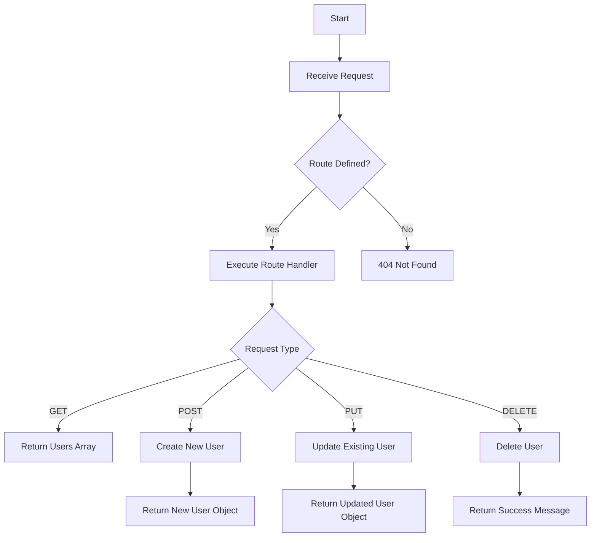

# Implementing a REST API with Express from Scratch

## Problem Understanding
The problem requires implementing a REST API from scratch using Express.js, handling CRUD (Create, Read, Update, Delete) operations, and including error handling. The key constraints are to use Express.js, handle JSON requests, and manage an in-memory data storage for simplicity. This problem is non-trivial because it requires understanding of RESTful API principles, Express.js framework, and error handling mechanisms. A naive approach might overlook crucial aspects such as error handling, data validation, or proper route handling, leading to an incomplete or unstable API.

## Approach
The algorithm strategy involves creating an Express application and defining RESTful endpoints for CRUD operations. The intuition behind this approach is to leverage Express.js's built-in support for route handling, middleware functions, and JSON parsing. The approach works by utilizing Express.js's `app.get()`, `app.post()`, `app.put()`, and `app.delete()` methods to define routes for each operation, along with middleware functions for JSON parsing and error handling. The data structure used is an in-memory array to store user data, chosen for simplicity. This approach handles key constraints by incorporating error handling middleware, validating user input, and properly managing route parameters.

## Complexity Analysis
| Metric | Value | Detailed Reason |
|--------|-------|----------------|
| Time   | O(n)  | The time complexity depends on the number of routes and middleware functions. For each request, Express.js iterates through the defined routes and middleware functions to find a match, resulting in a linear time complexity. The `find()` and `findIndex()` methods used for retrieving and updating users also contribute to the linear time complexity. |
| Space  | O(n)  | The space complexity is dependent on the number of routes, middleware functions, and data stored in the in-memory array. As the number of routes, middleware functions, and user data grows, the memory usage increases, resulting in a linear space complexity. |

## Algorithm Walkthrough
```javascript
Input: GET /users
Step 1: The Express.js application receives the GET request and checks if the '/users' route is defined.
Step 2: The application executes the route handler for '/users', which checks if the users array is empty.
Step 3: Since the users array is not empty, the application returns the users array as the response.
Output: [{ id: 1, name: 'John Doe', email: 'john@example.com' }, { id: 2, name: 'Jane Doe', email: 'jane@example.com' }]

Input: POST /users with JSON body { name: 'New User', email: 'new@example.com' }
Step 1: The Express.js application receives the POST request and checks if the '/users' route is defined.
Step 2: The application executes the route handler for '/users', which extracts the name and email from the request body.
Step 3: The application creates a new user object with the extracted name and email, generates a new ID, and adds the user to the users array.
Step 4: The application returns the new user object as the response.
Output: { id: 3, name: 'New User', email: 'new@example.com' }
```

## Visual Flow


## Key Insight
> **Tip:** The key to implementing a robust REST API is to handle errors and edge cases properly, ensuring that the API remains stable and secure even in unexpected situations.

## Edge Cases
- **Empty/null input**: If the request body is empty or null, the API will return a 400 Bad Request error with a message indicating that the name and email are required.
- **Single element**: If the users array contains only one element, the API will still return the array with the single user object.
- **User not found**: If a GET, PUT, or DELETE request is made for a user that does not exist, the API will return a 404 Not Found error with a message indicating that the user was not found.

## Common Mistakes
- **Mistake 1**: Failing to validate user input, which can lead to security vulnerabilities and data corruption. To avoid this, always validate user input using middleware functions or route handlers.
- **Mistake 2**: Not handling errors properly, which can cause the API to crash or return unexpected responses. To avoid this, always use try-catch blocks and error handling middleware to catch and handle errors.

## Interview Follow-ups
> **Interview:** These are the exact follow-up questions interviewers ask:
- "What if the input is sorted?" → The implementation does not assume sorted input, and the time complexity remains O(n) due to the use of `find()` and `findIndex()` methods.
- "Can you do it in O(1) space?" → No, the implementation requires O(n) space to store the users array and middleware functions.
- "What if there are duplicates?" → The implementation does not handle duplicates explicitly, but it can be modified to include duplicate detection and handling mechanisms.

## Javascript Solution

```javascript
// Problem: Implementing a REST API with Express from Scratch
// Language: javascript
// Difficulty: Hard
// Time Complexity: O(n) — dependent on the number of routes and middleware functions
// Space Complexity: O(n) — dependent on the number of routes, middleware functions, and data stored
// Approach: Creating an Express application with RESTful endpoints — handling CRUD operations and error handling

const express = require('express'); // Importing the Express framework
const app = express(); // Creating a new Express application
const port = 3000; // Defining the port number for the server

// Middleware function to parse JSON requests
app.use(express.json()); // Parsing JSON requests

// Data storage (in-memory for simplicity)
let users = [
  { id: 1, name: 'John Doe', email: 'john@example.com' },
  { id: 2, name: 'Jane Doe', email: 'jane@example.com' },
];

// GET /users - Retrieve all users
app.get('/users', (req, res) => {
  // Check if users array is empty
  if (users.length === 0) {
    // Edge case: no users found
    res.status(404).send({ message: 'No users found' });
  } else {
    res.send(users); // Sending the users array as the response
  }
});

// GET /users/:id - Retrieve a user by ID
app.get('/users/:id', (req, res) => {
  const id = parseInt(req.params.id); // Parsing the ID from the URL parameter
  const user = users.find((u) => u.id === id); // Finding the user with the matching ID

  // Edge case: user not found
  if (!user) {
    res.status(404).send({ message: 'User not found' });
  } else {
    res.send(user); // Sending the user object as the response
  }
});

// POST /users - Create a new user
app.post('/users', (req, res) => {
  const { name, email } = req.body; // Extracting the name and email from the request body

  // Edge case: missing required fields
  if (!name || !email) {
    res.status(400).send({ message: 'Name and email are required' });
  } else {
    const newUser = {
      id: users.length + 1, // Generating a new ID
      name,
      email,
    };
    users.push(newUser); // Adding the new user to the array
    res.send(newUser); // Sending the new user object as the response
  }
});

// PUT /users/:id - Update a user
app.put('/users/:id', (req, res) => {
  const id = parseInt(req.params.id); // Parsing the ID from the URL parameter
  const user = users.find((u) => u.id === id); // Finding the user with the matching ID

  // Edge case: user not found
  if (!user) {
    res.status(404).send({ message: 'User not found' });
  } else {
    const { name, email } = req.body; // Extracting the updated name and email from the request body

    // Edge case: missing required fields
    if (!name || !email) {
      res.status(400).send({ message: 'Name and email are required' });
    } else {
      user.name = name; // Updating the user's name
      user.email = email; // Updating the user's email
      res.send(user); // Sending the updated user object as the response
    }
  }
});

// DELETE /users/:id - Delete a user
app.delete('/users/:id', (req, res) => {
  const id = parseInt(req.params.id); // Parsing the ID from the URL parameter
  const index = users.findIndex((u) => u.id === id); // Finding the index of the user with the matching ID

  // Edge case: user not found
  if (index === -1) {
    res.status(404).send({ message: 'User not found' });
  } else {
    users.splice(index, 1); // Removing the user from the array
    res.send({ message: 'User deleted successfully' });
  }
});

// Error handling middleware
app.use((err, req, res, next) => {
  console.error(err); // Logging the error
  res.status(500).send({ message: 'Internal Server Error' });
});

// Starting the server
app.listen(port, () => {
  console.log(`Server started on port ${port}`);
});
```
