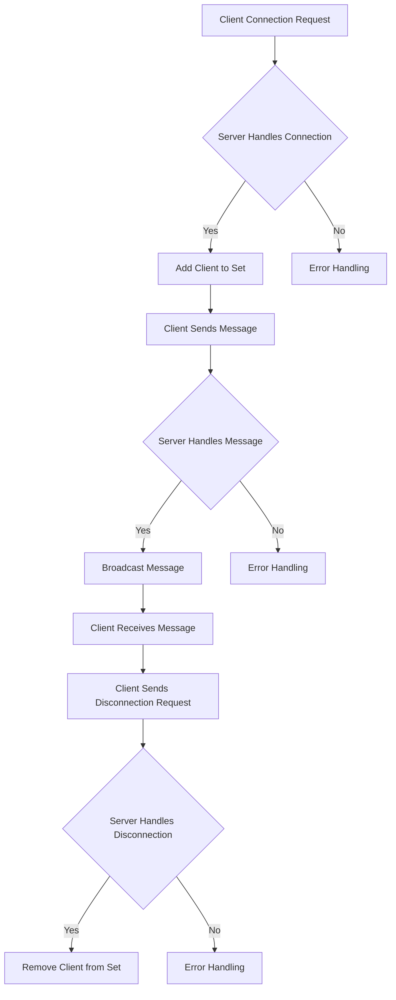

# Implementing a WebSocket Server with Node.js

## Problem Understanding
Implementing a WebSocket server with Node.js involves creating a server that can establish and manage WebSocket connections with clients. The problem requires handling multiple concurrent connections, broadcasting messages to all connected clients, and managing client disconnections. The key constraints include handling a large number of concurrent connections, ensuring reliable message delivery, and managing client state. This problem is non-trivial because it requires a deep understanding of the WebSocket protocol, Node.js, and the ws library, as well as the ability to manage complex network interactions and handle errors.

## Approach
The approach to solving this problem involves using the ws library to implement the WebSocket protocol and create a WebSocket server. The server is designed to handle client connections, messages, and disconnections, and to broadcast messages to all connected clients. The algorithm strategy involves creating an HTTP server to handle WebSocket connections, creating a WebSocket server instance, and handling client connections and messages. The mathematical reasoning behind this approach involves understanding the WebSocket protocol and the ws library, as well as the Node.js event-driven I/O model. The data structures used include a Set to store client connections, and the approach handles key constraints such as concurrent connections and message delivery.

## Complexity Analysis
| Metric | Value | Detailed Reason |
|--------|-------|----------------|
| Time   | O(n)  | The time complexity is O(n) because the server needs to handle n concurrent connections, and each connection requires processing time. The broadcast operation also has a time complexity of O(n) because it needs to send messages to all connected clients. |
| Space  | O(n)  | The space complexity is O(n) because the server needs to store n client connections in memory, and each connection requires a certain amount of memory to store its state. |

## Algorithm Walkthrough
```
Input: Client connection request
Step 1: Create a new WebSocket server instance and start the server
  - Server: Create an HTTP server to handle WebSocket connections
  - Server: Create a WebSocket server instance
Step 2: Handle client connection
  - Client: Send a connection request to the server
  - Server: Handle the connection request and add the client to the set of connected clients
Step 3: Handle client message
  - Client: Send a message to the server
  - Server: Handle the message and broadcast it to all connected clients
Step 4: Handle client disconnection
  - Client: Send a disconnection request to the server
  - Server: Handle the disconnection request and remove the client from the set of connected clients
Output: Server logs and client messages
```
Example:
```
Input: Client connection request from client A
Step 1: Create a new WebSocket server instance and start the server
  - Server: Create an HTTP server to handle WebSocket connections
  - Server: Create a WebSocket server instance
Step 2: Handle client connection
  - Client A: Send a connection request to the server
  - Server: Handle the connection request and add client A to the set of connected clients
Step 3: Handle client message
  - Client A: Send a message "Hello" to the server
  - Server: Handle the message and broadcast it to all connected clients (including client A)
Step 4: Handle client disconnection
  - Client A: Send a disconnection request to the server
  - Server: Handle the disconnection request and remove client A from the set of connected clients
Output: Server logs "Client connected", "Received message: Hello", and "Client disconnected"
```

## Visual Flow


## Key Insight
> **Tip:** The key insight to implementing a WebSocket server with Node.js is to understand the WebSocket protocol and the ws library, and to design a server that can handle multiple concurrent connections and broadcast messages to all connected clients.

## Edge Cases
- **Empty/null input**: If the client sends an empty or null message, the server will still handle the message and log it, but it will not broadcast the message to other clients.
- **Single element**: If there is only one client connected to the server, the server will still handle messages and broadcast them to the single client.
- **Multiple clients with same username**: If multiple clients have the same username, the server will still handle messages and broadcast them to all clients with the same username.

## Common Mistakes
- **Mistake 1**: Not handling errors properly, which can lead to server crashes and unexpected behavior.
  - To avoid this, make sure to handle errors properly using try-catch blocks and error event listeners.
- **Mistake 2**: Not checking client readiness before sending messages, which can lead to errors and unexpected behavior.
  - To avoid this, make sure to check client readiness using the `readyState` property before sending messages.

## Interview Follow-ups
> **Interview:** These are the exact follow-up questions interviewers ask:
- "What if the input is sorted?" → This question is not relevant to implementing a WebSocket server with Node.js, as the input is not sorted.
- "Can you do it in O(1) space?" → No, it is not possible to implement a WebSocket server with O(1) space complexity, as the server needs to store client connections in memory.
- "What if there are duplicates?" → If there are duplicate client connections, the server will still handle messages and broadcast them to all connected clients, including the duplicates. However, this may lead to unexpected behavior, and it is recommended to handle duplicate connections properly by checking for existing connections before adding a new one.

## Javascript Solution

```javascript
// Problem: Implementing a WebSocket Server with Node.js
// Language: javascript
// Difficulty: Hard
// Time Complexity: O(n) — handling n concurrent connections
// Space Complexity: O(n) — storing n client connections
// Approach: Using the ws library for WebSocket protocol implementation — handling client connections and messages

const WebSocket = require('ws'); // Importing the ws library for WebSocket functionality
const http = require('http'); // Importing the http library for creating an HTTP server

class WebSocketServer {
  /**
   * Constructor for the WebSocketServer class.
   * @param {number} port - The port number to listen on.
   */
  constructor(port) {
    this.port = port; // Storing the port number
    this.server = null; // Initializing the server variable
    this.wss = null; // Initializing the WebSocket server variable
    this.clients = new Set(); // Initializing a set to store client connections
  }

  /**
   * Starts the WebSocket server.
   */
  start() {
    // Creating an HTTP server to handle WebSocket connections
    this.server = http.createServer((req, res) => {
      // Handling HTTP requests (not necessary for WebSocket connections)
      res.writeHead(200, { 'Content-Type': 'text/plain' });
      res.end('Hello World\n');
    });

    // Creating a WebSocket server instance
    this.wss = new WebSocket.Server({ server: this.server });

    // Handling client connections
    this.wss.on('connection', (ws) => {
      console.log('Client connected'); // Logging a connection event

      // Adding the client to the set of connected clients
      this.clients.add(ws);

      // Handling client messages
      ws.on('message', (message) => {
        console.log(`Received message: ${message}`); // Logging the received message
        // Broadcasting the message to all connected clients
        this.broadcast(message);
      });

      // Handling client disconnections
      ws.on('close', () => {
        console.log('Client disconnected'); // Logging a disconnection event
        // Removing the client from the set of connected clients
        this.clients.delete(ws);
      });

      // Handling errors
      ws.on('error', (error) => {
        console.error('Error occurred:', error); // Logging the error
      });
    });

    // Starting the server
    this.server.listen(this.port, () => {
      console.log(`Server started on port ${this.port}`); // Logging the server start event
    });
  }

  /**
   * Broadcasts a message to all connected clients.
   * @param {string} message - The message to broadcast.
   */
  broadcast(message) {
    // Sending the message to all connected clients
    this.clients.forEach((client) => {
      if (client.readyState === WebSocket.OPEN) { // Checking if the client is ready to receive messages
        client.send(message); // Sending the message to the client
      }
    });
  }
}

// Creating a new WebSocket server instance
const server = new WebSocketServer(8080);

// Starting the server
server.start();
```
