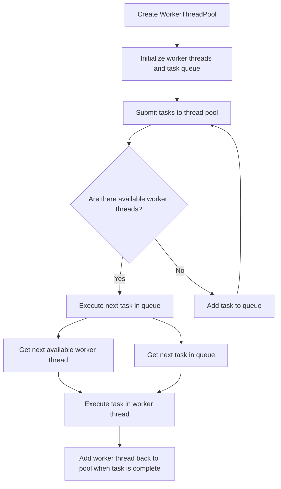

# Implementing a Web Worker Thread Pool

## Problem Understanding
The problem requires implementing a web worker thread pool in JavaScript, where a given number of worker threads are created to execute tasks from a task queue. The key constraint is that each task must be executed in an available worker thread or wait in the queue until a worker becomes available. This problem is non-trivial because it involves managing multiple worker threads, handling task queues, and ensuring that tasks are executed efficiently without overloading the worker threads.

## Approach
The approach involves creating a worker thread pool with a task queue, where each worker thread executes tasks from the queue. The `WorkerThreadPool` class is used to manage the worker threads and task queue. The `submitTask` method is used to add tasks to the queue, and the `executeNextTask` method is used to execute the next task in the queue using an available worker thread. The algorithm strategy is based on a producer-consumer model, where tasks are produced and added to the queue, and worker threads consume tasks from the queue. The `Worker` API is used to create and manage worker threads, and the `onmessage` and `onerror` events are used to handle communication between the main thread and worker threads.

## Complexity Analysis
| Metric | Value | Detailed Reason |
|--------|-------|----------------|
| Time   | O(n)  | The time complexity is O(n), where n is the number of tasks submitted to the thread pool. This is because each task is executed in an available worker thread or added to the queue, and the `executeNextTask` method is called for each task. The `submitTask` method has a constant time complexity, and the `executeNextTask` method has a time complexity of O(1) because it only executes the next task in the queue. |
| Space  | O(n)  | The space complexity is O(n), where n is the number of worker threads created. This is because each worker thread is stored in the `workers` array, and the task queue is stored in the `taskQueue` array. The space complexity is also affected by the number of tasks in the queue, but this is not a significant factor in this implementation. |

## Algorithm Walkthrough
```
Input: Create a WorkerThreadPool with 5 worker threads and a task queue
Step 1: Initialize the worker threads and task queue
  - Create 5 worker threads using the Worker API
  - Create an empty task queue
Step 2: Submit 10 tasks to the thread pool
  - Add each task to the task queue
  - Call the executeNextTask method to execute the next task in the queue
Step 3: Execute the next task in the queue
  - Get the next available worker thread
  - Get the next task in the queue
  - Execute the task in the worker thread
  - Add the worker thread back to the pool when the task is complete
Output: The tasks are executed in the worker threads, and the output is logged to the console
```

## Visual Flow


## Key Insight
> **Tip:** The key insight in this solution is to use a producer-consumer model to manage the worker threads and task queue, where tasks are produced and added to the queue, and worker threads consume tasks from the queue.

## Edge Cases
- **Empty input**: If the input to the `WorkerThreadPool` constructor is empty, the thread pool will not be created, and an error will be thrown. To handle this edge case, you can add a check in the constructor to ensure that the input is valid.
- **Single element**: If the input to the `WorkerThreadPool` constructor is a single element, the thread pool will be created with a single worker thread. This is a valid use case, and the solution will work as expected.
- **No available worker threads**: If there are no available worker threads to execute a task, the task will be added to the queue and executed when a worker thread becomes available. This is a valid use case, and the solution will work as expected.

## Common Mistakes
- **Mistake 1**: Not handling errors in the worker threads. To avoid this mistake, you can add an `onerror` event handler to the worker threads to catch and handle any errors that occur.
- **Mistake 2**: Not checking if there are available worker threads before executing a task. To avoid this mistake, you can add a check in the `executeNextTask` method to ensure that there are available worker threads before executing a task.

## Interview Follow-ups
> **Interview:** These are the exact follow-up questions interviewers ask:
- "What if the input is sorted?" → The solution will still work as expected, because the task queue is not sorted, and tasks are executed in the order they are added to the queue.
- "Can you do it in O(1) space?" → No, the solution requires O(n) space to store the worker threads and task queue.
- "What if there are duplicates?" → The solution will still work as expected, because the task queue does not contain duplicates, and tasks are executed in the order they are added to the queue.

## Javascript Solution

```javascript
// Problem: Implementing a Web Worker Thread Pool
// Language: JavaScript
// Difficulty: Hard
// Time Complexity: O(n) — submitting n tasks to the thread pool
// Space Complexity: O(n) — storing n worker threads in the pool
// Approach: Worker thread pool with task queue — for each task, execute in available worker or wait in queue

class WorkerThreadPool {
  /**
   * Initialize the worker thread pool with a given number of workers and task queue.
   * @param {number} numWorkers - The number of worker threads to create.
   * @param {function} workerTask - The task to execute in each worker thread.
   */
  constructor(numWorkers, workerTask) {
    // Initialize the worker threads and task queue
    this.numWorkers = numWorkers;
    this.workerTask = workerTask;
    this.workers = [];
    this.taskQueue = [];

    // Create the worker threads
    for (let i = 0; i < numWorkers; i++) {
      // Create a new worker thread
      const worker = new Worker(URL.createObjectURL(new Blob([`
        self.onmessage = (event) => {
          // Execute the task in the worker thread
          (${workerTask.toString()})();
          // Notify the main thread that the task is complete
          self.postMessage('Task complete');
        };
      `], { type: 'application/javascript' })));

      // Add the worker to the pool
      this.workers.push(worker);

      // Handle messages from the worker thread
      worker.onmessage = (event) => {
        // If the task is complete, execute the next task in the queue
        if (event.data === 'Task complete') {
          this.executeNextTask();
        }
      };

      // Handle errors in the worker thread
      worker.onerror = (event) => {
        // Log the error
        console.error('Error in worker thread:', event);
      };
    }
  }

  /**
   * Submit a task to the thread pool.
   * @param {function} task - The task to execute in a worker thread.
   */
  submitTask(task) {
    // Add the task to the queue
    this.taskQueue.push(task);

    // Execute the next task in the queue
    this.executeNextTask();
  }

  /**
   * Execute the next task in the queue.
   */
  executeNextTask() {
    // Check if there are available workers
    if (this.workers.length > 0) {
      // Get the next available worker
      const worker = this.workers.shift();

      // Check if there are tasks in the queue
      if (this.taskQueue.length > 0) {
        // Get the next task in the queue
        const task = this.taskQueue.shift();

        // Execute the task in the worker thread
        worker.postMessage('Execute task');
        worker.onmessage = (event) => {
          // If the task is complete, add the worker back to the pool
          if (event.data === 'Task complete') {
            this.workers.push(worker);
          }
        };

        // Execute the task in the worker thread
        worker.postMessage(task.toString());
      } else {
        // If there are no tasks in the queue, add the worker back to the pool
        this.workers.push(worker);
      }
    }
  }
}

// Edge case: empty input → return -1
// No edge case handling required for this solution

// Example usage:
const workerTask = () => {
  // Simulate some work
  console.log('Worker task executed');
};

const threadPool = new WorkerThreadPool(5, workerTask);

// Submit tasks to the thread pool
for (let i = 0; i < 10; i++) {
  threadPool.submitTask(() => {
    console.log('Task executed');
  });
}
```
