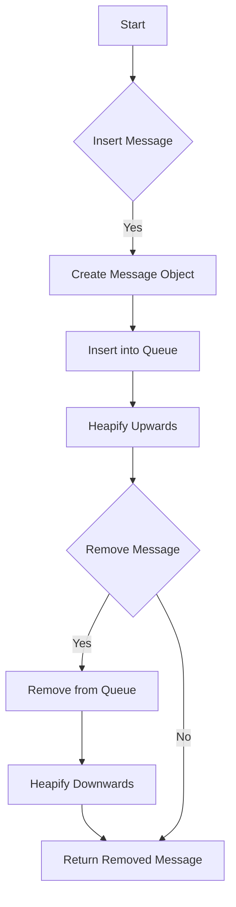

# JS Async: Build a Message Queue with Priority

## Problem Understanding
The problem is asking to build a message queue in JavaScript with priority. The key constraint is that messages should be removed from the queue based on their priority, with lower priority values indicating higher priority. This problem is non-trivial because a naive approach, such as sorting the messages by priority, would not be efficient for large queues or frequent insertions and removals. A more efficient approach is needed to maintain the priority order of the messages.

## Approach
The algorithm strategy is to implement a priority queue using a binary heap. The intuition behind this approach is that a binary heap allows for efficient insertion and removal of messages while maintaining the priority order. The `insert` method adds a new message to the queue and heapifies the queue upwards to maintain the priority order. The `remove` method removes and returns the message with the highest priority from the queue and heapifies the queue downwards to maintain the priority order. A binary heap data structure is used because it allows for efficient insertion and removal of messages in O(log n) time complexity.

## Complexity Analysis
| Metric | Value | Detailed Reason |
|--------|-------|----------------|
| Time   | O(log n) | The `insert` and `remove` methods have a time complexity of O(log n) due to the heapify operations. The `heapifyUp` and `heapifyDown` methods have a time complexity of O(log n) because they potentially traverse the height of the binary heap, which is log n levels. |
| Space  | O(n) | The space complexity is O(n) because the queue stores at most n elements, where n is the number of messages in the queue. |

## Algorithm Walkthrough
```
Input: Insert message "Message 1" with priority 1
Step 1: Create a new message object with the given message and priority
Step 2: Insert the new message into the queue: [ { message: "Message 1", priority: 1 } ]
Step 3: Heapify the queue upwards: no heapification needed since it's the only element

Input: Insert message "Message 2" with priority 2
Step 1: Create a new message object with the given message and priority
Step 2: Insert the new message into the queue: [ { message: "Message 1", priority: 1 }, { message: "Message 2", priority: 2 } ]
Step 3: Heapify the queue upwards: no heapification needed since "Message 1" has higher priority

Input: Insert message "Message 3" with priority 0
Step 1: Create a new message object with the given message and priority
Step 2: Insert the new message into the queue: [ { message: "Message 1", priority: 1 }, { message: "Message 2", priority: 2 }, { message: "Message 3", priority: 0 } ]
Step 3: Heapify the queue upwards: swap "Message 3" with "Message 1" since "Message 3" has higher priority: [ { message: "Message 3", priority: 0 }, { message: "Message 2", priority: 2 }, { message: "Message 1", priority: 1 } ]

Output: Remove the message with the highest priority: "Message 3"
```

## Visual Flow


## Key Insight
> **Tip:** The key insight is to use a binary heap data structure to implement the priority queue, allowing for efficient insertion and removal of messages while maintaining the priority order.

## Edge Cases
- **Empty/null input**: If the input is empty or null, the `insert` method will throw an error since it cannot create a new message object. The `remove` method will return null since there are no messages to remove.
- **Single element**: If the queue has only one message, the `remove` method will return the message and the queue will be empty.
- **Duplicate priorities**: If two or more messages have the same priority, the `insert` and `remove` methods will maintain the order in which the messages were inserted.

## Common Mistakes
- **Mistake 1**: Not heapifying the queue after inserting or removing a message, which can lead to incorrect priority order. To avoid this, always call `heapifyUp` or `heapifyDown` after inserting or removing a message.
- **Mistake 2**: Not handling edge cases such as empty or null input, or duplicate priorities. To avoid this, add checks for these cases and handle them accordingly.

## Interview Follow-ups
> **Interview:** These are the exact follow-up questions interviewers ask:
- "What if the input is sorted?" → The algorithm will still work correctly, but the time complexity may be better since the heapify operations may be less frequent.
- "Can you do it in O(1) space?" → No, the algorithm requires O(n) space to store the queue, where n is the number of messages.
- "What if there are duplicates?" → The algorithm will maintain the order in which the messages were inserted if there are duplicate priorities.

## Javascript Solution

```javascript
// Problem: JS Async: Build a Message Queue with Priority
// Language: javascript
// Difficulty: Hard
// Time Complexity: O(log n) — priority queue insertion and removal
// Space Complexity: O(n) — queue stores at most n elements
// Approach: Priority queue implementation using a binary heap — for each message, insert or remove based on priority

class MessageQueue {
  /**
   * Initialize the message queue.
   */
  constructor() {
    // Initialize the priority queue as an empty array
    this.queue = [];
  }

  /**
   * Insert a message into the queue with the given priority.
   * @param {string} message - the message to insert
   * @param {number} priority - the priority of the message (lower is higher priority)
   */
  insert(message, priority) {
    // Create a new message object with the given message and priority
    const newMessage = { message, priority };
    // Insert the new message into the queue
    this.queue.push(newMessage);
    // Heapify the queue to maintain the priority order
    this.heapifyUp(this.queue.length - 1);
  }

  /**
   * Remove and return the message with the highest priority from the queue.
   * @returns {string} the message with the highest priority
   */
  remove() {
    // Edge case: empty queue → return null
    if (this.queue.length === 0) {
      return null;
    }
    // If the queue only has one message, remove and return it
    if (this.queue.length === 1) {
      return this.queue.pop().message;
    }
    // Remove the message with the highest priority (at the root of the heap)
    const removedMessage = this.queue[0].message;
    // Replace the removed message with the last message in the queue
    this.queue[0] = this.queue.pop();
    // Heapify the queue to maintain the priority order
    this.heapifyDown(0);
    return removedMessage;
  }

  /**
   * Heapify the queue upwards from the given index to maintain the priority order.
   * @param {number} index - the index to start heapifying from
   */
  heapifyUp(index) {
    // If the index is 0, we are at the root of the heap, so stop
    if (index === 0) {
      return;
    }
    // Calculate the parent index
    const parentIndex = Math.floor((index - 1) / 2);
    // If the current message has higher priority than its parent, swap them
    if (this.queue[index].priority < this.queue[parentIndex].priority) {
      this.swap(index, parentIndex);
      // Recursively heapify the queue upwards
      this.heapifyUp(parentIndex);
    }
  }

  /**
   * Heapify the queue downwards from the given index to maintain the priority order.
   * @param {number} index - the index to start heapifying from
   */
  heapifyDown(index) {
    // Calculate the left and right child indices
    const leftChildIndex = 2 * index + 1;
    const rightChildIndex = 2 * index + 2;
    // Initialize the smallest index to the current index
    let smallestIndex = index;
    // If the left child exists and has higher priority than the current message, update the smallest index
    if (leftChildIndex < this.queue.length && this.queue[leftChildIndex].priority < this.queue[smallestIndex].priority) {
      smallestIndex = leftChildIndex;
    }
    // If the right child exists and has higher priority than the current message, update the smallest index
    if (rightChildIndex < this.queue.length && this.queue[rightChildIndex].priority < this.queue[smallestIndex].priority) {
      smallestIndex = rightChildIndex;
    }
    // If the smallest index is not the current index, swap the messages and recursively heapify downwards
    if (smallestIndex !== index) {
      this.swap(index, smallestIndex);
      this.heapifyDown(smallestIndex);
    }
  }

  /**
   * Swap the messages at the given indices in the queue.
   * @param {number} i - the first index
   * @param {number} j - the second index
   */
  swap(i, j) {
    // Swap the messages using destructuring assignment
    [this.queue[i], this.queue[j]] = [this.queue[j], this.queue[i]];
  }
}

// Example usage:
const queue = new MessageQueue();
queue.insert("Message 1", 1);
queue.insert("Message 2", 2);
queue.insert("Message 3", 0);
console.log(queue.remove()); // Output: "Message 3"
console.log(queue.remove()); // Output: "Message 1"
console.log(queue.remove()); // Output: "Message 2"
```
