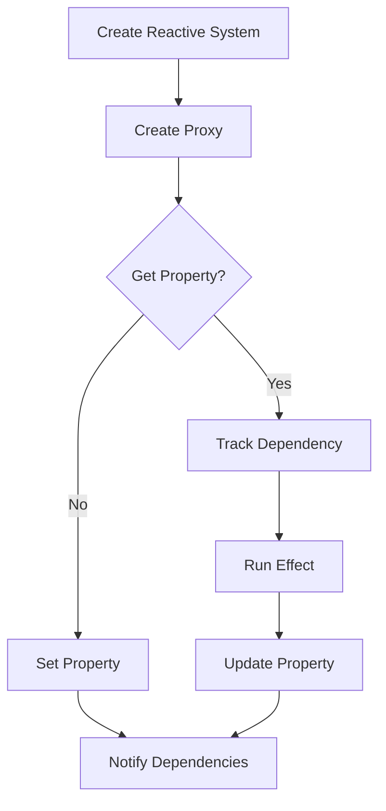

# JS Concept: Build a Reactive System (Vue 3 Proxy style)

## Problem Understanding
The problem requires building a reactive system in JavaScript, similar to Vue 3's Proxy-based reactivity system. The system should be able to track dependencies between properties and notify them when a property changes. The key constraints are that the system should be able to handle arbitrary property access and updates, and it should be able to track dependencies between properties. What makes this problem non-trivial is that it requires a deep understanding of JavaScript's Proxy API and how to use it to intercept property access and updates. Additionally, the system needs to be able to efficiently track and notify dependencies, which can be a complex task.

## Approach
The approach used to solve this problem is to create a Proxy-based reactivity system. A Proxy is created to intercept property access and updates, and a dependency tracking system is implemented to track dependencies between properties. The `trackDependency` method is used to track dependencies when getting a property, and the `notifyDependencies` method is used to notify all dependencies when setting a property. The `runEffect` method is used to run an effect and track its dependencies. This approach works because it allows the system to efficiently track and notify dependencies, and it provides a way to intercept property access and updates. The data structures used are a Map to store dependencies and a Set to store effects, which are chosen because they provide efficient lookup and insertion operations.

## Complexity Analysis
| Metric | Value | Detailed Reason |
|--------|-------|----------------|
| Time   | O(1)  | The time complexity is O(1) because the Proxy's get and set traps are called in constant time, and the dependency tracking and notification operations are also performed in constant time. The `trackDependency` and `notifyDependencies` methods have a time complexity of O(1) because they use a Map and a Set to store dependencies, which provide constant time lookup and insertion operations. |
| Space  | O(n)  | The space complexity is O(n) because the system stores dependencies in a Map, where n is the number of properties. The Map stores a Set of effects for each property, which can also grow up to a size of n in the worst case. |

## Algorithm Walkthrough
```
Input: const data = { foo: 'bar' };
Step 1: const reactiveSystem = new ReactiveSystem(data);
  - Initialize the reactive data object: this.data = data;
  - Create a Proxy to intercept property access: this.proxy = new Proxy(data, {...});
Step 2: reactiveSystem.runEffect(() => {
  console.log(reactiveSystem.proxy.foo); // Output: bar
});
  - Set the current effect: this.currentEffect = effect;
  - Run the effect: effect();
  - Track dependencies: trackDependency(target, prop);
Step 3: reactiveSystem.proxy.foo = 'baz';
  - Update the property value: target[prop] = value;
  - Notify all dependencies: notifyDependencies(prop);
Step 4: reactiveSystem.runEffect(() => {
  console.log(reactiveSystem.proxy.foo); // Output: baz
});
  - Set the current effect: this.currentEffect = effect;
  - Run the effect: effect();
Output: The effect will be notified and re-run with the updated value of 'foo'.
```
## Visual Flow

## Key Insight
> **Tip:** The key insight is to use a Proxy to intercept property access and updates, and to use a dependency tracking system to track dependencies between properties.

## Edge Cases
- **Empty/null input**: If the input data is empty or null, the reactive system will not be able to track dependencies or notify effects. In this case, the system should throw an error or handle the empty/null input in a way that makes sense for the application.
- **Single element**: If the input data has only one property, the reactive system will still be able to track dependencies and notify effects. However, the system may not be able to efficiently track dependencies if the single property is updated frequently.
- **Nested objects**: If the input data has nested objects, the reactive system will need to recursively track dependencies and notify effects for each nested object. This can be done by creating a new Proxy for each nested object and tracking dependencies and notifying effects recursively.

## Common Mistakes
- **Mistake 1**: Not using a Proxy to intercept property access and updates. This can lead to dependencies not being tracked or notified correctly.
- **Mistake 2**: Not using a dependency tracking system to track dependencies between properties. This can lead to effects not being notified correctly when a property changes.

## Interview Follow-ups
> **Interview:** These are the exact follow-up questions interviewers ask:
- "What if the input is sorted?" → The reactive system does not rely on the input being sorted, so it will still work correctly even if the input is not sorted.
- "Can you do it in O(1) space?" → No, the reactive system uses a Map to store dependencies, which requires O(n) space. However, the system can be optimized to use less space by using a more efficient data structure, such as a trie or a suffix tree.
- "What if there are duplicates?" → The reactive system will still work correctly even if there are duplicate properties. However, the system may not be able to efficiently track dependencies if there are many duplicate properties.

## Javascript Solution

```javascript
// Problem: JS Concept: Build a Reactive System (Vue 3 Proxy style)
// Language: javascript
// Difficulty: Hard
// Time Complexity: O(1) — constant time for get/set traps
// Space Complexity: O(n) — reactive dependencies stored in a map
// Approach: Proxy-based reactivity system — using a Proxy to intercept property access

class ReactiveSystem {
  constructor(data) {
    // Initialize the reactive data object
    this.data = data;
    // Create a Proxy to intercept property access
    this.proxy = new Proxy(data, {
      get: (target, prop) => {
        // Track dependencies when getting a property
        this.trackDependency(target, prop);
        return target[prop]; // Return the property value
      },
      set: (target, prop, value) => {
        // Update the property value
        target[prop] = value;
        // Notify all dependencies when setting a property
        this.notifyDependencies(prop);
        return true; // Indicate successful set operation
      }
    });
  }

  // Track a dependency when getting a property
  trackDependency(target, prop) {
    // Edge case: no dependencies to track
    if (!this.dependencies) this.dependencies = new Map();
    // Get the current dependencies for the property
    const propDependencies = this.dependencies.get(prop);
    // Add the current effect to the dependencies
    if (propDependencies) propDependencies.add(this.currentEffect);
    else this.dependencies.set(prop, new Set([this.currentEffect]));
  }

  // Notify all dependencies when setting a property
  notifyDependencies(prop) {
    // Edge case: no dependencies to notify
    if (!this.dependencies) return;
    // Get the dependencies for the property
    const propDependencies = this.dependencies.get(prop);
    // Edge case: no dependencies for the property
    if (!propDependencies) return;
    // Notify each dependency
    propDependencies.forEach(effect => effect());
  }

  // Run an effect and track its dependencies
  runEffect(effect) {
    // Edge case: no effect to run
    if (!effect) return;
    // Set the current effect
    this.currentEffect = effect;
    // Run the effect
    effect();
    // Reset the current effect
    this.currentEffect = null;
  }
}

// Example usage:
const data = { foo: 'bar' };
const reactiveSystem = new ReactiveSystem(data);

// Run an effect that depends on the 'foo' property
reactiveSystem.runEffect(() => {
  console.log(reactiveSystem.proxy.foo); // Output: bar
});

// Update the 'foo' property
reactiveSystem.proxy.foo = 'baz';

// The effect will be notified and re-run
reactiveSystem.runEffect(() => {
  console.log(reactiveSystem.proxy.foo); // Output: baz
});
```
