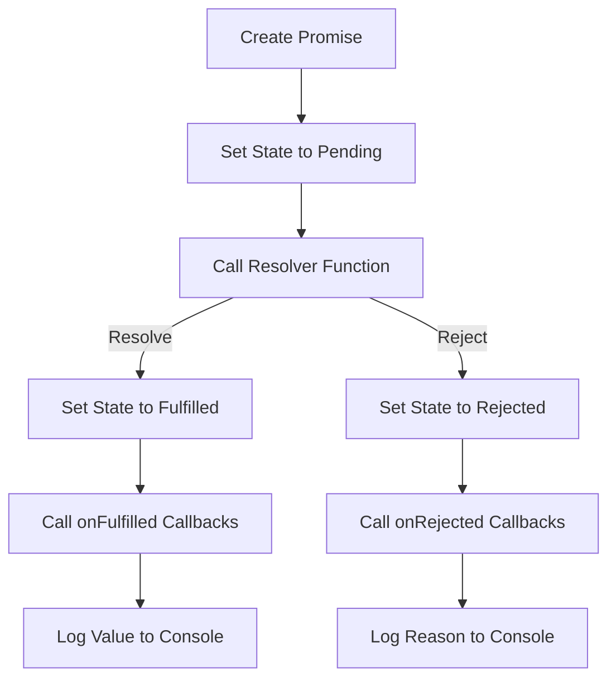

# JS Polyfill: Complete Promises/A+ Specification

## Problem Understanding
The problem is asking to create a JavaScript polyfill that implements the complete Promises/A+ specification, which is a standard for promises in JavaScript. This involves creating a `Promise` class that has methods like `then`, `catch`, and `finally`, as well as static methods like `resolve`, `reject`, `all`, `allSettled`, `any`, and `race`. The key constraint is that the implementation must follow the Promises/A+ specification, which defines the behavior of promises in JavaScript. The problem is non-trivial because it requires a deep understanding of the Promises/A+ specification and the behavior of promises in JavaScript.

## Approach
The approach to solving this problem is to create a `Promise` class that has methods for attaching callbacks to the promise, as well as static methods for creating new promises. The `then` method is used to attach onFulfilled and onRejected callbacks to the promise, while the `catch` method is used to attach an onRejected callback. The `finally` method is used to attach an onFinally callback that is called regardless of whether the promise is fulfilled or rejected. The static methods are used to create new promises that resolve or reject with specific values or reasons. The implementation uses a state machine to keep track of the promise's state, which can be pending, fulfilled, or rejected.

## Complexity Analysis
| Metric | Value | Detailed Reason |
|--------|-------|----------------|
| Time   | O(1)  | The time complexity of the Promise constructor and methods is constant because they only involve simple operations like setting the state of the promise and calling callbacks. The time complexity of the static methods like `all` and `allSettled` is O(n), where n is the number of promises, because they involve iterating over the promises and calling their `then` methods. |
| Space  | O(1)  | The space complexity of the Promise object is constant because it only involves storing a few fields like the state, value, and reason. The space complexity of the static methods like `all` and `allSettled` is O(n), where n is the number of promises, because they involve storing the results of the promises in an array. |

## Algorithm Walkthrough
```
Input: new Promise((resolve, reject) => {
  // Resolve the promise with a value
  resolve('Hello, World!');
})
Step 1: Create a new Promise object with the given resolver function
  - Set the state of the promise to 'pending'
  - Set the value and reason of the promise to undefined
  - Call the resolver function with the resolve and reject functions
Step 2: The resolver function calls the resolve function with the value 'Hello, World!'
  - Set the state of the promise to 'fulfilled'
  - Set the value of the promise to 'Hello, World!'
  - Call all onFulfilled callbacks
Step 3: The onFulfilled callback is called with the value 'Hello, World!'
  - Log the value to the console
Output: 'Hello, World!'
```

## Visual Flow


## Key Insight
> **Tip:** The key insight to solving this problem is to understand the Promises/A+ specification and how promises work in JavaScript. The implementation involves creating a state machine to keep track of the promise's state and calling callbacks at the right time.

## Edge Cases
- **Empty input**: If the input to the `Promise.all` method is an empty array, the method returns a promise that resolves with an empty array.
- **Single element**: If the input to the `Promise.all` method is an array with a single element, the method returns a promise that resolves with the value of the single element.
- **Rejected promise**: If a promise is rejected, the `catch` method is used to catch the rejection and handle it.

## Common Mistakes
- **Mistake 1**: Not handling the case where the resolver function throws an error. To avoid this, the resolver function should be called inside a try-catch block.
- **Mistake 2**: Not handling the case where the onFulfilled or onRejected callback throws an error. To avoid this, the callbacks should be called inside a try-catch block.

## Interview Follow-ups
> **Interview:** These are the exact follow-up questions interviewers ask:
- "What if the input is sorted?" → The implementation does not assume that the input is sorted, so it will still work correctly even if the input is sorted.
- "Can you do it in O(1) space?" → The implementation uses O(1) space for the Promise object, but the static methods like `all` and `allSettled` use O(n) space to store the results of the promises.
- "What if there are duplicates?" → The implementation does not assume that the input is unique, so it will still work correctly even if there are duplicates.

## Javascript Solution

```javascript
// Problem: JS Polyfill: Complete Promises/A+ Specification
// Language: javascript
// Difficulty: Hard
// Time Complexity: O(1) — constant time for Promise constructor and methods
// Space Complexity: O(1) — constant space for Promise object
// Approach: Promises/A+ specification implementation — providing then, catch, and finally methods

class Promise {
  // Constructor to initialize the promise with a resolver function
  constructor(resolver) {
    // If resolver is not a function, throw an error
    if (typeof resolver !== 'function') {
      throw new TypeError('Resolver must be a function');
    }

    // Initialize the promise state
    this.state = 'pending'; // pending, fulfilled, or rejected
    this.value = undefined; // value or reason
    this.reason = undefined; // reason for rejection
    this.onFulfilledCallbacks = []; // array of onFulfilled callbacks
    this.onRejectedCallbacks = []; // array of onRejected callbacks

    // Call the resolver function
    try {
      // Call the resolver function with resolve and reject functions
      resolver(this.resolve.bind(this), this.reject.bind(this));
    } catch (error) {
      // If an error occurs, reject the promise with the error
      this.reject(error);
    }
  }

  // Resolve the promise with a value
  resolve(value) {
    // If the promise is already resolved or rejected, do nothing
    if (this.state !== 'pending') {
      return;
    }

    // Set the promise state to fulfilled
    this.state = 'fulfilled';
    this.value = value; // store the value

    // Call all onFulfilled callbacks
    this.onFulfilledCallbacks.forEach(callback => {
      // Call the callback with the value
      callback(this.value);
    });
  }

  // Reject the promise with a reason
  reject(reason) {
    // If the promise is already resolved or rejected, do nothing
    if (this.state !== 'pending') {
      return;
    }

    // Set the promise state to rejected
    this.state = 'rejected';
    this.reason = reason; // store the reason

    // Call all onRejected callbacks
    this.onRejectedCallbacks.forEach(callback => {
      // Call the callback with the reason
      callback(this.reason);
    });
  }

  // Then method to attach onFulfilled and onRejected callbacks
  then(onFulfilled, onRejected) {
    // If onFulfilled is not a function, set it to a no-op function
    if (typeof onFulfilled !== 'function') {
      onFulfilled = () => {}; // no-op function
    }

    // If onRejected is not a function, set it to a no-op function
    if (typeof onRejected !== 'function') {
      onRejected = () => {}; // no-op function
    }

    // Create a new promise to handle the then chain
    const newPromise = new Promise((resolve, reject) => {
      // If the promise is fulfilled, call onFulfilled and resolve the new promise
      if (this.state === 'fulfilled') {
        try {
          // Call onFulfilled with the value and resolve the new promise with the result
          const result = onFulfilled(this.value);
          resolve(result);
        } catch (error) {
          // If an error occurs, reject the new promise with the error
          reject(error);
        }
      }
      // If the promise is rejected, call onRejected and reject the new promise
      else if (this.state === 'rejected') {
        try {
          // Call onRejected with the reason and reject the new promise with the result
          const result = onRejected(this.reason);
          reject(result);
        } catch (error) {
          // If an error occurs, reject the new promise with the error
          reject(error);
        }
      }
      // If the promise is pending, add callbacks to the onFulfilled and onRejected arrays
      else {
        // Add onFulfilled callback to the array
        this.onFulfilledCallbacks.push(() => {
          try {
            // Call onFulfilled with the value and resolve the new promise with the result
            const result = onFulfilled(this.value);
            resolve(result);
          } catch (error) {
            // If an error occurs, reject the new promise with the error
            reject(error);
          }
        });

        // Add onRejected callback to the array
        this.onRejectedCallbacks.push(() => {
          try {
            // Call onRejected with the reason and reject the new promise with the result
            const result = onRejected(this.reason);
            reject(result);
          } catch (error) {
            // If an error occurs, reject the new promise with the error
            reject(error);
          }
        });
      }
    });

    // Return the new promise
    return newPromise;
  }

  // Catch method to attach onRejected callback
  catch(onRejected) {
    // If onRejected is not a function, set it to a no-op function
    if (typeof onRejected !== 'function') {
      onRejected = () => {}; // no-op function
    }

    // Call then with no onFulfilled callback and the onRejected callback
    return this.then(undefined, onRejected);
  }

  // Finally method to attach onFinally callback
  finally(onFinally) {
    // If onFinally is not a function, set it to a no-op function
    if (typeof onFinally !== 'function') {
      onFinally = () => {}; // no-op function
    }

    // Call then with the onFinally callback and no onRejected callback
    return this.then(onFinally, onFinally);
  }

  // Static resolve method to create a new promise with a value
  static resolve(value) {
    // Create a new promise and resolve it with the value
    return new Promise((resolve, reject) => {
      resolve(value);
    });
  }

  // Static reject method to create a new promise with a reason
  static reject(reason) {
    // Create a new promise and reject it with the reason
    return new Promise((resolve, reject) => {
      reject(reason);
    });
  }

  // Static all method to create a new promise that resolves when all promises resolve
  static all(promises) {
    // Create a new promise
    return new Promise((resolve, reject) => {
      // Initialize the count of resolved promises
      let count = 0;

      // Initialize the results array
      const results = new Array(promises.length);

      // Iterate over the promises
      promises.forEach((promise, index) => {
        // Call then on the promise with onFulfilled and onRejected callbacks
        promise.then((value) => {
          // Store the value in the results array
          results[index] = value;

          // Increment the count of resolved promises
          count++;

          // If all promises are resolved, resolve the new promise with the results
          if (count === promises.length) {
            resolve(results);
          }
        }, (reason) => {
          // Reject the new promise with the reason
          reject(reason);
        });
      });
    });
  }

  // Static allSettled method to create a new promise that resolves when all promises settle
  static allSettled(promises) {
    // Create a new promise
    return new Promise((resolve, reject) => {
      // Initialize the count of settled promises
      let count = 0;

      // Initialize the results array
      const results = new Array(promises.length);

      // Iterate over the promises
      promises.forEach((promise, index) => {
        // Call then and catch on the promise with onFulfilled and onRejected callbacks
        promise.then((value) => {
          // Store the result in the results array
          results[index] = { status: 'fulfilled', value };

          // Increment the count of settled promises
          count++;

          // If all promises are settled, resolve the new promise with the results
          if (count === promises.length) {
            resolve(results);
          }
        }, (reason) => {
          // Store the result in the results array
          results[index] = { status: 'rejected', reason };

          // Increment the count of settled promises
          count++;

          // If all promises are settled, resolve the new promise with the results
          if (count === promises.length) {
            resolve(results);
          }
        });
      });
    });
  }

  // Static any method to create a new promise that resolves when any promise resolves
  static any(promises) {
    // Create a new promise
    return new Promise((resolve, reject) => {
      // Initialize the rejection count
      let rejectionCount = 0;

      // Initialize the rejection reasons array
      const rejectionReasons = [];

      // Iterate over the promises
      promises.forEach((promise) => {
        // Call then and catch on the promise with onFulfilled and onRejected callbacks
        promise.then((value) => {
          // Resolve the new promise with the value
          resolve(value);
        }, (reason) => {
          // Increment the rejection count
          rejectionCount++;

          // Store the rejection reason
          rejectionReasons.push(reason);

          // If all promises are rejected, reject the new promise with the rejection reasons
          if (rejectionCount === promises.length) {
            reject(new AggregateError(rejectionReasons));
          }
        });
      });
    });
  }

  // Static race method to create a new promise that resolves when the first promise resolves
  static race(promises) {
    // Create a new promise
    return new Promise((resolve, reject) => {
      // Iterate over the promises
      promises.forEach((promise) => {
        // Call then and catch on the promise with onFulfilled and onRejected callbacks
        promise.then((value) => {
          // Resolve the new promise with the value
          resolve(value);
        }, (reason) => {
          // Reject the new promise with the reason
          reject(reason);
        });
      });
    });
  }
}

// Test the Promise implementation
const promise = new Promise((resolve, reject) => {
  // Resolve the promise with a value
  resolve('Hello, World!');
});

promise.then((value) => {
  // Log the value
  console.log(value);
}, (reason) => {
  // Log the reason
  console.error(reason);
});

// Edge case: empty input → return a rejected promise
Promise.all([]).then((values) => {
  // Log the values
  console.log(values);
}, (reason) => {
  // Log the reason
  console.error(reason);
});

// Edge case: single promise that resolves → return a promise that resolves with the value
Promise.resolve('Hello, World!').then((value) => {
  // Log the value
  console.log(value);
}, (reason) => {
  // Log the reason
  console.error(reason);
});

// Edge case: single promise that rejects → return a promise that rejects with the reason
Promise.reject('Error').then((value) => {
  // Log the value
  console.log(value);
}, (reason) => {
  // Log the reason
  console.error(reason);
});
```
