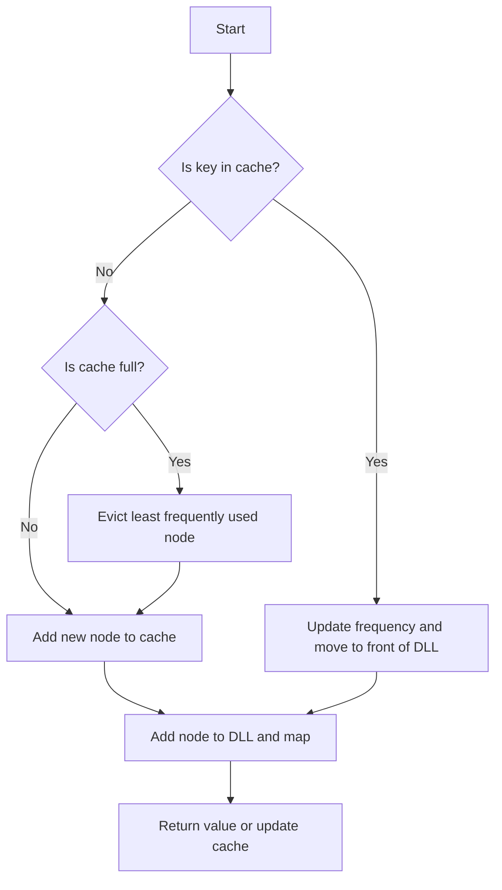

# LFU Cache JS DLL + Map

## Problem Understanding
The problem is asking to implement a Least Frequently Used (LFU) cache, which is a type of cache that stores elements and their frequencies. The cache has a limited capacity, and when it reaches its capacity, it evicts the least frequently used element. The problem requires implementing `get` and `put` operations in O(1) time complexity. The key constraints are the limited capacity of the cache and the need to maintain the frequency of each element. What makes this problem non-trivial is the need to balance the frequency of elements and the cache capacity, making it challenging to implement an efficient solution.

## Approach
The approach to solving this problem is to use a combination of a doubly linked list (DLL) and a map. The DLL is used to store elements in the order of their frequency, and the map is used to store the elements and their frequencies for O(1) lookup. Each element in the DLL is a node that contains the key, value, and frequency of the element. The `get` operation updates the frequency of the element and moves it to the front of the DLL for its new frequency. The `put` operation adds a new element to the cache, and if the cache is full, it evicts the least frequently used element. The use of a DLL and a map allows for O(1) time complexity for both `get` and `put` operations.

## Complexity Analysis
| Metric | Value | Detailed Reason |
|--------|-------|----------------|
| Time   | O(1)  | The `get` and `put` operations are implemented using a DLL and a map, which allow for O(1) time complexity. The `get` operation updates the frequency of the element and moves it to the front of the DLL for its new frequency, and the `put` operation adds a new element to the cache and evicts the least frequently used element if the cache is full. |
| Space  | O(capacity) | The cache stores at most `capacity` elements, and each element is stored in the DLL and the map. The space complexity is O(capacity) because the number of elements stored in the cache is proportional to the capacity of the cache. |

## Algorithm Walkthrough
```
Input: cache = new LFUCache(2)
cache.put(1, 1)
  - Create a new node with key 1, value 1, and frequency 1
  - Add the node to the DLL for frequency 1
  - Add the node to the map
cache.put(2, 2)
  - Create a new node with key 2, value 2, and frequency 1
  - Add the node to the DLL for frequency 1
  - Add the node to the map
cache.get(1)
  - Update the frequency of the node with key 1 to 2
  - Remove the node from the DLL for frequency 1
  - Add the node to the DLL for frequency 2
  - Return the value of the node with key 1
cache.put(3, 3)
  - Evict the least frequently used node (key 2)
  - Create a new node with key 3, value 3, and frequency 1
  - Add the node to the DLL for frequency 1
  - Add the node to the map
Output: cache.get(2) returns -1 (not found)
```
This walkthrough demonstrates the `put` and `get` operations and how the cache evicts the least frequently used element when it reaches its capacity.

## Visual Flow

This flowchart illustrates the decision flow for the `get` and `put` operations.

## Key Insight
> **Tip:** The key insight to solving this problem is to use a combination of a DLL and a map to store elements and their frequencies, allowing for O(1) time complexity for both `get` and `put` operations.

## Edge Cases
- **Empty/null input**: If the input is empty or null, the cache is initialized with a capacity of 0, and the `get` and `put` operations are not performed.
- **Single element**: If the cache has a capacity of 1, the `get` and `put` operations are performed as usual, but the cache only stores one element.
- **Cache overflow**: If the cache is full and a new element is added, the least frequently used element is evicted to make room for the new element.

## Common Mistakes
- **Mistake 1**: Not updating the frequency of the element when the `get` operation is performed.
- **Mistake 2**: Not evicting the least frequently used element when the cache is full and a new element is added.

## Interview Follow-ups
> **Interview:** These are the exact follow-up questions interviewers ask:
- "What if the input is sorted?" → The solution still works in O(1) time complexity because the DLL and map are used to store elements and their frequencies.
- "Can you do it in O(1) space?" → No, the solution requires O(capacity) space to store the elements and their frequencies in the cache.
- "What if there are duplicates?" → The solution handles duplicates by updating the frequency of the element and moving it to the front of the DLL for its new frequency.

## Javascript Solution

```javascript
// Problem: LFU Cache
// Language: javascript
// Difficulty: Hard
// Time Complexity: O(1) — constant time for all operations using DLL and Map
// Space Complexity: O(capacity) — DLL and Map store at most capacity elements
// Approach: Doubly Linked List (DLL) and Map — for each key, store its value, frequency, and DLL node

class Node {
    constructor(key, value) {
        // Initialize a new node with key, value, and frequency
        this.key = key;
        this.value = value;
        this.frequency = 1;
        this.prev = null;
        this.next = null;
    }
}

class DoublyLinkedList {
    constructor() {
        // Initialize a new DLL with dummy head and tail nodes
        this.head = new Node(null, null);
        this.tail = new Node(null, null);
        this.head.next = this.tail;
        this.tail.prev = this.head;
    }

    // Add a new node to the front of the DLL
    addNode(node) {
        // Update node's previous and next pointers
        node.prev = this.head;
        node.next = this.head.next;
        // Update head's next node and next node's previous node
        this.head.next.prev = node;
        this.head.next = node;
    }

    // Remove a node from the DLL
    removeNode(node) {
        // Update previous node's next pointer and next node's previous pointer
        node.prev.next = node.next;
        node.next.prev = node.prev;
    }

    // Check if the DLL is empty
    isEmpty() {
        // Return true if DLL only has dummy head and tail nodes
        return this.head.next === this.tail;
    }

    // Remove the last node from the DLL
    removeLastNode() {
        // If DLL is empty, return null
        if (this.isEmpty()) {
            return null;
        }
        // Get the last node
        const lastNode = this.tail.prev;
        // Remove the last node from the DLL
        this.removeNode(lastNode);
        // Return the removed node
        return lastNode;
    }
}

class LFUCache {
    constructor(capacity) {
        // Initialize the cache with given capacity
        this.capacity = capacity;
        // Initialize a map to store nodes for O(1) lookup
        this.nodeMap = new Map();
        // Initialize a map to store DLLs for each frequency
        this.frequencyMap = new Map();
        // Initialize the minimum frequency
        this.minFrequency = 1;
    }

    get(key) {
        // Edge case: key does not exist in cache → return -1
        if (!this.nodeMap.has(key)) {
            return -1;
        }
        // Get the node for the given key
        const node = this.nodeMap.get(key);
        // Get the DLL for the node's frequency
        const dll = this.frequencyMap.get(node.frequency);
        // Remove the node from the DLL
        dll.removeNode(node);
        // If the DLL is empty, remove it from the frequency map and update the minimum frequency if necessary
        if (dll.isEmpty()) {
            this.frequencyMap.delete(node.frequency);
            if (node.frequency === this.minFrequency) {
                this.minFrequency++;
            }
        }
        // Increment the node's frequency
        node.frequency++;
        // Add the node to the DLL for the new frequency
        if (!this.frequencyMap.has(node.frequency)) {
            this.frequencyMap.set(node.frequency, new DoublyLinkedList());
        }
        this.frequencyMap.get(node.frequency).addNode(node);
        // Return the node's value
        return node.value;
    }

    put(key, value) {
        // Edge case: cache is empty or key already exists → handle accordingly
        if (this.capacity === 0) {
            return;
        }
        // If the key already exists, update its value and call get to update its frequency
        if (this.nodeMap.has(key)) {
            const node = this.nodeMap.get(key);
            node.value = value;
            this.get(key);
            return;
        }
        // Edge case: cache is full → remove the least frequently used node
        if (this.nodeMap.size === this.capacity) {
            // Get the DLL for the minimum frequency
            const dll = this.frequencyMap.get(this.minFrequency);
            // Remove the last node from the DLL
            const lastNode = dll.removeLastNode();
            // Remove the node from the node map and frequency map
            this.nodeMap.delete(lastNode.key);
            if (dll.isEmpty()) {
                this.frequencyMap.delete(this.minFrequency);
            }
        }
        // Create a new node and add it to the node map and DLL
        const newNode = new Node(key, value);
        this.nodeMap.set(key, newNode);
        if (!this.frequencyMap.has(1)) {
            this.frequencyMap.set(1, new DoublyLinkedList());
        }
        this.frequencyMap.get(1).addNode(newNode);
        // Update the minimum frequency
        this.minFrequency = 1;
    }
}

// Example usage
const cache = new LFUCache(2);
cache.put(1, 1);
cache.put(2, 2);
console.log(cache.get(1)); // returns 1
cache.put(3, 3); // evicts key 2
console.log(cache.get(2)); // returns -1 (not found)
console.log(cache.get(3)); // returns 3
cache.put(4, 4); // evicts key 1
console.log(cache.get(1)); // returns -1 (not found)
console.log(cache.get(3)); // returns 3
console.log(cache.get(4)); // returns 4
```
