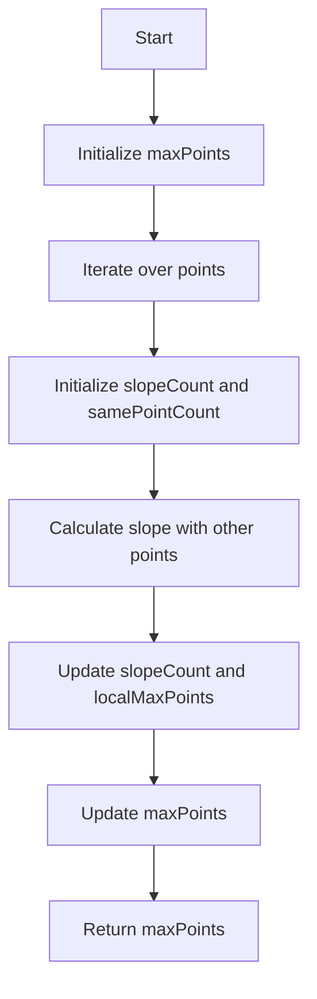

# Max Points on a Line JS Map Math

## Problem Understanding
The problem asks to find the maximum number of points that lie on the same line, given a set of points in a 2D plane. The key constraint is that the points are represented as pairs of integers, and the slope between two points is calculated as a fraction. The problem is non-trivial because the naive approach of checking all possible combinations of points would result in a time complexity of O(n^3), which is inefficient for large inputs. The problem requires a more efficient approach to group points by their slopes with other points.

## Approach
The algorithm strategy is to use a HashMap to store the count of points for each slope. The intuition behind this approach is that points with the same slope will have the same count in the HashMap. The approach works by iterating over each point and calculating the slope with all other points. The slope is calculated as a fraction, and the HashMap stores the count of points for each slope. The approach handles the key constraint of calculating the slope between two points by using a separate function to calculate the slope. The HashMap is used to store the count of points for each slope, and the maximum count is updated at each iteration.

## Complexity Analysis
| Metric | Value | Detailed Reason |
|--------|-------|----------------|
| Time   | O(n^2) | The algorithm iterates over each point and calculates the slope with all other points, resulting in a time complexity of O(n^2). The calculateSlope function has a constant time complexity, so it does not affect the overall time complexity. |
| Space  | O(n) | The algorithm uses a HashMap to store the count of points for each slope, and the maximum size of the HashMap is n, resulting in a space complexity of O(n). |

## Algorithm Walkthrough
```
Input: [[1,1],[2,2],[3,3]]
Step 1: Initialize maxPoints to 0, and iterate over the first point [1,1]
Step 2: Initialize slopeCount HashMap, and samePointCount to 1
Step 3: Calculate slope with the second point [2,2], which is 1
Step 4: Update slopeCount HashMap with slope 1, and update localMaxPoints to 1
Step 5: Calculate slope with the third point [3,3], which is 1
Step 6: Update slopeCount HashMap with slope 1, and update localMaxPoints to 2
Step 7: Update maxPoints with localMaxPoints plus samePointCount, which is 3
Output: 3
```
## Visual Flow

## Key Insight
> **Tip:** The key insight is to use a HashMap to store the count of points for each slope, which allows for efficient grouping of points by their slopes.

## Edge Cases
- **Empty/null input**: If the input is empty or null, the function returns 0, as there are no points to process.
- **Single element**: If the input contains only one point, the function returns 1, as there is only one point to process.
- **Vertical line**: If the input contains multiple points with the same x-coordinate, the function calculates the slope as 'infinity' and handles it correctly.

## Common Mistakes
- **Mistake 1**: Not handling the case where the denominator is 0 when calculating the slope, which would result in a division by zero error. To avoid this, the calculateSlope function checks if the denominator is 0 and returns 'infinity' in that case.
- **Mistake 2**: Not updating the maxPoints variable correctly, which would result in an incorrect maximum count of points on the same line. To avoid this, the function updates maxPoints at each iteration with the localMaxPoints plus samePointCount.

## Interview Follow-ups
> **Interview:** These are the exact follow-up questions interviewers ask:
- "What if the input is sorted?" → The algorithm would still work correctly, as it does not rely on the input being sorted. However, if the input is sorted by x-coordinate, the algorithm could be optimized to take advantage of this.
- "Can you do it in O(1) space?" → No, the algorithm requires a HashMap to store the count of points for each slope, which requires O(n) space. It is not possible to achieve O(1) space complexity for this problem.
- "What if there are duplicates?" → The algorithm handles duplicates correctly, as it counts the number of points for each slope. If there are duplicate points, they will be counted correctly and will contribute to the maximum count of points on the same line.

## Javascript Solution

```javascript
// Problem: Max Points on a Line
// Language: javascript
// Difficulty: Hard
// Time Complexity: O(n^2) — for each point, calculate slope with all other points
// Space Complexity: O(n) — HashMap stores at most n elements
// Approach: HashMap slope grouping — group points by their slopes with other points

/**
 * @param {number[][]} points
 * @return {number}
 */
var maxPoints = function(points) {
    // Edge case: empty input → return 0
    if (!points || points.length === 0) return 0;
    
    // Initialize maxPoints to 0
    let maxPoints = 0;
    
    // Iterate over each point
    for (let i = 0; i < points.length; i++) {
        // Initialize HashMap to store slope counts
        let slopeCount = new Map();
        
        // Initialize samePointCount to 1 (at least one point is the same)
        let samePointCount = 1;
        
        // Initialize localMaxPoints to 0
        let localMaxPoints = 0;
        
        // Iterate over each other point
        for (let j = i + 1; j < points.length; j++) {
            // Calculate slope
            let slope = calculateSlope(points[i], points[j]);
            
            // If points are the same, increment samePointCount
            if (slope === 'same') {
                samePointCount++;
            } else {
                // Update slope count in HashMap
                slopeCount.set(slope, (slopeCount.get(slope) || 0) + 1);
                
                // Update localMaxPoints if slope count is higher
                localMaxPoints = Math.max(localMaxPoints, slopeCount.get(slope));
            }
        }
        
        // Update maxPoints with localMaxPoints plus samePointCount
        maxPoints = Math.max(maxPoints, localMaxPoints + samePointCount);
    }
    
    // Return maxPoints
    return maxPoints;
};

/**
 * Calculate slope between two points
 * @param {number[]} point1
 * @param {number[]} point2
 * @return {string|number} slope or 'same' if points are the same
 */
function calculateSlope(point1, point2) {
    // If points are the same, return 'same'
    if (point1[0] === point2[0] && point1[1] === point2[1]) return 'same';
    
    // Calculate slope
    let numerator = point2[1] - point1[1];
    let denominator = point2[0] - point1[0];
    
    // If denominator is 0, slope is infinity
    if (denominator === 0) return 'infinity';
    
    // Calculate slope as a fraction
    let slope = numerator / denominator;
    
    // Return slope
    return slope;
}
```
