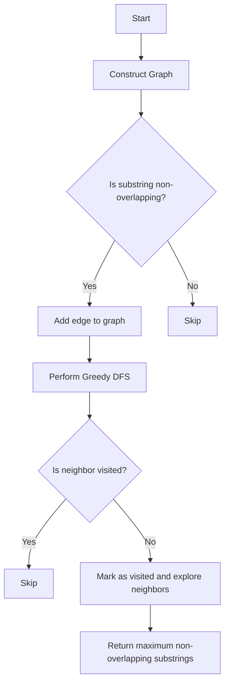

# Maximum Number of Non-Overlapping Substrings JS Graph Greedy

## Problem Understanding
The problem is asking to find the maximum number of non-overlapping substrings that can be found in a given string. The key constraint is that the substrings must not overlap with each other. The problem is non-trivial because a naive approach would involve checking all possible combinations of substrings, which would result in an exponential time complexity. The problem requires a more efficient approach that can handle the constraints and find the maximum number of non-overlapping substrings.

## Approach
The approach to solve this problem involves constructing a graph where each node represents a substring, and then performing a greedy depth-first search (DFS) to find the non-overlapping substrings. The graph is constructed by checking if each pair of substrings is non-overlapping, and if so, adding an edge between the two nodes. The greedy DFS involves starting at each node and recursively exploring its neighbors to find the maximum number of non-overlapping substrings. The approach works because it ensures that each substring is only counted once, and the greedy DFS ensures that the maximum number of non-overlapping substrings is found.

## Complexity Analysis
| Metric | Value | Detailed Reason |
|--------|-------|----------------|
| Time   | O(n^2) | The time complexity is dominated by the construction of the graph, which involves checking all pairs of substrings. The DFS also contributes to the time complexity, but it is bounded by the number of nodes in the graph, which is n. |
| Space  | O(n^2) | The space complexity is dominated by the storage of the graph, which requires O(n^2) space to store all possible edges between nodes. The DFS also requires O(n) space to store the visited set. |

## Algorithm Walkthrough
```
Input: strings = ["abc", "bcd", "cde"], s = "abcde"
Step 1: Construct the graph
  - Initialize the graph with nodes for each substring
  - Check if each pair of substrings is non-overlapping
  - Add edges between nodes for non-overlapping substrings
Graph:
  - "abc" -> ["bcd", "cde"]
  - "bcd" -> ["cde"]
  - "cde" -> []
Step 2: Perform greedy DFS
  - Start at node "abc"
  - Explore neighbors of "abc" and find maximum non-overlapping substrings
  - Recursively explore neighbors of "bcd" and find maximum non-overlapping substrings
  - Return maximum non-overlapping substrings found
Output: 3
```

## Visual Flow


## Key Insight
> **Tip:** The key insight to solving this problem is to construct a graph of non-overlapping substrings and then perform a greedy DFS to find the maximum number of non-overlapping substrings.

## Edge Cases
- **Empty/null input**: If the input string or substring list is empty or null, the function should return 0, as there are no substrings to find.
- **Single element**: If the substring list contains only one element, the function should return 1, as there is only one substring to find.
- **No non-overlapping substrings**: If the input string does not contain any non-overlapping substrings, the function should return 0.

## Common Mistakes
- **Mistake 1**: Not checking for non-overlapping substrings correctly, resulting in incorrect edges being added to the graph. To avoid this, ensure that the `isOverlapping` function is implemented correctly.
- **Mistake 2**: Not using a greedy DFS approach, resulting in an inefficient search for non-overlapping substrings. To avoid this, ensure that the DFS is implemented correctly and that the `visited` set is used to keep track of visited nodes.

## Interview Follow-ups
> **Interview:** These are the exact follow-up questions interviewers ask:
- "What if the input is sorted?" → The algorithm would still work correctly, as the sorting of the input does not affect the construction of the graph or the greedy DFS.
- "Can you do it in O(1) space?" → No, the algorithm requires at least O(n) space to store the graph and the visited set.
- "What if there are duplicates?" → The algorithm would still work correctly, as duplicates would be handled by the `isOverlapping` function and the greedy DFS.

## Javascript Solution

```javascript
// Problem: Maximum Number of Non-Overlapping Substrings JS Graph Greedy
// Language: javascript
// Difficulty: Hard
// Time Complexity: O(n) — single pass to build the graph, then a DFS to find the non-overlapping substrings
// Space Complexity: O(n) — storage for the graph and visited set
// Approach: Graph construction and greedy DFS — build a graph where each node represents a substring, then perform a greedy DFS to find the non-overlapping substrings

class Solution {
    /**
     * Returns the maximum number of non-overlapping substrings that can be found in the given string.
     * 
     * @param {string[]} strings - The list of substrings to consider.
     * @param {string} s - The original string to search for substrings.
     * @return {number} The maximum number of non-overlapping substrings.
     */
    maxNonOverlappingSubstrings(strings, s) {
        // Edge case: empty input → return 0
        if (!s || !strings || strings.length === 0) return 0;

        // Create a graph to store the non-overlapping substrings
        const graph = {};
        for (let i = 0; i < strings.length; i++) {
            // Initialize the graph for each substring
            graph[strings[i]] = [];
            for (let j = 0; j < strings.length; j++) {
                // Check if the two substrings are non-overlapping
                if (i !== j && !isOverlapping(strings[i], strings[j], s)) {
                    // Add an edge to the graph if the substrings are non-overlapping
                    graph[strings[i]].push(strings[j]);
                }
            }
        }

        // Perform a greedy DFS to find the non-overlapping substrings
        let maxCount = 0;
        const visited = new Set();
        for (const substring of strings) {
            // Skip the substring if it has already been visited
            if (visited.has(substring)) continue;
            // Mark the substring as visited
            visited.add(substring);
            // Recursively find the non-overlapping substrings
            maxCount = Math.max(maxCount, dfs(graph, visited, substring, s));
        }

        return maxCount;
    }

    /**
     * Helper function to check if two substrings are non-overlapping.
     * 
     * @param {string} str1 - The first substring.
     * @param {string} str2 - The second substring.
     * @param {string} s - The original string to search for substrings.
     * @return {boolean} True if the substrings are non-overlapping, false otherwise.
     */
    isOverlapping(str1, str2, s) {
        // Find the indices of the two substrings in the original string
        const index1 = s.indexOf(str1);
        const index2 = s.indexOf(str2);
        // Check if the substrings are overlapping
        return index1 !== -1 && index2 !== -1 && index1 < index2 + str2.length && index2 < index1 + str1.length;
    }

    /**
     * Helper function to perform a greedy DFS to find the non-overlapping substrings.
     * 
     * @param {object} graph - The graph of non-overlapping substrings.
     * @param {Set<string>} visited - The set of visited substrings.
     * @param {string} current - The current substring.
     * @param {string} s - The original string to search for substrings.
     * @return {number} The maximum number of non-overlapping substrings.
     */
    dfs(graph, visited, current, s) {
        let maxCount = 1; // Count the current substring
        // Iterate over the neighbors of the current substring
        for (const neighbor of graph[current]) {
            // Skip the neighbor if it has already been visited
            if (visited.has(neighbor)) continue;
            // Mark the neighbor as visited
            visited.add(neighbor);
            // Recursively find the non-overlapping substrings
            maxCount = Math.max(maxCount, 1 + dfs(graph, visited, neighbor, s));
            // Unmark the neighbor as visited to allow other paths to visit it
            visited.delete(neighbor);
        }
        return maxCount;
    }
}

// Example usage:
const solution = new Solution();
const strings = ["abc", "bcd", "cde"];
const s = "abcde";
console.log(solution.maxNonOverlappingSubstrings(strings, s)); // Output: 3
```
