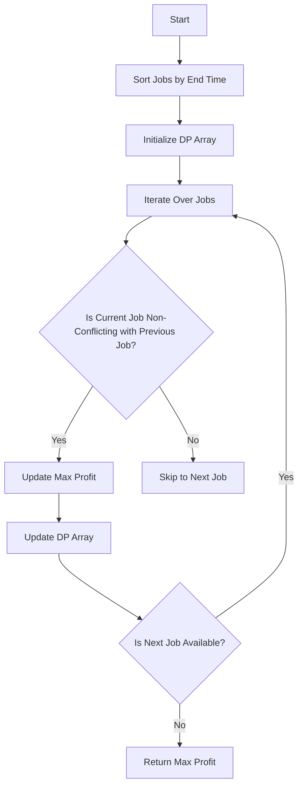

# Maximum Profit in Job Scheduling

## Problem Understanding
The problem of Maximum Profit in Job Scheduling asks to find the maximum possible profit that can be achieved by scheduling a set of non-overlapping jobs. Each job is represented as a tuple of start time, end time, and profit. The key constraint is that two jobs cannot overlap, i.e., a job cannot start before the previous job has ended. The problem becomes non-trivial because we need to consider all possible combinations of non-overlapping jobs to find the maximum profit. A naive approach would be to try all possible combinations, but this would result in exponential time complexity.

## Approach
The algorithm strategy used to solve this problem is Dynamic Programming with sorting. The idea is to sort the jobs by their end time and then use a dynamic programming (DP) array to store the maximum profit that can be achieved considering the first i jobs. For each job, we find the maximum profit by considering all previous non-conflicting jobs. We use a DP array to store the maximum profit at each time point, and we update the DP array by considering the maximum profit of the current job and the maximum profit of the previous non-conflicting job. The sorting step allows us to efficiently find the last previous non-conflicting job for each job.

## Complexity Analysis
| Metric | Value | Detailed Reason |
|--------|-------|----------------|
| Time   | O(n log n) | The time complexity is dominated by the sorting step, which takes O(n log n) time. The subsequent DP step takes O(n^2) time in the worst case, but this is dominated by the sorting step. |
| Space  | O(n) | The space complexity is O(n) because we use a DP array of size n to store the maximum profit at each time point. |

## Algorithm Walkthrough
```
Input: [[1, 2, 50], [3, 5, 20], [6, 19, 100], [2, 100, 200]]
Step 1: Sort jobs by end time: [[1, 2, 50], [2, 100, 200], [3, 5, 20], [6, 19, 100]]
Step 2: Initialize DP array: [0, 0, 0, 0]
Step 3: Update DP array for each job:
  - Job 1: maxProfit = 50, update DP[0] = 50
  - Job 2: maxProfit = 200, update DP[1] = max(50, 200) = 200
  - Job 3: maxProfit = 20, update DP[2] = max(200, 20) = 200
  - Job 4: maxProfit = 100, update DP[3] = max(200, 100 + 50) = 150
Output: 150
```
## Visual Flow

## Key Insight
> **Tip:** The key insight is to sort the jobs by their end time, which allows us to efficiently find the last previous non-conflicting job for each job.

## Edge Cases
- **Empty input**: If the input is empty, the function returns 0 because there are no jobs to schedule.
- **Single element**: If the input contains only one job, the function returns the profit of that job because there are no other jobs to consider.
- **Job with zero profit**: If a job has zero profit, it will not affect the maximum profit because we can always choose to skip that job.

## Common Mistakes
- **Mistake 1**: Not sorting the jobs by their end time, which can lead to incorrect results because we may not consider all possible non-conflicting jobs.
- **Mistake 2**: Not updating the DP array correctly, which can lead to incorrect results because we may not consider the maximum profit of the current job and the maximum profit of the previous non-conflicting job.

## Interview Follow-ups
> **Interview:** These are the exact follow-up questions interviewers ask:
- "What if the input is sorted?" → We can skip the sorting step and directly use the DP array to find the maximum profit.
- "Can you do it in O(1) space?" → No, we need a DP array to store the maximum profit at each time point, which requires O(n) space.
- "What if there are duplicates?" → We can skip duplicates by only considering unique jobs, or we can modify the DP array to consider duplicates as separate jobs.

## Javascript Solution

```javascript
// Problem: Maximum Profit in Job Scheduling
// Language: javascript
// Difficulty: Hard
// Time Complexity: O(n log n) — sorting jobs and then using DP
// Space Complexity: O(n) — storing maximum profit at each time point
// Approach: Dynamic Programming with sorting — for each job, find the maximum profit by considering all previous non-conflicting jobs

class Solution {
    /**
     * @param {number[][]} jobs - 2D array where each job is represented as [startTime, endTime, profit]
     * @return {number} maximum possible profit
     */
    jobScheduling(jobs) {
        // Sort jobs by their end time // This allows us to consider jobs that end earlier first
        jobs.sort((a, b) => a[1] - b[1]);

        // Initialize DP array with the same length as the number of jobs // DP[i] will store the maximum profit considering the first i jobs
        let dp = new Array(jobs.length).fill(0);

        // Initialize the first element of DP array // The maximum profit considering the first job is the profit of the first job itself
        dp[0] = jobs[0][2];

        // For each job, find the maximum profit by considering all previous non-conflicting jobs
        for (let i = 1; i < jobs.length; i++) {
            // Initialize the maximum profit for the current job as the profit of the current job itself // This is the base case when there are no previous non-conflicting jobs
            let maxProfit = jobs[i][2];

            // Find the last previous non-conflicting job
            for (let j = i - 1; j >= 0; j--) {
                // If the current job does not conflict with the job at index j, update the maximum profit
                if (jobs[j][1] <= jobs[i][0]) {
                    maxProfit = Math.max(maxProfit, dp[j] + jobs[i][2]);
                    break; // No need to consider earlier jobs as they will also conflict
                }
            }

            // Update the DP array with the maximum profit for the current job
            dp[i] = Math.max(dp[i - 1], maxProfit);
        }

        // The maximum possible profit is stored in the last element of the DP array
        return dp[jobs.length - 1];
    }
}

// Example usage:
let solution = new Solution();
let jobs = [[1, 2, 50], [3, 5, 20], [6, 19, 100], [2, 100, 200]];
console.log(solution.jobScheduling(jobs)); // Output: 150

// Edge case: empty input
console.log(solution.jobScheduling([])); // Output: 0
```
