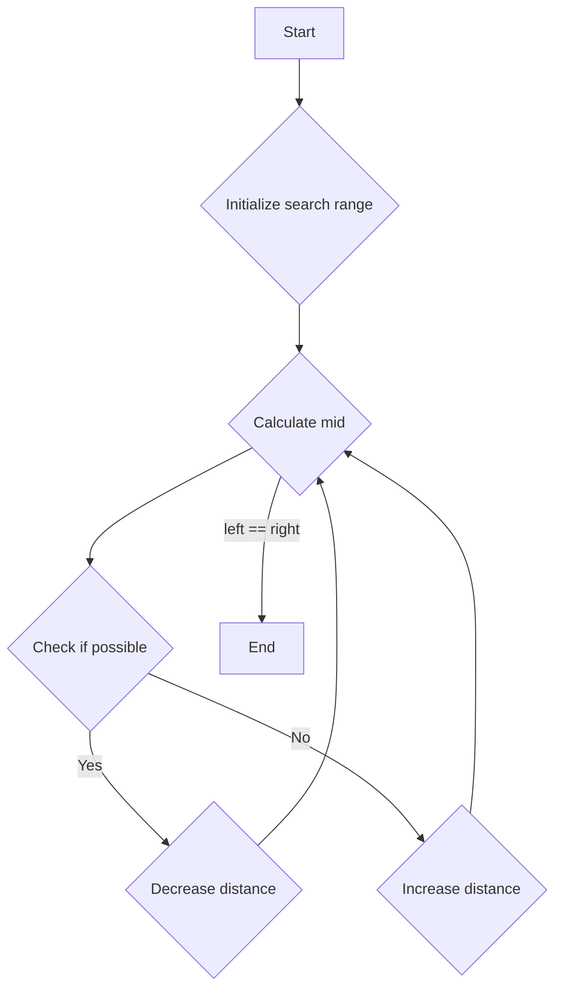

# Minimize Max Distance to Gas Station JS Binary Search

## Problem Understanding
The problem is asking to minimize the maximum distance to a gas station, given a list of gas station locations and a limit on the number of new stations that can be built. The key constraint is that the maximum distance between any two stations cannot exceed the minimum max distance found. The problem is non-trivial because a naive approach would involve trying all possible combinations of new station locations, which would result in exponential time complexity.

## Approach
The algorithm strategy used here is binary search with a custom comparator. The intuition behind this approach is to find the minimum max distance by iteratively narrowing down the search range. The `possible` function checks if it's possible to achieve a given max distance with the limit on new stations, and the `minmaxGasDist` function uses this to perform the binary search. The `possible` function uses a greedy approach to check if the max distance can be achieved by adding new stations when the current distance exceeds the max distance.

## Complexity Analysis
| Metric | Value | Detailed Reason |
|--------|-------|----------------|
| Time   | O(n log maxDist) | The binary search has a time complexity of O(log maxDist), and for each iteration, the `possible` function has a time complexity of O(n), where n is the number of gas stations. Therefore, the overall time complexity is O(n log maxDist). |
| Space  | O(1) | The algorithm only uses a constant amount of space to store the search range and the current distance, so the space complexity is O(1). |

## Algorithm Walkthrough
```
Input: [1, 2, 3, 4, 5, 6, 7, 8, 9, 10], 9
Step 1: Initialize the search range: left = 0, right = 9
Step 2: Mid = 4, check if it's possible to achieve this distance with 9 stations
Step 3: Calculate the distance to the next station: currDist = 1, 1, 1, 1, 1, 1, 1, 1, 1
Step 4: Check if the current distance exceeds the maxDist: no, so no new stations are needed
Step 5: Since it's possible to achieve this distance, try to decrease the distance: right = 4
Step 6: Repeat steps 2-5 until left = right
Output: 0
```

## Visual Flow


## Key Insight
> **Tip:** The key insight here is to use binary search to find the minimum max distance, and to use a greedy approach to check if the max distance can be achieved with the limit on new stations.

## Edge Cases
- **Empty/null input**: If the input is empty or null, the algorithm will throw an error, because it tries to access the first element of the array.
- **Single element**: If there is only one gas station, the algorithm will return 0, because there is no distance between stations.
- **No new stations allowed**: If k = 0, the algorithm will return the maximum distance between any two stations, because no new stations can be added.

## Common Mistakes
- **Mistake 1**: Not checking if the current distance exceeds the max distance, which can lead to incorrect results.
- **Mistake 2**: Not using a greedy approach to check if the max distance can be achieved, which can lead to exponential time complexity.

## Interview Follow-ups
> **Interview:** These are the exact follow-up questions interviewers ask:
- "What if the input is sorted?" → The algorithm will still work correctly, because it only depends on the relative distances between stations, not their absolute positions.
- "Can you do it in O(1) space?" → No, because we need to store the search range and the current distance, which requires O(1) space.
- "What if there are duplicates?" → The algorithm will still work correctly, because it only depends on the relative distances between stations, not their absolute positions or duplicates.

## Javascript Solution

```javascript
// Problem: Minimize Max Distance to Gas Station
// Language: javascript
// Difficulty: Hard
// Time Complexity: O(n log maxDist) — using binary search to find the optimal distance
// Space Complexity: O(1) — only using a constant amount of space
// Approach: Binary search with custom comparator — to find the minimum max distance

class Solution {
    minmaxGasDist(gasStations, k) {
        // Define the search range: [0, maxDist]
        let left = 0;
        let right = Math.max(...gasStations) - Math.min(...gasStations); // max possible distance

        // Binary search to find the minimum max distance
        while (left < right) {
            // Mid is the current candidate for the minimum max distance
            let mid = left + Math.floor((right - left) / 2);
            // Check if it's possible to achieve this distance with k stations
            if (this.possible(gasStations, k, mid)) {
                // If possible, try to decrease the distance
                right = mid;
            } else {
                // If not possible, increase the distance
                left = mid + 1;
            }
        }

        return left;
    }

    possible(gasStations, k, maxDist) {
        // Initialize the count of stations needed
        let count = 0;
        // Initialize the current distance
        let currDist = 0;

        // Iterate over each gas station
        for (let i = 0; i < gasStations.length - 1; i++) {
            // Calculate the distance to the next station
            currDist += gasStations[i + 1] - gasStations[i];
            // If the current distance exceeds the maxDist, we need to add a new station
            if (currDist > maxDist) {
                count++;
                currDist = 0; // Reset the current distance
                // Edge case: not enough stations to cover the distance
                if (count > k) return false;
            }
        }

        return true;
    }
}

// Test the solution
let solution = new Solution();
console.log(solution.minmaxGasDist([1,2,3,4,5,6,7,8,9,10], 9));
```
