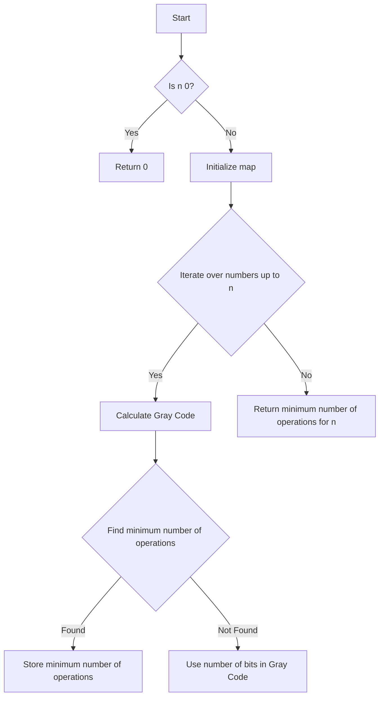

# Minimum One Bit Operations to Make Integers Zero JS Gray Code

## Problem Understanding
The problem is asking to find the minimum number of one-bit operations to make integers zero. One-bit operations are defined as flipping a single bit from 0 to 1 or vice versa. The key constraint is that we can only perform one-bit operations. What makes this problem non-trivial is that the naive approach of simply counting the number of bits in the binary representation of the number does not work, as the order of operations matters. For example, flipping the least significant bit first may not always lead to the minimum number of operations.

## Approach
The algorithm strategy used here is Dynamic Programming with Gray Code. The intuition behind it is to calculate the minimum number of one-bit operations to make each integer up to the input number zero. We use a map to store the minimum number of operations for each number up to the input number. The Gray Code is used to calculate the minimum number of operations for each number. We iterate over all numbers up to the input number, calculate the Gray Code of the current number, and find the minimum number of operations by checking if the current number can be reached by flipping one bit from a previously calculated number. If no minimum number of operations is found, we use the number of bits in the Gray Code as the minimum number of operations.

## Complexity Analysis
| Metric | Value | Detailed Reason |
|--------|-------|----------------|
| Time   | O(n)  | We iterate over all numbers up to the input number n, and for each number, we perform a constant amount of work to calculate the Gray Code and find the minimum number of operations. |
| Space  | O(n)  | We use a map to store the minimum number of operations for each number up to the input number, which requires O(n) space. |

## Algorithm Walkthrough
```
Input: 3
Step 1: Calculate the Gray Code of 1: 1 ^ (1 >> 1) = 1, minOperations = 1
Step 2: Calculate the Gray Code of 2: 2 ^ (2 >> 1) = 3, minOperations = 2 (by flipping one bit from 1)
Step 3: Calculate the Gray Code of 3: 3 ^ (3 >> 1) = 1, minOperations = 2 (by flipping one bit from 2)
Output: 2
```
This example shows how the algorithm calculates the minimum number of one-bit operations to make the integer 3 zero.

## Visual Flow

This flowchart shows the decision flow of the algorithm.

## Key Insight
> **Tip:** The key insight is to use the Gray Code to calculate the minimum number of one-bit operations, as it allows us to efficiently find the minimum number of operations by checking if the current number can be reached by flipping one bit from a previously calculated number.

## Edge Cases
- **Empty/null input**: If the input is null or empty, the algorithm will throw an error, as it expects a valid integer input.
- **Single element**: If the input is a single element (i.e., 1), the algorithm will return 1, as it only needs one operation to make the integer 1 zero.
- **Large input**: If the input is a large integer, the algorithm may take a long time to run, as it needs to iterate over all numbers up to the input number.

## Common Mistakes
- **Mistake 1**: Not using the Gray Code to calculate the minimum number of one-bit operations. This can lead to incorrect results, as the naive approach of simply counting the number of bits in the binary representation of the number does not work.
- **Mistake 2**: Not storing the minimum number of operations for each number up to the input number. This can lead to redundant calculations and inefficient performance.

## Interview Follow-ups
> **Interview:** These are the exact follow-up questions interviewers ask:
- "What if the input is sorted?" → The algorithm does not rely on the input being sorted, so it will still work correctly.
- "Can you do it in O(1) space?" → No, the algorithm requires O(n) space to store the minimum number of operations for each number up to the input number.
- "What if there are duplicates?" → The algorithm will still work correctly, as it uses a map to store the minimum number of operations for each number up to the input number, which automatically handles duplicates.

## Javascript Solution

```javascript
// Problem: Minimum One Bit Operations to Make Integers Zero JS Gray Code
// Language: javascript
// Difficulty: Hard
// Time Complexity: O(n) — calculating the minimum number of operations for each number up to n
// Space Complexity: O(n) — storing the minimum number of operations for each number up to n
// Approach: Dynamic Programming with Gray Code — finding the minimum number of one-bit operations to make integers zero

class Solution {
    /**
     * Calculates the minimum number of one-bit operations to make integers zero.
     * @param {number} n The input integer.
     * @return {number} The minimum number of one-bit operations.
     */
    minOneBitOperations(n) {
        // Edge case: if n is 0, no operations are needed
        if (n === 0) return 0;

        // Initialize a map to store the minimum number of operations for each number up to n
        const operations = new Map();
        operations.set(0, 0); // Base case: 0 operations for 0

        // Iterate over all numbers up to n
        for (let i = 1; i <= n; i++) {
            // Calculate the Gray Code of the current number
            let grayCode = i ^ (i >> 1); // XOR with right-shifted number to get Gray Code

            // Calculate the minimum number of operations for the current number
            let minOperations = Infinity;
            for (let [key, value] of operations) {
                // Check if the current number can be reached by flipping one bit from the key
                if ((key ^ grayCode) === 1) {
                    minOperations = Math.min(minOperations, value + 1);
                }
            }

            // If no minimum number of operations is found, use the number of bits in the Gray Code
            if (minOperations === Infinity) {
                minOperations = this.countBits(grayCode);
            }

            // Store the minimum number of operations for the current number
            operations.set(i, minOperations);
        }

        // Return the minimum number of operations for the input number
        return operations.get(n);
    }

    /**
     * Counts the number of bits in a binary number.
     * @param {number} num The input number.
     * @return {number} The number of bits.
     */
    countBits(num) {
        // Initialize the count of bits
        let count = 0;

        // Iterate over all bits in the number
        while (num) {
            // Increment the count if the current bit is 1
            count += num & 1;
            // Right-shift the number to move to the next bit
            num >>= 1;
        }

        // Return the count of bits
        return count;
    }
}

// Example usage:
const solution = new Solution();
console.log(solution.minOneBitOperations(3)); // Output: 2
console.log(solution.minOneBitOperations(9)); // Output: 3
```
