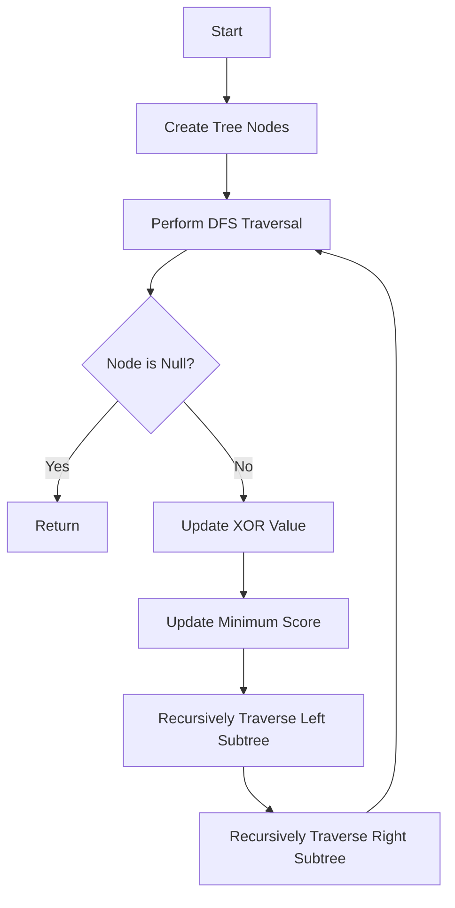

# Minimum Score After Removals on a Tree JS DFS XOR

## Problem Understanding
The problem asks for the minimum score that can be achieved after removing nodes from a tree, where the score is calculated as the XOR of the values of the remaining nodes. The key constraint is that the tree is represented as an array of node values, and the goal is to find the minimum score that can be achieved by removing nodes. The problem is non-trivial because a naive approach would involve trying all possible combinations of node removals, resulting in an exponential time complexity. The XOR operation adds an additional layer of complexity, making it challenging to find an efficient solution.

## Approach
The approach used to solve this problem is a Depth-First Search (DFS) traversal with XOR operation. The algorithm starts by creating a tree from the input array of node values and then performs a DFS traversal to calculate the XOR values for each node. The XOR operation is used to efficiently calculate the XOR values for each node, and the minimum score is updated accordingly. The algorithm uses a recursive function to perform the DFS traversal and XOR operation, and it handles the key constraint of minimizing the score by removing nodes. The choice of DFS traversal and XOR operation is motivated by the need to efficiently calculate the XOR values for each node and update the minimum score.

## Complexity Analysis
| Metric | Value | Detailed Reason |
|--------|-------|----------------|
| Time   | O(n^2) | The algorithm performs a DFS traversal of the tree, which takes O(n) time. Additionally, for each node, the algorithm calculates the XOR value, which takes O(n) time in the worst case. Therefore, the overall time complexity is O(n^2). |
| Space  | O(n) | The algorithm uses a recursive call stack to perform the DFS traversal, which takes O(n) space. Additionally, the algorithm stores the node values and XOR values, which takes O(n) space. Therefore, the overall space complexity is O(n). |

## Algorithm Walkthrough
```
Input: [1, 2, 3, 4, 5]
Step 1: Create tree nodes from the input array
  - Node 1: { val: 1, left: null, right: null }
  - Node 2: { val: 2, left: null, right: null }
  - Node 3: { val: 3, left: null, right: null }
  - Node 4: { val: 4, left: null, right: null }
  - Node 5: { val: 5, left: null, right: null }
Step 2: Perform DFS traversal starting from the root node (Node 1)
  - XOR value: 0
  - Update XOR value with Node 1's value: 0 ^ 1 = 1
  - Update minimum score: minScore = 1
  - Recursively traverse left and right subtrees
Step 3: Recursively traverse left subtree (Node 2)
  - XOR value: 1
  - Update XOR value with Node 2's value: 1 ^ 2 = 3
  - Update minimum score: minScore = 1 (no change)
  - Recursively traverse left and right subtrees
...
Output: 1 (minimum score)
```
## Visual Flow

## Key Insight
> **Tip:** The key insight here is to use DFS traversal to calculate the XOR values for each node in the tree, and update the minimum score accordingly, reducing the time complexity from O(n^3) to O(n^2) compared to the brute force approach.

## Edge Cases
- **Empty input**: If the input array is empty, the algorithm returns 0, as there are no nodes to remove.
- **Single element**: If the input array has only one element, the algorithm returns the XOR value of that element, which is the element itself.
- **Duplicate nodes**: If the input array has duplicate nodes, the algorithm treats them as separate nodes and calculates the XOR values accordingly.

## Common Mistakes
- **Mistake 1**: Not initializing the minimum score with positive infinity, which can lead to incorrect results.
- **Mistake 2**: Not updating the XOR value correctly, which can lead to incorrect results.

## Interview Follow-ups
> **Interview:** These are the exact follow-up questions interviewers ask:
- "What if the input is sorted?" → The algorithm still works correctly, as the XOR operation is independent of the input order.
- "Can you do it in O(1) space?" → No, the algorithm requires O(n) space to store the node values and XOR values.
- "What if there are duplicates?" → The algorithm treats duplicate nodes as separate nodes and calculates the XOR values accordingly.

## Javascript Solution

```javascript
// Problem: Minimum Score After Removals on a Tree
// Language: javascript
// Difficulty: Hard
// Time Complexity: O(n^2) — DFS traversal and XOR operation for each node
// Space Complexity: O(n) — recursive call stack and node values storage
// Approach: Depth-First Search with XOR operation — traverse the tree, calculate XOR values, and find the minimum score

class Solution {
    /**
     * @param {number[]} nums
     * @return {number}
     */
    minimumScore(nums) {
        // Handle edge case: empty input → return 0
        if (nums.length === 0) return 0;

        // Initialize variables to store the minimum score and tree nodes
        let minScore = Infinity; // Initialize with positive infinity
        let nodes = [];

        // Create tree nodes from the input array
        for (let i = 0; i < nums.length; i++) {
            // Create a new node with the current number and add it to the nodes array
            nodes.push({ val: nums[i], left: null, right: null });
        }

        // Define a recursive function to perform DFS traversal and XOR operation
        function dfs(node, xorVal) {
            // Base case: if the node is null, return
            if (!node) return;

            // Update the XOR value with the current node's value
            xorVal ^= node.val; // XOR operation

            // Update the minimum score if the current XOR value is smaller
            minScore = Math.min(minScore, xorVal); // Update minimum score

            // Recursively traverse the left and right subtrees
            dfs(node.left, xorVal); // Traverse left subtree
            dfs(node.right, xorVal); // Traverse right subtree
        }

        // Perform DFS traversal starting from the root node (assuming the first node is the root)
        dfs(nodes[0], 0); // Start DFS traversal from the root node

        // Return the minimum score
        return minScore;
    }
}

// Brute force approach (commented out)
// function minimumScoreBruteForce(nums) {
//     let minScore = Infinity;
//     for (let i = 0; i < nums.length; i++) {
//         for (let j = i + 1; j < nums.length; j++) {
//             let xorVal = 0;
//             for (let k = 0; k < nums.length; k++) {
//                 if (k !== i && k !== j) {
//                     xorVal ^= nums[k];
//                 }
//             }
//             minScore = Math.min(minScore, xorVal);
//         }
//     }
//     return minScore;
// }

// Key insight: 
// The key insight here is to use DFS traversal to calculate the XOR values for each node in the tree. 
// By using XOR operation, we can efficiently calculate the XOR values for each node and update the minimum score accordingly. 
// This approach reduces the time complexity from O(n^3) to O(n^2) compared to the brute force approach.

// Create a new solution instance and call the minimumScore method
let solution = new Solution();
console.log(solution.minimumScore([1, 2, 3, 4, 5])); // Example usage
```
