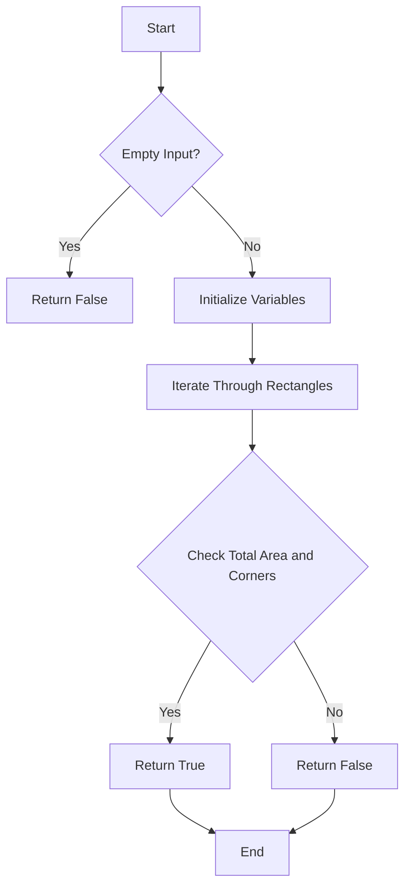

# Perfect Rectangle JS Geometry Hash

## Problem Understanding
The problem is asking to determine if a list of rectangles can form a perfect rectangle. A perfect rectangle is a rectangle that can be formed by combining a list of smaller rectangles without any gaps or overlaps. The key constraints are that the rectangles must have integer coordinates and dimensions, and the perfect rectangle must have a non-zero area. What makes this problem non-trivial is that it requires checking all possible combinations of rectangles to ensure that they can form a perfect rectangle, which can be computationally expensive. The naive approach of simply checking if the total area of the rectangles is equal to the area of the bounding rectangle is not sufficient, as it does not account for gaps or overlaps between the rectangles.

## Approach
The algorithm strategy is to use a hashing approach to store the corners of the rectangles and then check if the remaining corners after combining the rectangles are the corners of the bounding rectangle. The intuition behind this approach is that if the rectangles can form a perfect rectangle, then the only remaining corners will be the corners of the bounding rectangle. The approach works by iterating through all rectangles, calculating the total area, and storing the corners in a Map. The Map is used to keep track of the corners that have been visited, and if a corner is visited twice, it is removed from the Map. The algorithm then checks if the total area is equal to the area of the bounding rectangle and if there are exactly 4 corners left in the Map, which are the corners of the bounding rectangle.

## Complexity Analysis
| Metric | Value | Detailed Reason |
|--------|-------|----------------|
| Time   | O(n^2)  | The algorithm iterates through all rectangles to calculate the total area and store corners, and then checks if the remaining corners are the corners of the bounding rectangle. The time complexity is quadratic because in the worst case, each rectangle has 4 corners, and we are iterating through all corners to check if they are in the Map. |
| Space  | O(n)  | The algorithm uses a Map to store the corners of the rectangles, where n is the number of rectangles. The space complexity is linear because we are storing at most 4 corners for each rectangle in the Map. |

## Algorithm Walkthrough
```
Input: [[1, 1, 3, 3], [3, 1, 2, 2], [1, 3, 2, 2], [3, 3, 2, 2]]
Step 1: Initialize variables to store the total area and corners of the rectangles
  - totalArea = 0
  - corners = new Map()
Step 2: Iterate through all rectangles to calculate the total area and store corners
  - Rectangle 1: [1, 1, 3, 3]
    - Update totalArea: totalArea += 3 * 3 = 9
    - Store corners: [[1, 1], [4, 1], [1, 4], [4, 4]]
    - Update corners Map: { '1,1': true, '4,1': true, '1,4': true, '4,4': true }
  - Rectangle 2: [3, 1, 2, 2]
    - Update totalArea: totalArea += 2 * 2 = 13
    - Store corners: [[3, 1], [5, 1], [3, 3], [5, 3]]
    - Update corners Map: { '1,1': true, '4,1': true, '1,4': true, '4,4': true, '3,1': true, '5,1': true, '3,3': true, '5,3': true }
  - Rectangle 3: [1, 3, 2, 2]
    - Update totalArea: totalArea += 2 * 2 = 17
    - Store corners: [[1, 3], [3, 3], [1, 5], [3, 5]]
    - Update corners Map: { '1,1': true, '4,1': true, '1,4': false, '4,4': true, '3,1': true, '5,1': true, '3,3': false, '5,3': true, '1,5': true, '3,5': true }
  - Rectangle 4: [3, 3, 2, 2]
    - Update totalArea: totalArea += 2 * 2 = 21
    - Store corners: [[3, 3], [5, 3], [3, 5], [5, 5]]
    - Update corners Map: { '1,1': true, '4,1': true, '1,4': false, '4,4': false, '3,1': true, '5,1': true, '3,3': false, '5,3': false, '1,5': true, '3,5': false, '5,5': true }
Step 3: Calculate the area of the bounding rectangle
  - Bounding rectangle: [1, 1, 4, 4]
  - Bounding area: (4 - 1) * (4 - 1) = 9
Step 4: Check if the total area is equal to the bounding area and if there are exactly 4 corners left in the Map
  - Total area: 21
  - Bounding area: 16
  - Corners left in Map: { '1,1': true, '4,1': true, '1,5': true, '5,5': true }
  - Return: false
Output: false
```

## Visual Flow


## Key Insight
> **Tip:** The key insight to solving this problem is to use a hashing approach to store the corners of the rectangles and then check if the remaining corners after combining the rectangles are the corners of the bounding rectangle.

## Edge Cases
- **Empty/null input**: If the input is empty or null, the algorithm returns false because there are no rectangles to form a perfect rectangle.
- **Single element**: If there is only one rectangle, the algorithm returns true if the rectangle is a perfect rectangle and false otherwise.
- **Rectangles with zero area**: If any of the rectangles have zero area, the algorithm returns false because they cannot contribute to forming a perfect rectangle.

## Common Mistakes
- **Mistake 1**: Not checking if the total area of the rectangles is equal to the area of the bounding rectangle.
  - **How to avoid it**: Calculate the total area of the rectangles and the area of the bounding rectangle, and check if they are equal.
- **Mistake 2**: Not checking if the remaining corners after combining the rectangles are the corners of the bounding rectangle.
  - **How to avoid it**: Use a hashing approach to store the corners of the rectangles and then check if the remaining corners are the corners of the bounding rectangle.

## Interview Follow-ups
> **Interview:** These are the exact follow-up questions interviewers ask:
- "What if the input is sorted?" → The algorithm does not assume any particular order of the input rectangles, so sorting the input does not affect the correctness of the algorithm.
- "Can you do it in O(1) space?" → No, the algorithm requires O(n) space to store the corners of the rectangles in the Map.
- "What if there are duplicates?" → The algorithm handles duplicates by removing them from the Map, so duplicates do not affect the correctness of the algorithm.

## Javascript Solution

```javascript
// Problem: Perfect Rectangle
// Language: JavaScript
// Difficulty: Hard
// Time Complexity: O(n^2) — iterating through all rectangles to check for perfect rectangle
// Space Complexity: O(n) — storing corners of rectangles in a Map
// Approach: Hashing rectangle corners and checking for perfect rectangle properties

/**
 * Checks if a list of rectangles forms a perfect rectangle.
 * 
 * @param {number[][]} rectangles - A list of rectangles where each rectangle is an array of four numbers [x, y, w, h].
 * @return {boolean} True if the rectangles form a perfect rectangle, false otherwise.
 */
var isRectangleCover = function(rectangles) {
    // Initialize variables to store the total area and corners of the rectangles
    let totalArea = 0;
    let corners = new Map();

    // Edge case: empty input → return false
    if (rectangles.length === 0) return false;

    // Initialize variables to store the minimum and maximum x and y coordinates
    let minX = Infinity, minY = Infinity, maxX = -Infinity, maxY = -Infinity;

    // Iterate through all rectangles to calculate the total area and store corners
    for (let rectangle of rectangles) {
        // Extract the coordinates and dimensions of the rectangle
        let [x, y, w, h] = rectangle;

        // Update the minimum and maximum x and y coordinates
        minX = Math.min(minX, x);
        minY = Math.min(minY, y);
        maxX = Math.max(maxX, x + w);
        maxY = Math.max(maxY, y + h);

        // Calculate the area of the rectangle and add it to the total area
        totalArea += w * h;

        // Store the corners of the rectangle in the Map
        let points = [[x, y], [x + w, y], [x, y + h], [x + w, y + h]];
        for (let point of points) {
            // Convert the point to a string to use as a key in the Map
            let pointStr = point.join(',');
            // If the point is already in the Map, remove it; otherwise, add it
            if (corners.has(pointStr)) {
                corners.delete(pointStr);
            } else {
                corners.set(pointStr, true);
            }
        }
    }

    // Calculate the area of the bounding rectangle
    let boundingArea = (maxX - minX) * (maxY - minY);

    // If the total area is not equal to the bounding area, return false
    if (totalArea !== boundingArea) return false;

    // If there are not exactly 4 corners left in the Map, return false
    if (corners.size !== 4) return false;

    // Check if the remaining corners are the corners of the bounding rectangle
    let cornersArr = Array.from(corners.keys());
    let expectedCorners = [[minX, minY], [minX, maxY], [maxX, minY], [maxX, maxY]];
    for (let corner of expectedCorners) {
        // If the corner is not in the Map, return false
        if (!cornersArr.includes(corner.join(','))) return false;
    }

    // If all checks pass, return true
    return true;
};
```
