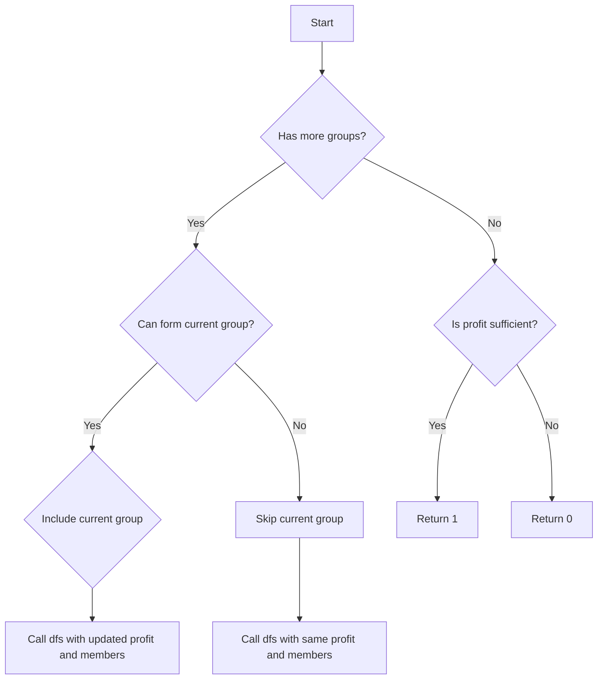

# Profitable Schemes JS DP Knapsack

## Problem Understanding
The problem is asking to find the number of profitable schemes that can be formed from a given set of groups, where each group has a certain profit and requires a certain number of members. The goal is to form schemes that have a total profit greater than or equal to a minimum required profit, given a limited number of members. The key constraint is that the number of members is limited, and each group requires a certain number of members to form. This problem is non-trivial because it involves a combination of dynamic programming and memoization to efficiently explore all possible schemes.

## Approach
The algorithm strategy used is dynamic programming with memoization, where the solution is built up from smaller subproblems. The intuition behind this approach is to break down the problem into smaller subproblems, solve each subproblem only once, and store the results in a memoization table to avoid redundant computation. The memoization table is used to store the results of subproblems, and the helper function `dfs` is used to perform the depth-first search with memoization. The algorithm handles the key constraint of limited members by considering two options: including the current group or skipping it, and it uses a modulo operation to avoid overflow.

## Complexity Analysis
| Metric | Value | Detailed Reason |
|--------|-------|----------------|
| Time   | O(n * profits.length * group.length) | The time complexity is O(n * profits.length * group.length) because in the worst case, we need to fill up the entire DP table, which has a size of n * profits.length * group.length. The memoization helps to avoid redundant computation, but it does not reduce the overall time complexity. |
| Space  | O(n * profits.length * group.length) | The space complexity is O(n * profits.length * group.length) because we need to store the memoized results in the DP table, which has a size of n * profits.length * group.length. |

## Algorithm Walkthrough
```
Input: n = 5, minProfit = 3, group = [2,2], profits = [2,3]
Step 1: Initialize the memoization table and call the helper function dfs(0, 0, 5)
Step 2: In dfs(0, 0, 5), we have two options: include the first group or skip it
Step 3: If we include the first group, we call dfs(1, 0 + 2, 5 - 2) = dfs(1, 2, 3)
Step 4: In dfs(1, 2, 3), we have two options: include the second group or skip it
Step 5: If we include the second group, we call dfs(2, 2 + 3, 3 - 2) = dfs(2, 5, 1)
Step 6: In dfs(2, 5, 1), we have reached the end of the groups, and the profit is greater than or equal to the minimum required profit, so we return 1
Step 7: We backtrack and explore other options, and finally, we return the total count of profitable schemes
Output: 2
```
This walkthrough demonstrates how the algorithm explores all possible schemes and uses memoization to avoid redundant computation.

## Visual Flow

This flowchart shows the decision flow of the algorithm, including the options to include or skip the current group, and the final check for sufficient profit.

## Key Insight
> **Tip:** The key insight is to use memoization to store the results of subproblems and avoid redundant computation, which allows the algorithm to efficiently explore all possible schemes and find the total count of profitable schemes.

## Edge Cases
- **Empty input**: If the input arrays are empty, the algorithm will return 0, because there are no groups to form.
- **Single element**: If there is only one group, the algorithm will return 1 if the profit of the group is greater than or equal to the minimum required profit, and 0 otherwise.
- **Zero members**: If the number of members is 0, the algorithm will return 0, because no groups can be formed.

## Common Mistakes
- **Mistake 1**: Not using memoization, which can lead to redundant computation and inefficient exploration of all possible schemes. To avoid this, use a memoization table to store the results of subproblems.
- **Mistake 2**: Not considering the modulo operation to avoid overflow, which can lead to incorrect results. To avoid this, use a modulo operation to ensure that the count of profitable schemes is within the valid range.

## Interview Follow-ups
> **Interview:** These are the exact follow-up questions interviewers ask:
- "What if the input is sorted?" → The algorithm does not assume any specific order of the input, so it will work correctly even if the input is sorted.
- "Can you do it in O(1) space?" → No, the algorithm requires O(n * profits.length * group.length) space to store the memoized results, so it is not possible to reduce the space complexity to O(1).
- "What if there are duplicates?" → The algorithm will work correctly even if there are duplicates in the input, because it uses a memoization table to store the results of subproblems and avoid redundant computation.

## Javascript Solution

```javascript
// Problem: Profitable Schemes
// Language: javascript
// Difficulty: Hard
// Time Complexity: O(n * profits.length * group.length) — filling up DP table with memoization
// Space Complexity: O(n * profits.length * group.length) — storing memoized results in DP table
// Approach: Dynamic Programming with memoization — building up solution from smaller subproblems

/**
 * @param {number} n
 * @param {number[]} minProfit
 * @param {number[]} group
 * @param {number[]} profits
 * @return {number}
 */
var profitableSchemes = function(n, minProfit, group, profits) {
    // Create a DP table to store memoized results
    const memo = new Map();

    // Define a helper function to perform DFS with memoization
    const dfs = (i, profit, members) => {
        // Create a key for memoization
        const key = `${i},${profit},${members}`;
        
        // If the result is already memoized, return it
        if (memo.has(key)) return memo.get(key);

        // Initialize the count of profitable schemes
        let count = 0;

        // If we've reached the end of the groups, check if the profit is sufficient
        if (i === group.length) {
            // If the profit is greater than or equal to the minimum required profit, increment the count
            count = profit >= minProfit ? 1 : 0;
        } else {
            // If we can't form the current group, skip it and move to the next group
            if (members < group[i]) {
                count = dfs(i + 1, profit, members);
            } else {
                // Try two options: include the current group or skip it
                count = (dfs(i + 1, profit, members) + dfs(i + 1, profit + profits[i], members - group[i])) % (10**9 + 7);
            }
        }

        // Memoize the result
        memo.set(key, count);

        // Return the count of profitable schemes
        return count;
    };

    // Call the helper function to start the DFS
    return dfs(0, 0, n);
};
```
