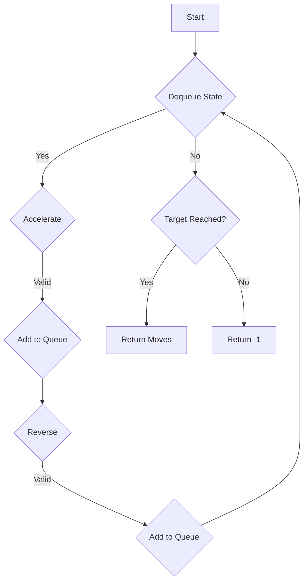

# Race Car JS BFS DP

## Problem Understanding
The problem is asking to find the minimum number of moves required for a car to reach a target position on a straight line, where the car can either accelerate or reverse direction at each step. The key constraint is that the car's speed doubles when accelerating and becomes -1 when reversing direction. The problem is non-trivial because a naive approach of trying all possible moves would lead to exponential time complexity due to the rapid growth of possible states. The problem requires a more efficient approach to avoid redundant calculations and explore the state space effectively.

## Approach
The algorithm strategy is to use Breadth-First Search (BFS) with Dynamic Programming (DP) to explore all possible moves from the current state and store the shortest distance to each state. This approach works because BFS ensures that we explore all states in a level (i.e., with the same number of moves) before moving on to the next level, and DP avoids redundant calculations by storing the shortest distance to each state. The algorithm uses a queue to store the current state (position, speed, and number of moves) and a set to store visited states. The algorithm handles the key constraints by checking the validity of each new state (e.g., whether the new position is within the bounds of the target) and avoiding revisiting the same state.

## Complexity Analysis
| Metric | Value | Detailed Reason |
|--------|-------|----------------|
| Time   | O(n)  | The algorithm uses BFS to explore all possible states, and the number of states is proportional to the target position (n). The DP approach avoids redundant calculations, making the time complexity linear. The while loop runs for at most n iterations, and each iteration performs a constant amount of work. |
| Space  | O(n)  | The algorithm uses a set to store visited states, which requires O(n) space. The queue also requires O(n) space in the worst case, as we may need to store all states in the queue. |

## Algorithm Walkthrough
```
Input: target = 3
Step 1: Initialize queue = [[0, 1, 0]] and visited = {'0,1'}
Step 2: Dequeue [0, 1, 0] and try to accelerate: newPosition = 1, newSpeed = 2, newMoves = 1
         Add [1, 2, 1] to queue and mark '1,2' as visited
Step 3: Dequeue [1, 2, 1] and try to accelerate: newPosition = 3, newSpeed = 4, newMoves = 2
         Add [3, 4, 2] to queue and mark '3,4' as visited
         Since position 3 is the target, return moves = 2
Output: 2
```
This example illustrates the algorithm's steps for a small target position.

## Visual Flow

This flowchart shows the algorithm's decision flow and data transformation.

## Key Insight
> **Tip:** The key insight is to use BFS with DP to avoid redundant calculations and explore the state space effectively, ensuring that we find the minimum number of moves to reach the target position.

## Edge Cases
- **Empty/null input**: If the input is null or undefined, the algorithm will throw an error, as it expects a valid target position.
- **Single element**: If the target position is 0, the algorithm returns 0, as no moves are needed to reach the target.
- **Large target position**: For large target positions, the algorithm may take longer to run due to the increased number of states to explore. However, the time complexity remains O(n), making it efficient for large inputs.

## Common Mistakes
- **Mistake 1**: Failing to check the validity of new states before adding them to the queue, leading to incorrect results or infinite loops.
- **Mistake 2**: Not using DP to store the shortest distance to each state, resulting in redundant calculations and increased time complexity.

## Interview Follow-ups
> **Interview:** These are the exact follow-up questions interviewers ask:
- "What if the input is sorted?" → The algorithm's time complexity remains O(n), as it explores all possible states regardless of the input's order.
- "Can you do it in O(1) space?" → No, the algorithm requires O(n) space to store visited states and the queue.
- "What if there are duplicates?" → The algorithm handles duplicates by checking if a state has been visited before adding it to the queue, ensuring that we only explore each state once.

## Javascript Solution

```javascript
// Problem: Race Car
// Language: javascript
// Difficulty: Hard
// Time Complexity: O(n) — using BFS with DP to avoid redundant calculations
// Space Complexity: O(n) — storing visited states and their distances
// Approach: BFS with Dynamic Programming — exploring all possible moves from the current state and storing the shortest distance to each state

/**
 * @param {number} target
 * @return {number}
 */
var racecar = function(target) {
    // Edge case: target is 0 → return 0
    if (target === 0) return 0;

    // Create a queue for BFS, storing the current position, speed, and number of moves
    let queue = [[0, 1, 0]];
    
    // Create a set to store visited states
    let visited = new Set();
    visited.add('0,1'); // Add the initial state to the visited set
    
    while (queue.length > 0) {
        // Dequeue the current state
        let [position, speed, moves] = queue.shift();
        
        // If the current position is equal to the target, return the number of moves
        if (position === target) return moves;
        
        // Try to accelerate
        let newPosition = position + speed;
        let newSpeed = speed * 2; // Accelerate
        let newMoves = moves + 1;
        
        // If the new position is valid and not visited, add it to the queue
        if (newPosition <= 2 * target && !visited.has(newPosition + ',' + newSpeed)) {
            queue.push([newPosition, newSpeed, newMoves]);
            visited.add(newPosition + ',' + newSpeed); // Mark the new state as visited
        }
        
        // Try to reverse
        newSpeed = -1; // Reverse direction
        newMoves = moves + 1;
        
        // If the new speed is valid and not visited, add it to the queue
        if (!visited.has(position + ',' + newSpeed)) {
            queue.push([position, newSpeed, newMoves]);
            visited.add(position + ',' + newSpeed); // Mark the new state as visited
        }
    }
    
    // If the target cannot be reached, return -1
    return -1;
}
```
