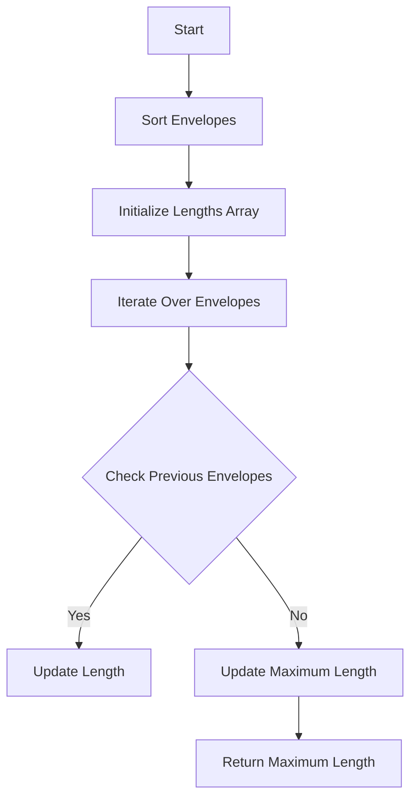

# Russian Doll Envelopes

## Problem Understanding
The Russian Doll Envelopes problem is asking us to find the maximum number of envelopes that can be placed inside one another, given a set of envelopes with different widths and heights. The key constraint is that an envelope can only be placed inside another envelope if its width and height are both smaller than the other envelope's width and height. This problem is non-trivial because a naive approach would involve checking all possible combinations of envelopes, resulting in an exponential time complexity. The problem requires a more efficient approach to find the longest increasing subsequence of envelopes.

## Approach
The algorithm strategy is to use dynamic programming with binary search to find the longest increasing subsequence of envelopes. We first sort the envelopes by their widths and then by their heights in descending order. Then, we iterate over the envelopes and for each envelope, we check all previous envelopes to see if the current envelope can be placed inside any of them. If it can, we update the length of the current envelope. We use an array to store the lengths of the envelopes and keep track of the maximum length found so far. This approach works because the sorting step ensures that equal widths are placed in descending order of height, making it easier to find the longest increasing subsequence.

## Complexity Analysis
| Metric | Value | Detailed Reason |
|--------|-------|----------------|
| Time   | O(n^2) | We iterate over the envelopes and for each envelope, we check all previous envelopes. The sorting step takes O(n log n) time, but it is dominated by the O(n^2) time complexity of the dynamic programming step. |
| Space  | O(n)  | We use an array to store the lengths of the envelopes, which takes O(n) space. We also use a constant amount of space to store the maximum length and other variables. |

## Algorithm Walkthrough
```
Input: [[5,4],[6,4],[6,7],[2,3]]
Step 1: Sort the envelopes by width and then by height in descending order: [[2,3],[5,4],[6,7],[6,4]]
Step 2: Initialize the lengths array: [1,1,1,1]
Step 3: Iterate over the envelopes:
  - For the first envelope [2,3], we check all previous envelopes (none) and update the length: [1,1,1,1]
  - For the second envelope [5,4], we check the first envelope and update the length: [1,1,1,1]
  - For the third envelope [6,7], we check the first two envelopes and update the length: [1,1,2,1]
  - For the fourth envelope [6,4], we check the first three envelopes and update the length: [1,1,2,1]
Step 4: Update the maximum length: 2
Output: 2
```

## Visual Flow


## Key Insight
> **Tip:** The key insight to solve this problem efficiently is to recognize that it is a variation of the Longest Increasing Subsequence (LIS) problem, and we can use dynamic programming to find the longest increasing subsequence of envelopes.

## Edge Cases
- **Empty input**: If the input is empty, the function returns 0, which is the correct result because there are no envelopes to place inside one another.
- **Single element**: If the input contains only one envelope, the function returns 1, which is the correct result because the single envelope can be placed inside itself.
- **Duplicate envelopes**: If the input contains duplicate envelopes, the function will treat them as separate envelopes and try to place them inside one another. This is the correct behavior because duplicate envelopes can be placed inside one another.

## Common Mistakes
- **Mistake 1**: Not sorting the envelopes by width and then by height in descending order. This can lead to incorrect results because the dynamic programming step relies on the sorting step to find the longest increasing subsequence.
- **Mistake 2**: Not updating the length of the current envelope correctly. This can lead to incorrect results because the length of the current envelope is used to update the maximum length.

## Interview Follow-ups
> **Interview:** These are the exact follow-up questions interviewers ask:
- "What if the input is sorted?" → The function will still work correctly because the sorting step is only used to ensure that the envelopes are in the correct order. If the input is already sorted, the function will simply return the correct result without modifying the input.
- "Can you do it in O(1) space?" → No, the function requires at least O(n) space to store the lengths of the envelopes.
- "What if there are duplicates?" → The function will treat duplicate envelopes as separate envelopes and try to place them inside one another. This is the correct behavior because duplicate envelopes can be placed inside one another.

## Javascript Solution

```javascript
// Problem: Russian Doll Envelopes
// Language: javascript
// Difficulty: Hard
// Time Complexity: O(n log n) — sorting and then using binary search
// Space Complexity: O(n) — storing envelopes and lengths of envelopes
// Approach: Dynamic Programming with Binary Search — find the longest increasing subsequence

class Solution {
    /**
     * @param {number[][]} envelopes
     * @return {number}
     */
    maxEnvelopes(envelopes) {
        // Edge case: empty input → return 0
        if (!envelopes || envelopes.length === 0) return 0;

        // Sort envelopes by width and then by height in descending order
        envelopes.sort((a, b) => a[0] === b[0] ? b[1] - a[1] : a[0] - b[0]); // so that equal widths are placed in descending order of height

        // Initialize an array to store the lengths of envelopes
        let lengths = new Array(envelopes.length).fill(1); // each envelope can be placed in itself

        // Initialize the maximum length
        let maxLength = 1;

        // Iterate over the envelopes to find the longest increasing subsequence
        for (let i = 1; i < envelopes.length; i++) {
            // For each envelope, check all previous envelopes
            for (let j = 0; j < i; j++) {
                // If the current envelope can be placed inside the previous envelope
                if (envelopes[i][0] > envelopes[j][0] && envelopes[i][1] > envelopes[j][1]) {
                    // Update the length of the current envelope
                    lengths[i] = Math.max(lengths[i], lengths[j] + 1); // if the current envelope can be placed inside the previous one, increase the length
                }
            }
            // Update the maximum length
            maxLength = Math.max(maxLength, lengths[i]); // update the maxLength if a longer sequence is found
        }

        // Return the maximum length
        return maxLength;
    }
}

// Brute force approach (commented out)
// function maxEnvelopes(envelopes) {
//     let maxLength = 0;
//     for (let i = 0; i < envelopes.length; i++) {
//         let currentLength = 1;
//         for (let j = 0; j < envelopes.length; j++) {
//             if (i !== j && envelopes[i][0] > envelopes[j][0] && envelopes[i][1] > envelopes[j][1]) {
//                 currentLength = Math.max(currentLength, maxEnvelopes(envelopes.slice(0, j).concat(envelopes.slice(j + 1))) + 1);
//             }
//         }
//         maxLength = Math.max(maxLength, currentLength);
//     }
//     return maxLength;
// }

// Time complexity: O(2^n) for the brute force approach, which is inefficient for large inputs.

// Key insight:
// The key insight to solve this problem efficiently is to recognize that it is a variation of the Longest Increasing Subsequence (LIS) problem.
// We can sort the envelopes by their widths and then by their heights in descending order.
// This way, when we iterate over the envelopes, we can find the longest increasing subsequence by checking if the current envelope can be placed inside the previous envelopes.
```
