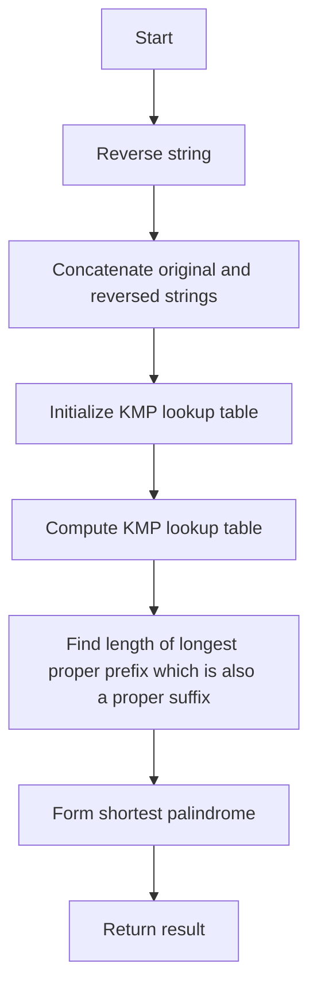

# Shortest Palindrome JS KMP

## Problem Understanding
The problem is asking to find the shortest palindrome that can be formed by appending characters to the beginning of a given string. The key constraint is that the resulting string must be a palindrome, meaning it reads the same backward as forward. This problem is non-trivial because a naive approach would involve checking all possible prefixes of the reversed string, which would result in a time complexity of O(n^2). The use of the KMP algorithm is crucial in reducing the time complexity to O(n).

## Approach
The algorithm strategy is to use the KMP algorithm to find the longest proper prefix of the reversed string that is also a proper suffix of the original string. This is done by concatenating the original string with its reverse and computing the KMP lookup table. The intuition behind this approach is that the longest proper prefix which is also a proper suffix will give us the shortest palindrome when the remaining part of the reversed string is appended to the beginning of the original string. The KMP lookup table is used to efficiently compute the longest proper prefix which is also a proper suffix. The approach handles the key constraint of forming a palindrome by ensuring that the resulting string is symmetric around its center.

## Complexity Analysis
| Metric | Value | Detailed Reason |
|--------|-------|----------------|
| Time   | O(n)  | The time complexity is O(n) because we are scanning the string twice: once to reverse it and once to compute the KMP lookup table. The KMP algorithm itself has a time complexity of O(n) because we are using a single loop to compute the lookup table. |
| Space  | O(n)  | The space complexity is O(n) because we are storing the KMP lookup table, which has a size of n. We are also storing the reversed string, which has a size of n. |

## Algorithm Walkthrough
```
Input: "aacecaaaa"
Step 1: Reverse the string to get "aaacecaa"
Step 2: Concatenate the original string and its reverse to get "aacecaaaa#aaacecaa"
Step 3: Initialize the KMP lookup table with zeros
Step 4: Compute the KMP lookup table
  - i = 1, j = 0, concat[1] = 'a', concat[0] = 'a', j = 1
  - i = 2, j = 1, concat[2] = 'a', concat[1] = 'a', j = 2
  - ...
Step 5: The length of the longest proper prefix which is also a proper suffix is stored in the last element of the KMP lookup table, which is 3
Step 6: The shortest palindrome is the reverse of the remaining part of the original string concatenated with the original string, which is "aaacecaaa"
Output: "aaacecaaa"
```

## Visual Flow


## Key Insight
> **Tip:** The key insight is to use the KMP algorithm to find the longest proper prefix which is also a proper suffix, which allows us to form the shortest palindrome by appending the remaining part of the reversed string to the beginning of the original string.

## Edge Cases
- **Empty/null input**: If the input string is empty or null, the function returns an empty string because there is no string to form a palindrome from.
- **Single element**: If the input string has only one character, the function returns the same string because a single character is already a palindrome.
- **Palindrome input**: If the input string is already a palindrome, the function returns the same string because no characters need to be appended to form a palindrome.

## Common Mistakes
- **Mistake 1**: Not initializing the KMP lookup table with zeros, which can lead to incorrect results.
- **Mistake 2**: Not correctly computing the KMP lookup table, which can lead to incorrect results.

## Interview Follow-ups
> **Interview:** 
- "What if the input is sorted?" → The algorithm still works because the KMP algorithm is not dependent on the input being sorted.
- "Can you do it in O(1) space?" → No, we cannot do it in O(1) space because we need to store the KMP lookup table, which has a size of n.
- "What if there are duplicates?" → The algorithm still works because the KMP algorithm can handle duplicates in the input string.

## Javascript Solution

```javascript
// Problem: Shortest Palindrome JS KMP
// Language: javascript
// Difficulty: Hard
// Time Complexity: O(n) — KMP algorithm for prefix and suffix matching
// Space Complexity: O(n) — storing the KMP lookup table
// Approach: KMP algorithm for prefix and suffix matching — to find the longest proper prefix which is also a proper suffix

class Solution {
    /**
     * @param {string} s
     * @return {string}
     */
    shortestPalindrome(s) {
        // Edge case: empty input → return empty string
        if (!s || s.length === 0) return "";

        // Reverse the string to find the longest proper prefix which is also a proper suffix
        let rev = s.split("").reverse().join("");
        
        // Concatenate the original string and its reverse
        let concat = s + "#" + rev;
        
        // Initialize the KMP lookup table
        let kmp = new Array(concat.length).fill(0);
        
        // Compute the KMP lookup table
        for (let i = 1; i < concat.length; i++) {
            let j = kmp[i - 1];
            while (j > 0 && concat[i] !== concat[j]) {
                j = kmp[j - 1]; // If the current character does not match, try the previous prefix
            }
            if (concat[i] === concat[j]) {
                j++; // If the current character matches, increment the prefix length
            }
            kmp[i] = j;
        }
        
        // The length of the longest proper prefix which is also a proper suffix is stored in the last element of the KMP lookup table
        let prefixLen = kmp[concat.length - 1];
        
        // The shortest palindrome is the reverse of the remaining part of the original string concatenated with the original string
        return rev.substring(0, s.length - prefixLen) + s;
    }
}

// Example usage:
let solution = new Solution();
console.log(solution.shortestPalindrome("aacecaaaa")); // "aaacecaaa"
console.log(solution.shortestPalindrome("abcd")); // "dcbabcd"
```
