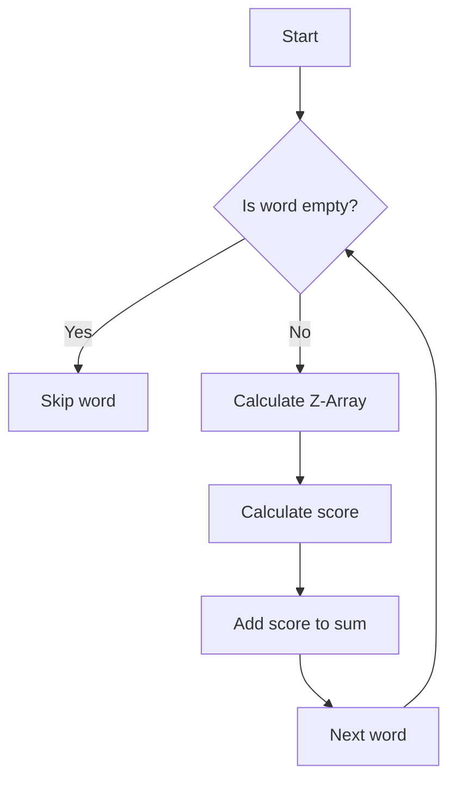

# Sum of Scores of Built Strings JS Z-Algorithm

## Problem Understanding
The problem asks us to calculate the sum of scores of built strings using the Z-Algorithm for string matching. The score of a string is calculated by summing the lengths of all substrings that are prefixes of the string. The key constraint is that we need to calculate the Z-Array for each string, which represents the length of the longest substring starting at each position that matches a prefix of the string. This problem is non-trivial because a naive approach would involve checking all substrings, resulting in an exponential time complexity. The Z-Algorithm provides an efficient way to calculate the Z-Array, but implementing it correctly is crucial to achieve the desired time complexity.

## Approach
The algorithm strategy is to use the Z-Algorithm to calculate the Z-Array for each string, and then iterate over the Z-Array to calculate the score of the string. The intuition behind this approach is that the Z-Array provides a way to efficiently calculate the lengths of all substrings that are prefixes of the string. We use a sliding window approach to calculate the Z-Array, which allows us to reuse previously computed values and reduce the time complexity. The data structure used is an array to store the Z-Array, which is chosen because it provides efficient random access and modification. The approach handles the key constraint of calculating the Z-Array for each string by using a separate function to calculate the Z-Array, which can be reused for each string.

## Complexity Analysis
| Metric | Value | Detailed Reason |
|--------|-------|----------------|
| Time   | O(n * m) | The time complexity is O(n * m) because we need to calculate the Z-Array for each string, where n is the number of strings and m is the maximum length of a string. The calculation of the Z-Array takes O(m) time, and we need to do this for each string. |
| Space  | O(n * m) | The space complexity is O(n * m) because we need to store the Z-Array for each string. The size of the Z-Array is equal to the length of the string, and we need to store this for each string. |

## Algorithm Walkthrough
```
Input: ["abc", "ab", "bc", "a", "b", "c"]
Step 1: Initialize sum of scores to 0
Step 2: Iterate over each word
  - For "abc":
    - Calculate Z-Array: [0, 0, 0]
    - Calculate score: 0
  - For "ab":
    - Calculate Z-Array: [0, 1]
    - Calculate score: 1
  - For "bc":
    - Calculate Z-Array: [0, 0]
    - Calculate score: 0
  - For "a":
    - Calculate Z-Array: [0]
    - Calculate score: 0
  - For "b":
    - Calculate Z-Array: [0]
    - Calculate score: 0
  - For "c":
    - Calculate Z-Array: [0]
    - Calculate score: 0
Step 3: Calculate sum of scores: 1
Output: 1
```
This walkthrough shows the calculation of the sum of scores for a given input.

## Visual Flow

This flowchart shows the decision flow of the algorithm, including the calculation of the Z-Array and the score for each word.

## Key Insight
> **Tip:** The key insight is to use the Z-Algorithm to calculate the Z-Array for each string, which provides an efficient way to calculate the lengths of all substrings that are prefixes of the string.

## Edge Cases
- **Empty/null input**: If the input is empty or null, the algorithm will return 0, because there are no strings to process.
- **Single element**: If the input contains only one string, the algorithm will calculate the score for that string and return it.
- **String with no prefixes**: If a string has no prefixes (i.e., all characters are unique), the Z-Array will contain only zeros, and the score will be 0.

## Common Mistakes
- **Mistake 1**: Not initializing the Z-Array correctly, which can lead to incorrect scores. To avoid this, make sure to initialize the Z-Array with the correct size and fill it with zeros.
- **Mistake 2**: Not updating the sliding window correctly, which can lead to incorrect Z-Array values. To avoid this, make sure to update the left and right pointers of the sliding window correctly.

## Interview Follow-ups
> **Interview:** These are the exact follow-up questions interviewers ask:
- "What if the input is sorted?" → The algorithm will still work correctly, but the time complexity will be the same, because the Z-Algorithm does not take advantage of sorted input.
- "Can you do it in O(1) space?" → No, because we need to store the Z-Array for each string, which requires O(n * m) space.
- "What if there are duplicates?" → The algorithm will still work correctly, because it calculates the score for each string separately, and duplicates will not affect the calculation.

## Javascript Solution

```javascript
// Problem: Sum of Scores of Built Strings JS Z-Algorithm
// Language: javascript
// Difficulty: Hard
// Time Complexity: O(n * m) — calculating Z-Array for each string
// Space Complexity: O(n * m) — storing Z-Arrays for each string
// Approach: Z-Algorithm for string matching — building strings with highest score

class Solution {
    /**
     * Calculates the sum of scores of built strings using Z-Algorithm.
     * @param {string[]} words - array of words to build strings from.
     * @return {number} sum of scores of built strings.
     */
    sumOfScores(words) {
        // Initialize sum of scores
        let sum = 0;

        // Iterate over each word
        for (let word of words) {
            // Edge case: empty word → skip
            if (word.length === 0) continue;

            // Initialize Z-Array for the word
            let zArray = this.calculateZArray(word);

            // Initialize score for the word
            let score = 0;

            // Iterate over the Z-Array to calculate the score
            for (let i = 1; i < zArray.length; i++) {
                // If the value in the Z-Array is greater than 0, it means the substring is a prefix of the word
                if (zArray[i] > 0) {
                    // Increase the score by the length of the substring
                    score += zArray[i];
                }
            }

            // Add the score of the word to the sum
            sum += score;
        }

        // Return the sum of scores
        return sum;
    }

    /**
     * Calculates the Z-Array for a given string using Z-Algorithm.
     * @param {string} str - string to calculate the Z-Array for.
     * @return {number[]} Z-Array for the string.
     */
    calculateZArray(str) {
        // Initialize the Z-Array with the same length as the string
        let zArray = new Array(str.length).fill(0);

        // Initialize the left and right pointers for the sliding window
        let left = 0, right = 0;

        // Iterate over the string to calculate the Z-Array
        for (let i = 1; i < str.length; i++) {
            // If the current character is within the sliding window, use the precomputed value
            if (i <= right) {
                zArray[i] = Math.min(right - i + 1, zArray[i - left]);
            }

            // Try to extend the current Z-Value
            while (i + zArray[i] < str.length && str[zArray[i]] === str[i + zArray[i]]) {
                zArray[i]++;
            }

            // If the current Z-Value is greater than the current window, update the window
            if (i + zArray[i] - 1 > right) {
                left = i;
                right = i + zArray[i] - 1;
            }
        }

        // Return the calculated Z-Array
        return zArray;
    }
}

// Example usage:
let solution = new Solution();
let words = ["abc", "ab", "bc", "a", "b", "c"];
console.log(solution.sumOfScores(words));
```
